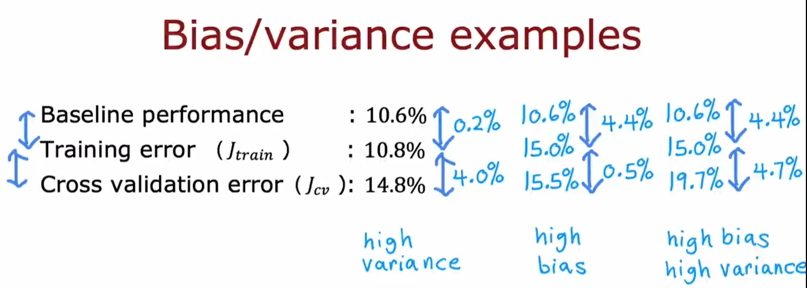
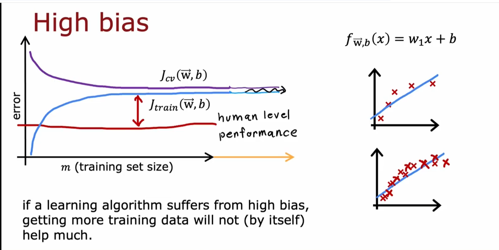
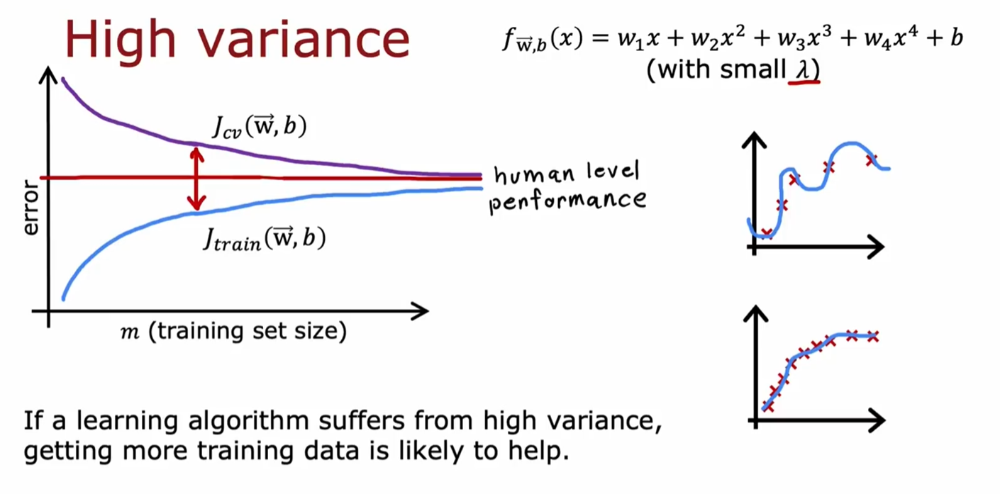
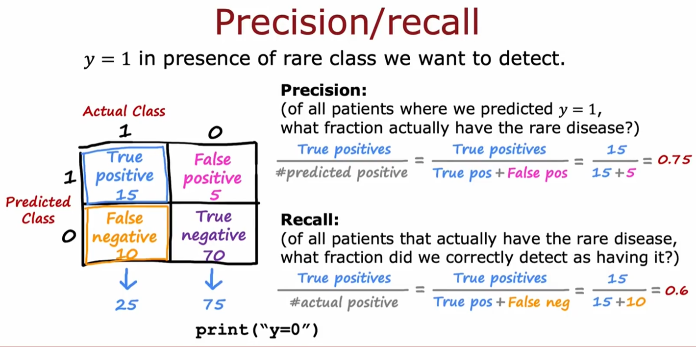
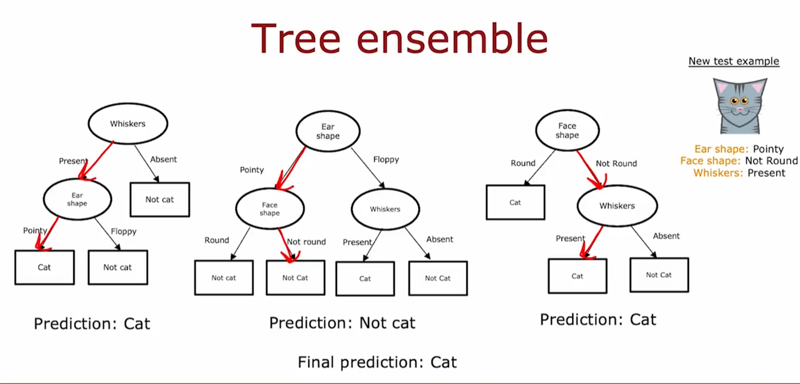

# week 1

## 一、Neural Networks Intuition

### 1.1 Neurons and the brain

- 神经网络的灵感来源：大脑

神经网络的设计灵感来源于人类大脑的工作方式。大脑由大量的神经元（Neurons）组成，这些神经元通过复杂的连接网络进行信息传递和处理。

神经网络试图模拟这种生物神经元的行为，通过数学建模来实现类似的学习和推理能力。

- 神经网络如何模拟大脑

1. **输入层（Input Layer）**：接收原始数据。

2. **隐藏层（Hidden Layer）**：通过多层神经元提取数据的抽象特征。

3. **输出层（Output Layer）**：生成最终的预测结果。

### 1.2 Demand Prediction

- 例1：预测衣服是否会成为畅销品

input ：x=price   →    model：activiation=$f(x)=\frac{1}{1+e^{-(wx+b)}}$	→	output：成为畅销品的概率

单个神经元

​	**输入**：价格（price）

​	**输出**：概率

​	**中间处理**：激活函数

通过将多个这样的神经元连接起来，可以构建一个神经网络。

- 例2：预测衣服是否会成为畅销品

**input layer（接收原始数据）**：price、shipping cost（运输费）、marketing（营销）、material

> 我们需要构建一个神经网络 来预测衣服是否affordability，而affordability取决于price、shipping cost，因此我们在这里使用一个神经元 来预测人们是否认为这是可负担的。
>
> 又需要创建另一个神经元来预测人们是否认为这是awareness，而awareness取决于marketing。
>
> 又需要创建另一个神经元来预测人们是否认为这是perceived quality，而perceived quality取决于material。
>
> 我们把这三个神经元叫做layer，layer以相似的特征进行输入 并输出一些数字

**hidden layer（特征抽象与转换）**：affordability（可负担）、awareness （高度认知）、perceived quality（高质量）

> 我们将这三个神经元连接到右侧另一个逻辑回归单元，最终输出这个衣服成为畅销品的概率。
>
> 这单个神经元 也是layer，同时也叫 output layer

**output layer（生成最终预测）**：衣服成为畅销品的概率

我们将affordability（可负担）、awareness （高度认知）、perceived quality（高质量） 称为activations（激活值）。

affordability（可负担）、awareness （高度认知）、perceived quality（高质量） 是第一个layer 3个单元的激活值。

output是第二个layer的激活值。

输入4个数字，然后神经网络使用这4个数字计算3个新数字（也称作激活值），然后神经网络的最终层 使用这3个数字 计算1个数字。

这4个数字price、shipping cost（运输费）、marketing（营销）、material 被成为输入层（input layer）

在大型的神经网络中，决定哪个神经元 应该以哪些特征作为输入 是一项繁重的工作，所以实践中 是让每一层的每一个神经元前一层的每个特征。 在实际预测中，它可能会学会忽略哪些特征，通过适当调节参数来仅关注与affordability最相关的特征。

为了进一步简化，我们将input layer的这四个price、shipping cost（运输费）、marketing（营销）、material写为$\vec{x}$，这个$\vec{x}$输入到中间层 然后计算3个激活值，即这3个数字/激活值 又变成另一个向量$\vec{a}$最终被输入到最终的输出层，最终输出这件衣服成为畅销品的概率。

输入的层为input layer， 中间的层为 hidden layer， 输出的层为 output layer

在训练中，神经网络会告诉你什么是正确的输入、输出，但不会告诉你hidden layer的affordability（可负担）、awareness （高度认知）、perceived quality（高质量）正确的值，这些正确的值是隐藏的，你在训练中看不见他们，这就是为什么中间层被称为隐藏层

另一种理解神经网络的方式

把左边的4个特征遮住，看到一个逻辑回归算法/逻辑回归单元 以 ffordability（可负担）、awareness （高度认知）、perceived quality（高质量）作为输入，并使用这3个特征来估计衣服是否成为畅销品的概率，它不适用原始的4个特征price、shipping cost（运输费）、marketing（营销）、material，而是使用一组新的，更好的特征，这些新特征更有可能预测出衣服是否成为畅销品，所以一种思考方式是，它只是逻辑回归，但它是一种可以自己学习自己特征的逻辑回归版本，这使得更容易走出准确的预测，神经网络的作用是，你不需要手动设计特征，它可以学习 来使问题变得更容易

总结一下 神经网络是这样工作的

输入层有一个特征向量，在这个例子中有4个，他被输入到hidden laryer，hidden layer有3个输出数字，这里用向量$\vec{a}$来表示这个hidden layer输出的激活向量，然后output layer将这3个数字作为输入，并输出1个数字 这是神经网络的最终激活值或最终预测.

神经网络的一个很好的特性是，但你从数据中训练它时，你不需要明确绝对什么是特征 ，它会自己理解所有的特征 并自己找出hidden layer中需要的特征

### 1.3 Example：Recognizing Images

想要构建一个脸部识别应用，需要训练一个神经网络，以图片作为输入，输出图片人物的身份。

图片是1000*1000像素的，因此表现为 1000rows * 1000colums的像素矩阵 并转换成向量$\vec{x}$。

- 现在问题变成了 **input=$\vec{x}$ ， output=人物的身份？**

1. **input layer**：图片 转换为  $\vec{x}$

2. **first hidden layer**：图片被输出到first hidden layer提取特征。

   查看first hidden layer中的内容发现神经网络正在试图寻找线段。

   2.1 第一个神经元正在寻找 / 形状的线段

   2.2 第二个神经元寻找\ 形状的线段

   2.3 第三个寻找 \ 形状的线段。

3. **second hidden layer**：first hidden layer的特征被输出到 second hidden layer 再提取一些特征。

   查看secend hidden layer中的内容发现，神经网络正在将许多小线段组合在一起，以寻找面部的一部分。

   3.1 第一个神经元检测眼睛

   3.2 第二个神经元检测鼻子

   

   

4. **third hidden layer**：second hidden layer的特征被输出到 third hidden layer 再提取一些特征。

   查看third hidden layer中的内容发现，神经网络正在聚合不同的面部特征，试图检测出面部形状存在与否。

   

5. **output layer**：输出某个人物的概率

   最终检测面部与不同面部的对应程度，创建了一组丰富的特征，用来帮助output layer确定图片中人物的身份。

神经网络一个显著的特点是能自行学习隐藏层的特征，在这个例子中，没人告诉他第一层应该寻找短线段，第二层应该寻找眼睛、鼻子，第三层寻找面部形状。神经网络能从数据中自行找出这些特征。

需要注意的是，first hidden layer 一次检测的区域很小，secend hidden layer 一次检测的区域中等，third hidden layer 一次检测的区域很大

- 例2：检测汽车

也是同理，只不过first hidden layer仍然是检测线段， secend hidden layer变成了检测轮胎、车门， third hidden layer变成了检测 汽车。

只需输入不同的数据，神经网络就会自动学习 检测不同的特征，以便尝试进行汽车预测、人物识别或其他任何特定的训练任务。

### 1.4 Neural Network layer

> 在本视频中，将学习如何构建神经元

- **layer 0 / input layer** 

$\vec{x}$ 输入4个数字【197，184，136，214】

- **layer 1 / hidden layers** 

> 所有符号需加个  $^{[1]}$

每个神经元输入4个数字$\vec{x}=[197，184，136，214]$，每个神经元实现逻辑回归。

1. 第1个隐藏神经元，输入$\vec{x}$，有两个参数$\vec{w}_{1}^{[1]},b_{1}^{[1]}$，根据逻辑回归公式$g(z)=\frac{1}{1+e^{-(z)}}$ ，输出激活值$a_{1}^{[1]}=g(\vec{w}_{1}^{[1]}·\vec{x}+b_{1}^{[1]})=0.3$
2. 第2个隐藏神经元，输入$\vec{x}$，有两个参数$\vec{w}_{2}^{[1]},b_{2}^{[1]}$，根据逻辑回归公式$g(z)=\frac{1}{1+e^{-(z)}}$ ， 输出激活值$a_{2}^{[1]}=g(\vec{w}_{2}^{[1]}·\vec{x}+b_{2}^{[1]})=0.7$

2. 第3个隐藏神经元，输入$\vec{x}$，有两个参数$\vec{w}_{3}^{[1]},b_{3}^{[1]}$，根据逻辑回归公式$g(z)=\frac{1}{1+e^{-(z)}}$ ， 输出激活值$a_{3}^{[1]}=g(\vec{w}_{3}^{[1]}·\vec{x}+b_{3}^{[1]})=0.2$

- **layer 2 / hidden layers**

> 所有符号需加个  $^{[2]}$

> 第二层的输入是第一层的输出

每个神经元输入3个数字$\vec{a}=[0.3,0.7,0.2]$，每个神经元实现逻辑回归。

1. 第1个隐藏神经元，输入$\vec{a}$，有两个参数$\vec{w}_{1}^{[2]},b_{1}^{[2]}$，根据逻辑回归公式$g(z)=\frac{1}{1+e^{-(z)}}$ ，输出激活值$\vec{a}_{1}^{[2]}=g(\vec{w}_{1}^{[2]}·\vec{a}^{[1]}+b_{1}^{[2]})=0.84$

- **layer 4 / output layer**

if $a^{[2]}>0.5?$

yes : y=1

no: y=0

### 1.5 More complex neural networks

输出值 $\vec{a}^{[n]}=\vec{w}_{j}·\vec{a}^{[n-1]}+b_{j}^{n}$

### 1.6 inference:making predictions (forward propagation)

- 例：手写数字识别

1. layer 1

2. layer 2

3. layer 3

## 二、TensorFlow implementation

### 2.1 Inferfence in Code

- 例1：咖啡烹饪

x轴是烹饪温度，y轴是烹饪时间， 在合适范围内的"x" 才是好喝的咖啡， 范围外的"○" 是难喝的咖啡

**代码**：input 温度200、时间17， 判断咖啡是否好喝？

- 例2：手写数字识别

**代码**：input 图片像素，判断数字是否为1？

### 2.2 Data in TensorFlow

- numpy中如何表示数据

- TensorFlow中如何表示数据

### 2.3 Building a neural network

使用 Sequential(layer_1,layer_2,layer_3) 就可以把不同层连接起来，组成神经网络

~~~python
layer_1 = Dense(units=25, activation="sigmoid")
layer_2 = Dense(units=15, activation="sigmoid")
layer_3 = Dense(units=1, activation="sigmoid")
model = Sequential([layer_1,layer_2,layer_3])
~~~

也可以整合成一行代码

~~~python
model = Sequential([Dense(25, "sigmoid"), Dense(15, "sigmoid"), Dense(1, "sigmoid")])
~~~

### 2.4 Forward prop in a single layer

w1_1：假设为[1,2]

b1_1：假设为[-1]

w1_2：假设为[-3,4]

b1_2：假设为[1]

w1_3：假设为[5,-6]

b1_3：假设为[2]

### 2.5 General implement of ofward propagation

一开始，先有$\vec{w}$向量， 然后W是$\vec{w}_1^{[1]}、\vec{w}_2^{[1]}、\vec{w}_3^{[1]}$向量组成的2x3矩阵。

b再组成一个1x3矩阵。

input 为 [-2,4]的1x2矩阵。

W.shape[1]返回列数，就是3列。

np.zeros(units)把这3列归零, 变为[0,0,0]

for循环操作，W[a,b]是选择a行b列，W[:,j] 选择j列。

然后算出 a_out[j] 激活值。

最后使用sequential() 把神经元整合成神经网络	

## 三、Speculations on artificial general intelligence（AGI）

### 3.1 Is there a path to AGI?

**1. ANI（狭义人工智能）**

- **定义**

ANI 是指专门设计用于执行特定任务的人工智能系统。它只能在预先定义的范围内工作，无法超越其编程和训练数据的限制。

- **特点**

**任务特定性**：ANI 只能完成特定任务，例如语音识别、图像分类、推荐系统等。

**无自主意识**：ANI 不具备自我意识或理解能力，只能根据输入数据执行预设的操作。

**广泛应用**：ANI 是目前人工智能技术的主流形式，已广泛应用于各行各业。

**AGI（通用人工智能）**

- **定义**

AGI 是指具备与人类相当或超越人类智能水平的人工智能系统。它能够理解、学习和执行任何智力任务，具备自主意识和泛化能力。

-  **特点**

**通用性**：AGI 可以像人类一样处理各种任务，而不仅限于特定领域。

**自主意识**：AGI 具备自我意识和理解能力，能够进行抽象思考和创造。

**适应性**：AGI 能够适应新环境和新任务，无需重新编程。

## 四、Vectorization（optional）

### 4.1 How neural networks are implement efficiently

### 4.2 Martix multiplication

### 4.3 Martix multiplication rules

### 4.4 Martix multiplication code

## 五、Neural Network Training

### 5.1 TensorFlow implementation

### 5.2 Training Data

1. **Define the model**

2. **Specify loss and cost functions**

3. **Training data to minimize**

## 六、Activation Functions

### 6.1 Alternatives to the sigmoid activation

- **Sigmoid activation functions**

- **ReLu activation functions**

- **Linear activation function / No activation function**

### 6.2 Choosing activation functions

#### 6.2.1 **Output layer**

根据不同的情况，选择不同的激活函数

- Binary classification情况：预测结果 0 / 1，结果非0即1，activation function使用Sigmoid

- Regression 情况：预测股票明天变化幅度，可正、可负、可零。activation function使用Linear activation function

- Regression 情况：预测房价，只能为正。activation function使用ReLU	

#### 6.2.2 **Hidden layer**

现如今更多的情况 是使用 ReLU activation function，很少使用Sigmoid activation function  仅仅在个别二分类的情况才会使用。

原因：①ReLU只需要计算 max(0,1)，而Sigmoid需要进行指数运算和逆运算。 ②ReLU只有左侧是平坦的，而Sigmoid 左侧和右侧都平坦，这会造成在进行梯度下降的时候，出经常出现平坦，从而减慢学习速度

### 6.3 Why do we need activation functions?

神经网络需要激活函数，如果都使用线性激活函数（即不使用激活函数），神经网络就无法工作

如何我们对神经网络中所有的节点都使用线性激活函数，这个神经网络将会变得与线性回归无异。

这就是都是用线性函数的话，神经网络并不能学习到比线性函数更复杂的东西

1. 神经网络中 都使用线性回归，output中也使用线性回归 → 等同于 Linear Regression
2. 隐藏层使用线性回归，output中使用Sigmoid → 等同于 Logistic Regression

一个重要的经验法则是，不要在hidden layer中使用线性激活函数，而是要使用ReLU激活函数

## 七、Multiclass Classfication

### 7.1 Multiclass

多分类问题，是指有超过两个可能的输出标签，而不仅仅是0 or 1

- 二分类问题决策边界

- 多分类问题决策边界

### 7.2 Softmax

softmax回归算法 是逻辑回归的泛化，逻辑回归是一种二分类算法，而softmax适用于多分类场景

- Logistic regression

- Softmax regression

**softmax公式**

- Logistic Regression Cost   vs  softmax Regression cost

> $a_j$越大，损失越小。 j=1,2,3....n

### 7.3 Neural Network with Softmax output

在logistic Regression中，计算$a_1$只需要用到$g(z_1)$，$a_2$只需要用到$g(z_2)$。

而在softmax中，计算$a_1$需要用到$z_1,z_2,....z_{10}$

### 7.4 Imporoved implementation of softmax

- Numerical Roundoff Errors

虽然在数学上，这两种情况是等价的，但在代码中

是存在误差的。

在代码中，使用下面这种，就不会有误差了，只是代码变得稍微不那么易读

Original loss 相当于 $x=\frac{2}{10000}$，而More accurate loss相当于$x=(1+\frac{1}{10000})-(1-\frac{1}{10000})$

- 应用于softmax

上下两段代码都在做相同的事情，只是下面的数值更精确，不会出现四舍五入的情况，但易读性不如上面

### 7.5 Classification with multiple outputs(Optional)

- 多类分类（multi-class classification）：输出标签可以是两个或更多个

- 多标签分类（multi-label classification）：每个图像有多个标签

传统的方法：创建3个神经网络，output 1个数，输出car、bus、pedestrain

多标签分类：创建1个神经网络，output 1个向量，向量中包含3个数 [car,bus,pedestrain]

## 八、Additional Neural Network Concepts

### 8.1 Advanced Optimization

左图：梯度下降步长太小了，w 或 b 在相同方向上保持移动，Adam算法会自动增加α的值，让步长变大

右图：梯度下降步长太大了，w 或 b 保持震荡，Adam算法会自动缩小α的值，让步长变小

- Adam算法：Adaptive Moment estimation  

Adam算法不使用单一的全局学习率α，它可以自动调节学习率 为每个模型使用不同的学习率。

有11个α

- Code

### 8.2 Additional Layer Types

到目前为止我们使用的都是全连接层（dense layer type），每一层的每个神经元，都是从前一层的所有激活中获取的输入

但在某些工作中，会使用不同的layer。

- Convoutional Layer（卷积层）

例1：

这个例子中，第1个蓝色的神经元 对应1个区域，第二个粉丝的神经元对应4个区域......， 每个神经元都不会查看所有的像素，而是查看图像部分的像素。 

这样做有两个好处：

1. 快速计算
2. 仅需要很少的数据，减少过拟合

例2：

 把心电图的信号分为了$x_1 \sim x_{100}$。

1. 第1个hidden layer / convolutional layer（卷积层）中，有9个神经元。

   第1个神经元只看$x_1 \sim x_{20}$,第2个神经元只看$x_11 \sim x_{30}$，......

2. 第2个hidden layer / convolutional layer（卷积层）中，有3个神经元。

   第1个神经元只看$a_1 \sim a_{5}$,第2个神经元只看$a_3 \sim a_{7}$，......

3. 最后的output layer / Sigmoid layer，输入$\vec{a}^{[2]}$的3个值，输出 是否有心脏病？

> 神经元有很多架构可以选择，比如神经元该看多大的输入窗口，神经元选择多少个。通过有效的选择参数，可以比全连接更有效。

## 九、Backprop Intuition（Optional）

### 9.1 What is a derivative

### 9.2 Computation Graph

- 前向传播图

- 反向传播图

一开始想知道 $\frac{\partial j}{\partial w}$，于是需要先知道$\frac{\partial j}{\partial c}$，于是需要先知道$$\frac{\partial j}{\partial b}$$，于是需要先知道$$\frac{\partial j}{\partial a}$$，于是需要先知道$\frac{\partial j}{\partial d}$

之所以使用反向传播图，是因为他很高效，计算一次就能存储起来，下次可以直接用。

有N：10000个参数， P：100000个参数的时候。

只需要计算 N+P=10000 + 100000=110000个步骤，就能计算出导数， 而不是需要每一步都重新计算。

### 9.3 Larger Neural Network Example

## 十、Advice for applying machien learning

### 10.1 Deciding what to try next

当你需要预测放假时，出现了一个不可接受的错误，你下一步会怎么做？

1. 收集更多数据 ?
2. 尝试减小特征 ?
3. 尝试增加特征 ?
4. 添加更多特征 ?
5. 减小$\lambda$ ?
6. 增加$\lambda$ ?

## 十一、Evaluating and choosing models

### 10.1 Evaluating a model

在预测房屋价格的模型中，发现这个模型太波动了。

仅仅用 size 这一个特征，不太合适，增加特征的话，高维图像怎么画？

- **Evaluating a model**

使用测试集评估模型性能。70%的training set，30%的test set。 一般按照37分 或者28分

当想最小化cost function J 时，可通过下面两个公式来计算误差

在本例中$j_{test}$的误差很小，是红x的点。 而$J_{test}$的误差很大，是紫色的点。

另一个方法，是测量算法误分类的比例有多少，错误的把0分类为1 和 错误的把1分类为0。

### 10.2 Model selection and training/cross validation/test sets

- training set / test set

> 仅把数据分为两个子集 train set / test set 存在的问题

Once parameters $\vec{w},b$ are fit to the training set, the training error $J_{train}(\vec{w},b)$ is likely lower than actual generalization error. 

训练误差可能不是一个很好的指标 来衡量算法在新标本上的表现或泛化能力，特别是对于这个例子，训练误差几乎为0，这远低于实际泛化误差

$J_{test}(\vec{w},b)$ is better estimate of how well the model will generalize to new data compared to $J_{train}(\vec{w},b)$ 

例如：
$$
\begin{aligned}
d=1, \quad & f_{\vec{w},b}(\vec{x}) = w_1x + b \\
d=2, \quad & f_{\vec{w},b}(\vec{x}) = w_1x + w_2x^2 + b \\
d=3, \quad & f_{\vec{w},b}(\vec{x}) = w_1x + w_2x^2 + w_3x^3 + b \\
& \vdots \\
d=10, \quad & f_{\vec{w},b}(\vec{x}) = w_1x + w_2x^2 + \cdots + w_{10}x^{10} + b \\
\end{aligned}
$$
算法表明，当d=5 时 $J_{test}(\vec{w}^{<5>},b^{<5>})$的误差最小。 但问题是如果你仅仅根据test set的结果选择d=5的公式，$J_{test}(\vec{w}^{<5>},b^{<5>})$ 是过于乐观的，低于实际的泛化误差。

w,b are overly optimistic estimate of generalization error on trainining data 

- Training set  / cross validation set / test set

> 更为合理的是 把数据分为 Training set  / cross validation set / test set  这三个子集

training set （训练集） ： 60%。

cross validation set / validation set / development set / dev set （交叉验证集）：20%。

test set （测试集） ：20%。

例：

1. train set上选出合适的w,b 
2. dev set 选出d 即用哪个公式
3. 确定了最终模型后，在test set上进行测试，得到一个相对公平的泛化误差估计值。

## 十二、Bias and variance

### 12.1 Diagnosing bias and variance

训练机器学习模型时，几乎没有一次就能达成我想要的效果的，因此构建机器学习系统的关键在于如何决定下一步该做什么以及提高性能，查看学习算法的偏差和方差可以很好的指导你下一步该做什么。

1. High bias(underfit) ：$J_{train}$的误差很大，cross-validation set 的误差也很大。
2. High variance (overfit)：$J_{train}$的误差很小，cross-validation set 的误差很大。
3. just right ： $J_{train}$的误差很小，cross-validation set 的误差也很小。

**$J_{train}$**：d=1时，degree of polynomial(多项式次数)很低，欠拟合，$J_{train}$误差很高。而当多项式越来越复杂时(d=4)，拟合效果越来越好，随着degree of polynomial(多项式次数)增加，$J_{train}$通常会下降。

**$J_{cv}$：**d=1时，degree of polynomial(多项式次数)很低，欠拟合，$J_{cv}$误差很高。当多项式越来越复杂时(d=4)，过拟合了，$J_{cv}$的误差仍然很高。 而如果多项式刚刚好（d=2），那么$J_{cv}$就会很低

- 总结

### 12.2 Regularization and bais/variance

正则化λ的选择，以及λ如何影响 bais 和 variance的，这将有助于你的算法选择一个好的λ。

**λ=10000**：λ非常大，算法倾向于保持参数w非常小，最终$w_1，w_2$这些参数将接近于0，模型变为$f_{\vec{w},b}(\vec{x})=b$这样一个常数。该模型high bias(underfit) , $J_{train}$的误差大，$J_{cv}$的误差大。

**λ=0**：λ非常小，算法倾向于保持参数w非常大。该模型high variance(overfit)， $J_{train}$的误差小，$J_{cv}$的误差大。

**λ=恰当好处**：λ 刚好合适， $J_{train}$的误差小，$J_{cv}$的误差小。

- 如何选择一个好的λ呢？

一个一个试，最终找到一个合适的λ，例如从0试到10，最终找到 λ=0.08 是最合适的。

λ samll：过拟合。$J_{train}$的误差小，$J_{cv}$的误差大。

λ large：欠拟合。$J_{train}$的误差大，$J_{cv}$的误差大。

### 12.3 Establishing a baseline level of performance

- 语音识别问题

1. high variance

人类错误率：10.6%

Training error：10.8%

cross-validation error：14.8%

在training set 上，和人类差不多，而在cv set上，则高了4%的error。因此这个算法有更多的variance问题（overfit），而不是bias问题（underfit）。

2. high bias

....

3. highg bias 、high variance

...

- 你希望算法达到一个什么样的水平？

判断一个训练误差是否高时，建立一个 **基准性能水平** 通常是很有用的。

1. 人类表现水平
2. 和其他算法表现水平进行比较
3. 根据经验猜测

不应该问：我的算法误差大吗？

而是应该问：我的算法相对于我最终能达到的水平，误差大吗？

### 12.4 Learning curves

1. **$J_{cv}$随着样本数量m的增加，cross-validation set的error减小，很好理解**

2. **$J_{train}$随着样本数量m的增加，error增加**

   m=1时（1个样本），拟合起来很容易,误差很低。

   m=2时（2个样本），拟合直线。

   m=3时（3个样本），拟合曲线。

   m=4时（4个样本），想要兼顾4个样本，拟合有点困难，稍微有点偏差。

   m=5时（5个样本），拟合起来有点困难，出现偏差。

   m=6时（6个样本），拟合出现明显偏差，误差很高。

   随着样本数量的增加，想要兼顾所有样本很困难，因此训练集的表现会越来越差。

#### high bias（underfit）

如果一个算法具有high bias（underfit），获得的更多数据 并没有多大帮助，从曲线上看，当m的数量到达一定量级后，算法的error会变得平坦。

**high bias 无论你添加多少数据，都不会使你的算法变得更好。**

#### high variance（overfit）

使用小的λ。**$J_{train}$随着样本数量m的增加，error增加，$J_{cv}$随着样本数量m的增加，error减小**

$J_{cv}$的误差远高于$J_{train}$的误差，high variance set 在 train set的表现远好于 cross-validation set的表现。

画一个baseline level of performance（human level performance），你会发现$J_{train}$的error甚至会低于人类的error，在train set上overfit，以至于得到一个不切实际的低误差，这实际上比人类的能力还要好。

**higt variance，增加样本m的数量，可能会有较大的帮助。**

- Tips

如果你正在构建一个机器学习应用，你可以绘制学习曲线，你可以使用训练集的不同子集，即使你有1000哥训练样本，你也可以只用100个训练样本训练一个模型，并查看训练误差和交叉验证误差，然后使用200个样本训练一个模型，保留800个样本暂不使用，并绘制$J_{train}和J_{cv}$。如果你以这种方式可视化，那么这可能是另一种让你看到 你的更像高偏差还是高方差的方法

### 12.5 Deciding what to try next revisted

### 12.6 Bias/variance and neural networks

high bias 和 high variacne 都会损害算法的性能，神经网络成功的原因，是神经网络提供了一种新的方式，来平衡 high bias - high variance 。

1. 首先在训练集上训练算法，检验$J_{train}$ 的表现是否比baseline level要好？

2. 如果$J_{train}$表现不好 → NO

3. 使用更大的神经网络，更多的隐藏层，每层更多的神经元。

4. 继续这个循环，使你的神经网络越来越大，直到它在训练集上的表现良好。

5. 如果$J_{train}$表现良好 → YES

6. 检验它在 cross-validation set上的表现好吗？ 

7. 如果它在 $J_{cv}$ 的表现不好 → NO。

   你可以得出结论算法 high variance，因为它在training set上的表现好，在cross-validation set上的表现不好，因为$J_{train}$和$J_{train}$直接有一个big gap

8. 解决high variance的方法 是获得更多的数据。

9. 然后重新训练模型，并再次检查它在training set上的表现。

10. 循环此过程，最终$J_{train}和J_{cv}$表现都良好，获得该模型。

- **局限性：**

1. 增加神经网络，计算成本高（GPU在训练神经网络上很好用，因此需要GPU，其他的硬件则不行）。 
2. 需要更多数据。

- **神经网络太大了，会引起high variance吗？**

不会的，一个适当正则化的神经网络表现的和较小的神经网络一样，甚至更好。

例如 你有一个像左边这样的小神经网络，切换到右边这个更大的神经网络，你会认为过拟合的风险会显著增加，但事实上是，这个大的神经网络，经过正则化以后，表现的会比左边小的神经网络更好。大的神经网络 仅仅会增加成本，减慢训练和推理的过程。

- **代码：**

## 十三、Machine learning development process

### 13.1 Iterative loop of ML development

### 13.2 Error analysis

你有500个 cross validation set，算法错误分类了500个cross validation set中的100个，错误分析过程是指手动查看这100个样本，并尝试从中获得算法出错的洞察。

具体来说，就是找到一组被算法错误分类的样本，这些样本来自cross validation set，并尝试将他们分组到常见的主题或共同特征中

- 100个分类错误

1. pharmaceutical sapm emails：21
2. Deliberate misspellings（w4tches，med1cine）：3
3. Unusual email routing：7
4. steal passwords（phishing）：18
5. spam message in embedded iamge：5

从数据中看pharmaceutical sapm emails 和 steal passwords 是个大问题，而Deliberate misspellings虽然是个问题，但只是一个较小的问题，即使你构建了非常复杂的算法解决Deliberate misspellings这个问题，也只占100个中的3个，影响有限。

另外，这些问题是可以重叠的，比如pharmaceutical sapm emails同时也有Unusual email routing的问题，Deliberate misspellings同时也有steal passwords的问题，所以一个邮件可以被计入多个类别。

假设你有5000个cross validation set，那么可能有1000个错误分类的样本，这时候，你就没有时间查看这么多样本，通常会抽取一个子集 100个样本进行查看。

在经过这个分析后，你发现很多错误都是pharmaceutical sapm emails，你就需要进行下一步的工作，例如收集更多有关 pharmaceutical sapm emails的数据，以便学习算法能够更好的识别这些药品是垃圾邮件。或者提出一些垃圾邮件试图销售的药品名，作为相关的特征，以便你的算法能更好的识别这种药品垃圾邮件。

**错误分析，就是手动检查一组你算法错误分类、错误标记的样本**

- 局限性

人类擅长的东西，能手动从错误中识别出来的东西，表现的很好。

人类不擅长的东西，不能手动从错误中识别出来的，则表现的不好。

### 13.3 Adding data

对于某些问题，人类可以创建标签、收集更多数据。但对于某些问题，无法获得更多数据，这就是为什么在不同的应用中，要使用不同的技术。

在构建Machine Learning 算法时，我们总想要更多的数据

1. **添加数据。**

   ①添加everything类型的数据。

   ②添加typicaly类型的数据。

   > 针对错误分析进行添加，只需要少量数据，就可以显著提高算法发性能，节省成本。

2. **Data augmentaion（数据增强）**

3. **Data synthesis（数据生成）**

- **Data augmentation（数据增强）**

通过对数据每个网格的随机扭曲，对每个像素添加噪音，可以得到多个样本

**Data augmentation for speech**

在语言识别中，通过添加噪音，可以得到多个样本

- **Data synthesis（数据生成）**

在图片识别文字的问题上，可以自己找艺术字生成样本，让算法学习。

- Engineering the data used by your system

AI = Code（algorithm/mdoel） + Data

过去的几十年，机器学习研究者通常会专注于算法。而得益于机器学习研究这一范式，现在我们能够使用很多优秀的算法了 ，因此将更多的时间投入到数据中，专注于优化数据，效果会更好

### 13.4 Transfer learning : using data from a different task

transfer learning（迁移学习）：适用于难以获得数据的场景。关键思想是从一个完全不同，但相关的任务中获取数据，通过神经网络 可以利用不同任务的数据来使你的算法在应用中表现的更好。

- transfer learning

假设你想识别 0~9 的手写数字，但你没有很多这些手写数字的标签数据，你可以这样做。

先找一个包含100万张猫、狗、汽车、人等图片的大型数据集，你可以先在这个大型数据集上训练一个神经网络，该数据集有1000个类别。然后以 x为输入，学习识别这1000个不同的类别，第一层参数$w^{[1]},b^{[1]}$,第二层参数$w^{[2]},b^{[2]}$,第三层参数$w^{[3]},b^{[3]}$,第四层参数$w^{[4]},b^{[4]}$,第五层参数$w^{[5]},b^{[5]}$。

要应用迁移学习，你可以复制这个网络保留第一层参数$w^{[1]},b^{[1]}$,第二层参数$w^{[2]},b^{[2]}$,第三层参数$w^{[3]},b^{[3]}$,第四层参数$w^{[4]},b^{[4]}$，但对于最后一层 output layer，你需要删除并替换成一个你需要的output layer，只有10个输出，代表0~9数字识别。

注意第五层参数$w^{[5]},b^{[5]}$不能复制过来，因为这一层已经改变，你需要从头训练。

使用output layer之外的所有层，作为神经网络参数的起点，然后运行优化算法。

有两种方法可以训练这个神经网络的参数

1. 只训练output layer的参数，保留除了output layer之外的所有参数。

   > 适用于：训练集很小

2. 训练所有参数

   > 适用于：训练集很大

- 为什么迁移学习可以工作？

在大量不同的图片上学习检测不同类别，他的第一层是 检测edges（线段），第二层检测corners，第三层检测curves/basic shapes，这些东西是通用的，对于检测手写数字，也很有帮助。

- 迁移学习限制

图片任务，只能用训练图片的神经网络进行迁移。

音频任务，只能用训练音频的神经网络进行迁移。

文本任务，只能用训练文本的神经网络进行迁移。

- 总结

迁移学习的步骤

1. 下载一个在大型数据集上预训练的神经网络，并且输入类型 要与你需要训练的类型相同（eg：图片、音频、文本）

   > 1亿张图片的训练集

2. 在你的数据上进一步训练，进行微调

   > 1000张图片的训练集

### 13.5 Full cycle of a machine learning project

当你在构建一个有价值的机器学习系统时，你需要考虑和规划哪些步骤？

1. 确定项目范围：决定项目具体内容和你想解决的问题
2. 收集数据：决定机器学习训练需要哪些数据
3. 训练模型：训练，错误分析，循环改进。
4. 部署模型：部署，并继续监控系统的性能

- Deployment

将学习模型部署到一个服务器上，称其为推理服务器，它的工作是调用你训练好的学习模型进行预测。

然后部署一个app，当用户使用app使，发起一个API调用，将音频传递给你的推理服务器。

推理服务器使用机器学习模型进行预测，然后返回给模型

### 13.6 Fairness,bias ,and ethics

主要介绍一些道德规范....

## 十四、Skewed datasets(optional)

### 14.1 Error metrics for skewed datasets

如果一个罕见病的发病率只有0.5% 。那么算法只要一直输出y=0(不患病)，那算法的正确率都会有99.5%，这是明显不合理的。

如果你有3个算法， 一种是99.2%的正确率 ，一种99.3%的正确率，一种99.5%的正确率，你很难判断哪一种是最好的

- 精确率、召回率

可以让你更容易发现算法中存在的问题，如果算法一直判断y=0：

​	算法将不会预测任何y=1的情况，True positive = 0，False positive = 0，精确率变为$\frac{0}{0+0}$，召回率变为$\frac{0}{0+10}$

### 14.2 Trading off precision and recall

我们希望算法有高精确率和高召回率

高精确率（high precision）：高精确率意味着模型在预测为正类的样本中，错误预测（即将负类预测为正类）的比例较低。换句话说，模型预测为正类的样本大多是真正的正类。

高召回率（high recall）：高召回率意味着模型能够识别出大部分实际为正类的样本，漏报（False Negatives）的比例较低。

## 十五、Decision Trees

### 15.1 Decision Tree Model

输入特征x，是否能判断出猫？

决策树学习算法的任务是，从所有可能的决策树中，尝试挑选一个在训练集上表现良好，并且在理想情况下也能很好的泛化到新数据的树，例如交叉验证集和测试集

### 15.2 Learning Process

## 十六、Decision Tree Learning

### 16.1 Measuring purity

一种测量纯度的方法，如果样本全是猫 或单一类别，那么它的纯度非常高，如果全是非猫，纯度也非常高， 但如果介于两者之间，如何量化这个样本的纯度？

- Entropy as a measure of impurity

> 熵：用来测量纯度

$p_1=\frac{3}{6}$：猫所占比例。

$H(p_1)$：Entropy（熵）的函数用H表示，$p_1$为参数。

横轴是样本中猫的比例$p_1$，纵轴是熵的值。在这个例子中，当$p_1=0.5$时，Entropy=1，为最高值。

当样本集为0.5时，不纯度 最大，熵为1，当样本集全为猫时，$p_1=0$，当样本集全为狗时，$p_1=1$。

- 看几个其他的例子

- $p_1$数学公式

$p_1$表示猫的比例，则$p_0=p_1-0$，表示狗的比例。

### 16.2 choosing a split : Information Gain

Imformation Gain（信息增益）：构建决策树时，我们决定在节点上分割哪个特征，从而最大程度减少熵，减少不纯度，最大化纯度的过程，成为imformation gain。

在决策树根据特征分割猫、狗时， 不同的特征 ear shape、face shape、whiskers 能分出3组不同的猫、狗。

我们该选择哪一个特征进行分割？因为不同的特征，分出来的熵都不同，这些不同组的熵 又如何比较呢？ → **加权平均**

- 信息增益(imformation gain)

通过加权平均，计算出imformation gain的值。

imformation gain分类为：0.28、0.03、0.12。

imformation gain衡量的是 在你的决策树中，通过分割获得的熵减少量。

决定何时不进一步分割的准则是：如果熵减少量太少，这种情况下你可以不必冒着 增加树的大小、过拟合的风险进行分割，如果熵减少量低于某个阈值，就决定不再分割。

- imformation gain公式

### 16.3 Putting it together

- 构建决策树的整体过程

1. 所有的training examples作为root node

2. 计算imformation gain，选择imformation gain最高的feature进行splitting。

3. 创建left branch 和 right branch，将training examples分配给left branch 和 right branch。

4. 重复splitting过程，直到满足停止标准

   **停止标准**

   - 一个节点100%属于单一类别，entropy为0。
   - 进一步分裂导致树超过你设置的最大深度
   - information gain的熵减少量小于某个阈值（threshold）
   - 节点中的样本数量小于某个阈值（threshold）

- recursive splitting（递归分裂）

1. 计算根节点的信息增益，发现ear shape 的熵减少量最佳，于是选择earshape.

2. 创建 左分支pointy 和 右分支floppy，并把数据集发给左右分支。

3. 先看左分支

   3.1 检查是否满足停止分裂的标准，发现不满足

   3.2 依次查看每个特征，并计算信息增益，发现face shpe的熵减少量最佳，于是选择earshape

   ​	3.2.1 检查是否满足停止分裂的标准，发现满足

   ​	3.2.2 停止分裂

4. 右分支同理

树的深度越大，决策树模型越复杂，相当于多项次函数， 因此可以选择cross-validation来选择深度

### 16.4 Using one-hot encoding of categorical features

在目前看到的例子中，每个特征只能取两个可能值中的一个，ear shape要么是pointy 要么是 floppy，但如果你的特征可以取两个以上的离散值呢？

- one-hot encoding （独热编码）

ear shape有三个形状 pointy、floppy、oval， 耳朵可以取3个可能值 而不是2个，可以创建3个分支。

可以通过0、1 来表示不同的特征。

这种方式不仅适用于决策树，也适用于神经网络

### 16.5 Continuous valued features

之前处理的是离散值，那如何处理连续值呢？ 比如根据体重分割猫、狗

尝试以 Weight=8 作为阈值分割，算出information为0.24， 又尝试以Weight=9 作为阈值分割，算出information为0.61 ..........

总共有10只猫狗，于是尝试9种阈值（从小到大排序，取两两中点），取information最大的 作为阈值

### 16.6 Regression Trees（optional）

想要通过Decision Trees来预测体重

只要符合 Ear shape=pointy，Face shape=round的，体重就预测为 8.35（$\frac{7.2+8.4+7.6+10.2}{4}$），其他的同理。

- 那么关键是，为了预测体重，如何重新构建回归树？

在构建回归树时，我们不再像决策树一样 试图减少熵，而是试图减少体重的方差。

分割过程会不断寻找特征（ear shape、face shape、whiskers）的最佳分割点，使得分割后的群体体重差异（方差）更小。

所有的10个样本，方差是20.51，然后假设根据不同的feature进行分割 从而计算方差，看哪种分割，减少的方差最大。

> - **决策树**
>
> 在分类任务中，每个节点会根据某个特征进行分割，目的是让子节点中的样本尽可能属于同一类别，这时候常用的指标有信息增益（基于熵）或者基尼不纯度。
>
> - **回归树**
>
> 用来预测连续数值，因此在每个节点，分割的标准不再是类别纯度，而是如何减少预测值的方差，使得分割后的子集尽可能相似。

## 十七、Tree ensembles

### 17.1 Using multiple desicion trees

> **鲁棒性**：模型对数据中的噪声、缺失值、异常值不敏感，预测性能不会因数据的小幅扰动而大幅下降。

使用单一决策树的坏处是，决策树对数据的微小变化敏感，解决的方法是构建不止一颗决策树，让算法不那么敏感 或 让算法更鲁棒（robust）,这种构建很多决策树，我们称之为树集成。

- 仅仅微小的变化，就可以生成两颗不同的决策树

- 决策树的集合

假设你有一个三棵树组成的集合，每棵树都是一种分类猫、非猫的合理方式，如果你有一个新样本让着三棵树对这个新样本进行分类，并让他们投票决定最终的预测结果，由于三颗树的预测结果多数投票是猫，于是这个树的集成最终预测是一只猫

### 17.2 Sampling with replacement

- sampling with replacement（有放回抽样）

把10个猫狗放进一个箱子里，每次拿出一个 记录下来，再放回，重复这样10次。

最终得到的training examples并不包含所有的10个原始training examples。

sampling with replacement让你构建一个新的training examples，有点类似但不同于你的original training set，这是构建树集成的关键模块

### 17.3 Random forest algorithm

现在我们有了一个方法，可以通过有放回抽样创建新的training set，这些training set和original trainining有些相似 也有些不同，在这个视频中，将讨论random forest algorithm，这是一种非常强大的树集合算法，其效果远优于使用单一决策树。

- bagged decision tree（袋装决策树）

如果你有一个大小为m的训练集，那么对于 b = 1 to B（即我们这样做B次），你可以通过有放回抽样来创建大小为m的新训练集，如果你有10个training set，那么将这10个training set放入虚拟袋中，并进行10次有放回抽样以生成一个 10个样本的新训练集，如果你在这个新训练集上训练决策树算法，你将得到这颗决策树，完成一次后 再重复这个过程，将得到又一个决策树，你这样做B次，就得到了B颗这样的树。

关于B的选择推荐64 ~ 128 之间的值，B太大了 永远不会损害性能 但超过某个点后 收益递减 显著减慢计算速度， B太小了 训练效果不好。

由于在根节点，这些树总是使用相同的分割，因此提出了一种改进的算法Random forest algorithm

- Random forest algorithm

尝试在每个节点上随机化特征选择，使这些树集合变得更加不同，从而在投票时得到更准确的预测，通常做法是 在每个节点上选择一个特征进行分裂时，如果有n个特征可用，则选一个随机子集k，k<n，仅允许算法选择子集k里的特征作为节点 ，然后从这k个特征中选择information gain最高的特征作为分裂的选择
$$
k=\sqrt[]n
$$

Random forest algorithm算法比单个决策树表现更好，也更鲁棒（robust），这种替换过程导致算法探索了许多对数据的微小变化，并且训练了不同的决策树，并平均了采样替换过程导致的所有数据变化，这意味着任何数据微小的变化都不会对整个random forest algorithm产生太大的影响

### 17.4 XGBoost

- boosted trees intuition

每次通过这个循环，从第二次开始，在采样时，不再以$\frac{1}{m}$的概率从所有的m个样本中均匀选择，而是更有可能选择之前训练的树表现不佳的错误分类样本。类似于练琴时 只练错误的段落。

- XGBoost

## 十八、Conclusion

### 18.1 When to use decision trees

决策树、树集成、神经网络 都是非常强大高效的学习算法，那你应该什么时候选择其中一个呢？

- 决策树、树集成

1. 在 表格（结构化数据）上表现良好，如果你的数据看起来像一个巨大的电子表格，那么决策树是值得考虑的。例如在房价预测应用中，我们有一个数据集，其特征有 房屋大小、卧室数量、楼层数、房屋年龄 这种数据存储在电子表格中，具有分类或连续值特征，并且适用于分类或回归任务，即预测离散类别或预测数值，这些问题是决策树擅长处理的。

2. 不建议在非结构数据上使用决策树和树集成。 非结构数据 如图像、视频、音频、文本，你不太可能以电子表格格式存储。

3. 决策树和树集成的优势是 他们的训练速度快，你可以通过这个循环 高效的改进学习算法

   

4. 小型决策树，是人类可解释的。如果你训练一个决策树 只有几十个节点，那么你能够打印出这个决策树 并且理解它如何做出决策。但如果你建立一个100颗树的集成，并且每课时有数百个节点时，理解起来也会很困难

- 神经网络

1. 在表格（结构化数据）、非表格（非结构化数据）都表现良好。在非结构化数据上，神经网络是首选算法，而不是决策树或树集成。
2. 神经网络的一个缺点是，它比决策树慢，大型神经网络需要很长时间来训练
3. 神经网络的好处包括 它适用于迁移学习，这一点非常重要，因为在许多只有少量数据集的应用中，能够使用迁移学习并在更大的数据集上预训练，这对获得竞争性能至关重要
4. 如果你在构建一个由多个机器学习模型协同工作的系统，将多个神经网络串联起来 并进行训练，可能比多个决策树更容易，你可以将多个神经网络串联起来 使用梯度下降一起训练。而对于决策树，你一次只能训练1个决策树。

