# week 1

## 一、Neural Networks Intuition

### 1.1 Neurons and the brain

- 神经网络的灵感来源：大脑

神经网络的设计灵感来源于人类大脑的工作方式。大脑由大量的神经元（Neurons）组成，这些神经元通过复杂的连接网络进行信息传递和处理。

神经网络试图模拟这种生物神经元的行为，通过数学建模来实现类似的学习和推理能力。

- 神经网络如何模拟大脑

1. **输入层（Input Layer）**：接收原始数据。

2. **隐藏层（Hidden Layer）**：通过多层神经元提取数据的抽象特征。

3. **输出层（Output Layer）**：生成最终的预测结果。

### 1.2 Demand Prediction

- 例1：预测衣服是否会成为畅销品

input ：x=price   →    model：activiation=$f(x)=\frac{1}{1+e^{-(wx+b)}}$	→	output：成为畅销品的概率

单个神经元

​	**输入**：价格（price）

​	**输出**：概率

​	**中间处理**：激活函数

通过将多个这样的神经元连接起来，可以构建一个神经网络。

- 例2：预测衣服是否会成为畅销品

**input layer（接收原始数据）**：price、shipping cost（运输费）、marketing（营销）、material

> 我们需要构建一个神经网络 来预测衣服是否affordability，而affordability取决于price、shipping cost，因此我们在这里使用一个神经元 来预测人们是否认为这是可负担的。
>
> 又需要创建另一个神经元来预测人们是否认为这是awareness，而awareness取决于marketing。
>
> 又需要创建另一个神经元来预测人们是否认为这是perceived quality，而perceived quality取决于material。
>
> 我们把这三个神经元叫做layer，layer以相似的特征进行输入 并输出一些数字

**hidden layer（特征抽象与转换）**：affordability（可负担）、awareness （高度认知）、perceived quality（高质量）

> 我们将这三个神经元连接到右侧另一个逻辑回归单元，最终输出这个衣服成为畅销品的概率。
>
> 这单个神经元 也是layer，同时也叫 output layer

**output layer（生成最终预测）**：衣服成为畅销品的概率

我们将affordability（可负担）、awareness （高度认知）、perceived quality（高质量） 称为activations（激活值）。

affordability（可负担）、awareness （高度认知）、perceived quality（高质量） 是第一个layer 3个单元的激活值。

output是第二个layer的激活值。

输入4个数字，然后神经网络使用这4个数字计算3个新数字（也称作激活值），然后神经网络的最终层 使用这3个数字 计算1个数字。

这4个数字price、shipping cost（运输费）、marketing（营销）、material 被成为输入层（input layer）

在大型的神经网络中，决定哪个神经元 应该以哪些特征作为输入 是一项繁重的工作，所以实践中 是让每一层的每一个神经元前一层的每个特征。 在实际预测中，它可能会学会忽略哪些特征，通过适当调节参数来仅关注与affordability最相关的特征。

为了进一步简化，我们将input layer的这四个price、shipping cost（运输费）、marketing（营销）、material写为$\vec{x}$，这个$\vec{x}$输入到中间层 然后计算3个激活值，即这3个数字/激活值 又变成另一个向量$\vec{a}$最终被输入到最终的输出层，最终输出这件衣服成为畅销品的概率。

输入的层为input layer， 中间的层为 hidden layer， 输出的层为 output layer

在训练中，神经网络会告诉你什么是正确的输入、输出，但不会告诉你hidden layer的affordability（可负担）、awareness （高度认知）、perceived quality（高质量）正确的值，这些正确的值是隐藏的，你在训练中看不见他们，这就是为什么中间层被称为隐藏层

另一种理解神经网络的方式

把左边的4个特征遮住，看到一个逻辑回归算法/逻辑回归单元 以 ffordability（可负担）、awareness （高度认知）、perceived quality（高质量）作为输入，并使用这3个特征来估计衣服是否成为畅销品的概率，它不适用原始的4个特征price、shipping cost（运输费）、marketing（营销）、material，而是使用一组新的，更好的特征，这些新特征更有可能预测出衣服是否成为畅销品，所以一种思考方式是，它只是逻辑回归，但它是一种可以自己学习自己特征的逻辑回归版本，这使得更容易走出准确的预测，神经网络的作用是，你不需要手动设计特征，它可以学习 来使问题变得更容易

总结一下 神经网络是这样工作的

输入层有一个特征向量，在这个例子中有4个，他被输入到hidden laryer，hidden layer有3个输出数字，这里用向量$\vec{a}$来表示这个hidden layer输出的激活向量，然后output layer将这3个数字作为输入，并输出1个数字 这是神经网络的最终激活值或最终预测.

神经网络的一个很好的特性是，但你从数据中训练它时，你不需要明确绝对什么是特征 ，它会自己理解所有的特征 并自己找出hidden layer中需要的特征

### 1.3 Example：Recognizing Images

想要构建一个脸部识别应用，需要训练一个神经网络，以图片作为输入，输出图片人物的身份。

图片是1000*1000像素的，因此表现为 1000rows * 1000colums的像素矩阵 并转换成向量$\vec{x}$。

- 现在问题变成了 **input=$\vec{x}$ ， output=人物的身份？**

1. **input layer**：图片 转换为  $\vec{x}$

2. **first hidden layer**：图片被输出到first hidden layer提取特征。

   查看first hidden layer中的内容发现神经网络正在试图寻找线段。

   2.1 第一个神经元正在寻找 / 形状的线段

   2.2 第二个神经元寻找\ 形状的线段

   2.3 第三个寻找 \ 形状的线段。

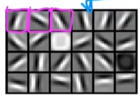

3. **second hidden layer**：first hidden layer的特征被输出到 second hidden layer 再提取一些特征。

   查看secend hidden layer中的内容发现，神经网络正在将许多小线段组合在一起，以寻找面部的一部分。

   3.1 第一个神经元检测眼睛

   3.2 第二个神经元检测鼻子

   

   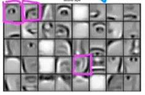

4. **third hidden layer**：second hidden layer的特征被输出到 third hidden layer 再提取一些特征。

   查看third hidden layer中的内容发现，神经网络正在聚合不同的面部特征，试图检测出面部形状存在与否。

   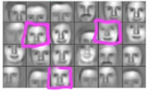

5. **output layer**：输出某个人物的概率

   最终检测面部与不同面部的对应程度，创建了一组丰富的特征，用来帮助output layer确定图片中人物的身份。

神经网络一个显著的特点是能自行学习隐藏层的特征，在这个例子中，没人告诉他第一层应该寻找短线段，第二层应该寻找眼睛、鼻子，第三层寻找面部形状。神经网络能从数据中自行找出这些特征。

需要注意的是，first hidden layer 一次检测的区域很小，secend hidden layer 一次检测的区域中等，third hidden layer 一次检测的区域很大

- 例2：检测汽车

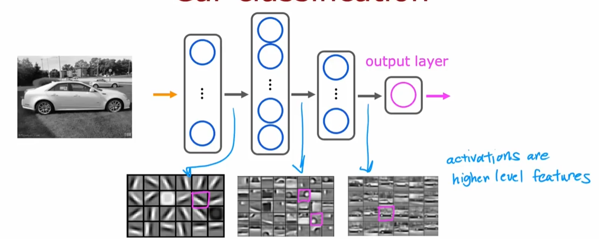

也是同理，只不过first hidden layer仍然是检测线段， secend hidden layer变成了检测轮胎、车门， third hidden layer变成了检测 汽车。

只需输入不同的数据，神经网络就会自动学习 检测不同的特征，以便尝试进行汽车预测、人物识别或其他任何特定的训练任务。

### 1.4 Neural Network layer

> 在本视频中，将学习如何构建神经元

- **layer 0 / input layer** 

$\vec{x}$ 输入4个数字【197，184，136，214】

- **layer 1 / hidden layers** 

> 所有符号需加个  $^{[1]}$

每个神经元输入4个数字$\vec{x}=[197，184，136，214]$，每个神经元实现逻辑回归。

1. 第1个隐藏神经元，输入$\vec{x}$，有两个参数$\vec{w}_{1}^{[1]},b_{1}^{[1]}$，根据逻辑回归公式$g(z)=\frac{1}{1+e^{-(z)}}$ ，输出激活值$a_{1}^{[1]}=g(\vec{w}_{1}^{[1]}·\vec{x}+b_{1}^{[1]})=0.3$
2. 第2个隐藏神经元，输入$\vec{x}$，有两个参数$\vec{w}_{2}^{[1]},b_{2}^{[1]}$，根据逻辑回归公式$g(z)=\frac{1}{1+e^{-(z)}}$ ， 输出激活值$a_{2}^{[1]}=g(\vec{w}_{2}^{[1]}·\vec{x}+b_{2}^{[1]})=0.7$

2. 第3个隐藏神经元，输入$\vec{x}$，有两个参数$\vec{w}_{3}^{[1]},b_{3}^{[1]}$，根据逻辑回归公式$g(z)=\frac{1}{1+e^{-(z)}}$ ， 输出激活值$a_{3}^{[1]}=g(\vec{w}_{3}^{[1]}·\vec{x}+b_{3}^{[1]})=0.2$

- **layer 2 / hidden layers**

> 所有符号需加个  $^{[2]}$

> 第二层的输入是第一层的输出

每个神经元输入3个数字$\vec{a}=[0.3,0.7,0.2]$，每个神经元实现逻辑回归。

1. 第1个隐藏神经元，输入$\vec{a}$，有两个参数$\vec{w}_{1}^{[2]},b_{1}^{[2]}$，根据逻辑回归公式$g(z)=\frac{1}{1+e^{-(z)}}$ ，输出激活值$\vec{a}_{1}^{[2]}=g(\vec{w}_{1}^{[2]}·\vec{a}^{[1]}+b_{1}^{[2]})=0.84$

- **layer 4 / output layer**

if $a^{[2]}>0.5?$

yes : y=1

no: y=0

### 1.5 More complex neural networks

输出值 $\vec{a}^{[n]}=\vec{w}_{j}·\vec{a}^{[n-1]}+b_{j}^{n}$

### 1.6 inference:making predictions (forward propagation)

- 例：手写数字识别

1. layer 1

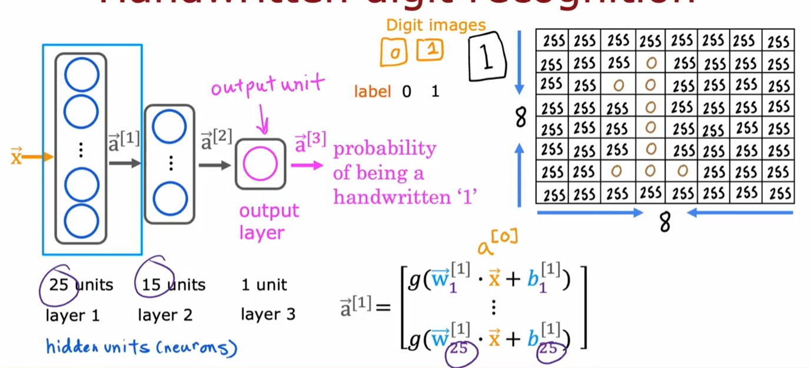

2. layer 2

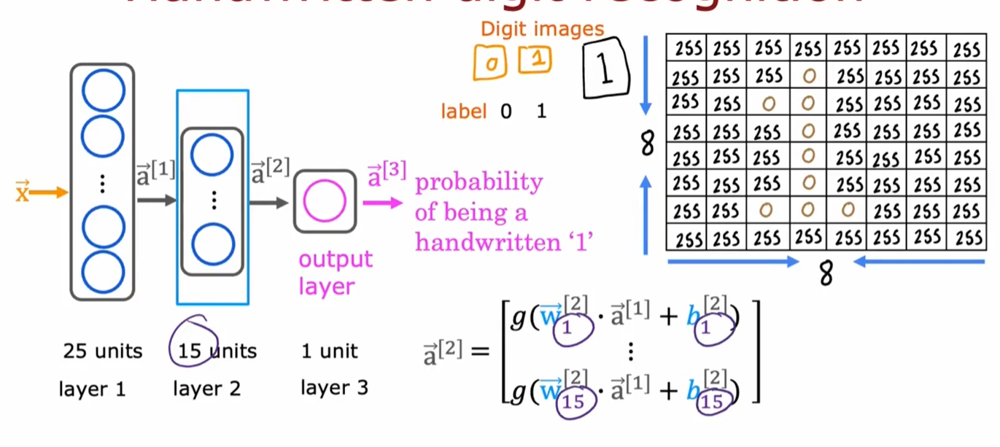

3. layer 3

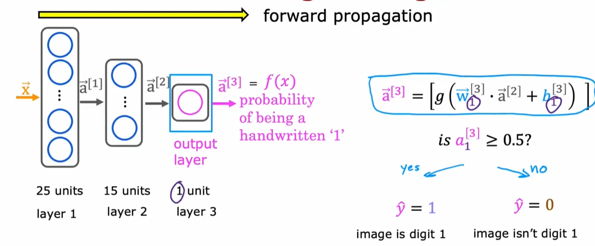

## 二、TensorFlow implementation

### 2.1 Inferfence in Code

- 例1：咖啡烹饪

x轴是烹饪温度，y轴是烹饪时间， 在合适范围内的"x" 才是好喝的咖啡， 范围外的"○" 是难喝的咖啡

**代码**：input 温度200、时间17， 判断咖啡是否好喝？

- 例2：手写数字识别

**代码**：input 图片像素，判断数字是否为1？

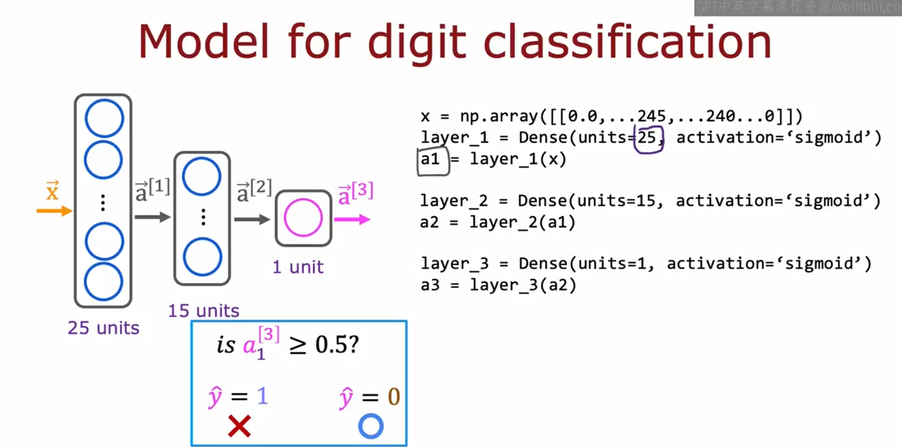

### 2.2 Data in TensorFlow

- numpy中如何表示数据

- TensorFlow中如何表示数据

### 2.3 Building a neural network

使用 Sequential(layer_1,layer_2,layer_3) 就可以把不同层连接起来，组成神经网络

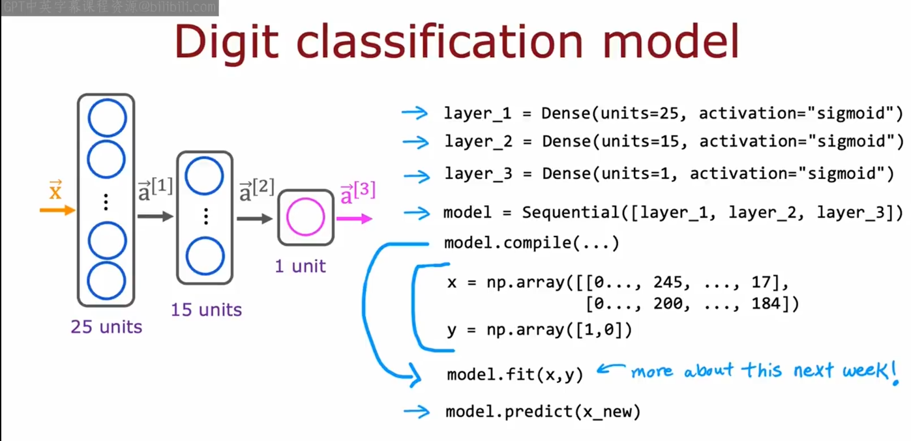

~~~python
layer_1 = Dense(units=25, activation="sigmoid")
layer_2 = Dense(units=15, activation="sigmoid")
layer_3 = Dense(units=1, activation="sigmoid")
model = Sequential([layer_1,layer_2,layer_3])
~~~

也可以整合成一行代码

~~~python
model = Sequential([Dense(25, "sigmoid"), Dense(15, "sigmoid"), Dense(1, "sigmoid")])
~~~

### 2.4 Forward prop in a single layer

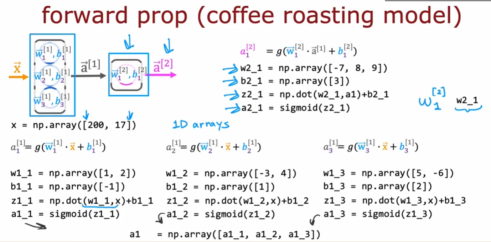

w1_1：假设为[1,2]

b1_1：假设为[-1]

w1_2：假设为[-3,4]

b1_2：假设为[1]

w1_3：假设为[5,-6]

b1_3：假设为[2]

### 2.5 General implement of ofward propagation

一开始，先有$\vec{w}$向量， 然后W是$\vec{w}_1^{[1]}、\vec{w}_2^{[1]}、\vec{w}_3^{[1]}$向量组成的2x3矩阵。

b再组成一个1x3矩阵。

input 为 [-2,4]的1x2矩阵。

W.shape[1]返回列数，就是3列。

np.zeros(units)把这3列归零, 变为[0,0,0]

for循环操作，W[a,b]是选择a行b列，W[:,j] 选择j列。

然后算出 a_out[j] 激活值。

最后使用sequential() 把神经元整合成神经网络	

## 三、Speculations on artificial general intelligence（AGI）

### 3.1 Is there a path to AGI?

**1. ANI（狭义人工智能）**

- **定义**

ANI 是指专门设计用于执行特定任务的人工智能系统。它只能在预先定义的范围内工作，无法超越其编程和训练数据的限制。

- **特点**

**任务特定性**：ANI 只能完成特定任务，例如语音识别、图像分类、推荐系统等。

**无自主意识**：ANI 不具备自我意识或理解能力，只能根据输入数据执行预设的操作。

**广泛应用**：ANI 是目前人工智能技术的主流形式，已广泛应用于各行各业。

**AGI（通用人工智能）**

- **定义**

AGI 是指具备与人类相当或超越人类智能水平的人工智能系统。它能够理解、学习和执行任何智力任务，具备自主意识和泛化能力。

-  **特点**

**通用性**：AGI 可以像人类一样处理各种任务，而不仅限于特定领域。

**自主意识**：AGI 具备自我意识和理解能力，能够进行抽象思考和创造。

**适应性**：AGI 能够适应新环境和新任务，无需重新编程。

## 四、Vectorization（optional）

### 4.1 How neural networks are implement efficiently

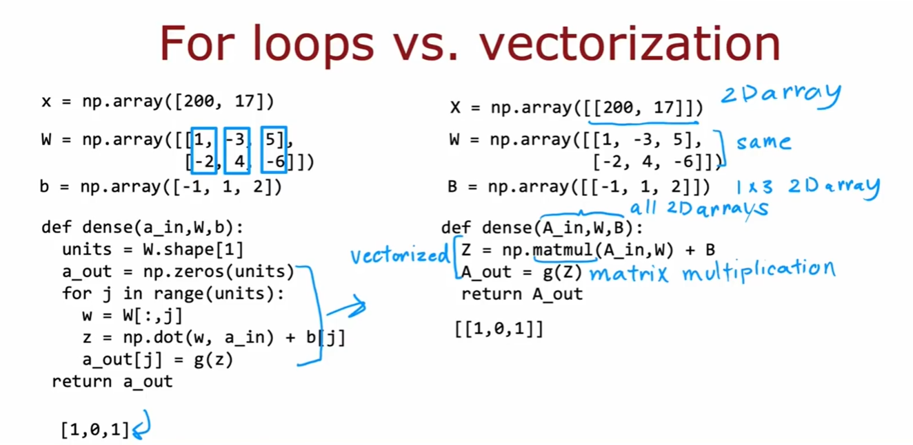

### 4.2 Martix multiplication

### 4.3 Martix multiplication rules

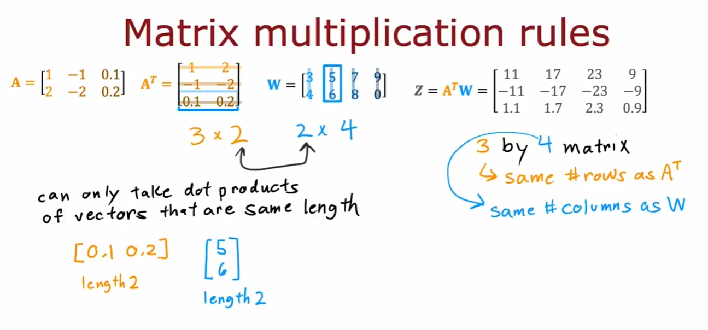

### 4.4 Martix multiplication code

## 五、Neural Network Training

### 5.1 TensorFlow implementation

### 5.2 Training Data

1. **Define the model**

2. **Specify loss and cost functions**

3. **Training data to minimize**

## 六、Activation Functions

### 6.1 Alternatives to the sigmoid activation

- **Sigmoid activation functions**

- **ReLu activation functions**

- **Linear activation function / No activation function**

### 6.2 Choosing activation functions

#### 6.2.1 **Output layer**

根据不同的情况，选择不同的激活函数

- Binary classification情况：预测结果 0 / 1，结果非0即1，activation function使用Sigmoid

- Regression 情况：预测股票明天变化幅度，可正、可负、可零。activation function使用Linear activation function

- Regression 情况：预测房价，只能为正。activation function使用ReLU	

#### 6.2.2 **Hidden layer**

现如今更多的情况 是使用 ReLU activation function，很少使用Sigmoid activation function  仅仅在个别二分类的情况才会使用。

原因：①ReLU只需要计算 max(0,1)，而Sigmoid需要进行指数运算和逆运算。 ②ReLU只有左侧是平坦的，而Sigmoid 左侧和右侧都平坦，这会造成在进行梯度下降的时候，出经常出现平坦，从而减慢学习速度

### 6.3 Why do we need activation functions?

神经网络需要激活函数，如果都使用线性激活函数（即不使用激活函数），神经网络就无法工作

如何我们对神经网络中所有的节点都使用线性激活函数，这个神经网络将会变得与线性回归无异。

这就是都是用线性函数的话，神经网络并不能学习到比线性函数更复杂的东西

1. 神经网络中 都使用线性回归，output中也使用线性回归 → 等同于 Linear Regression
2. 隐藏层使用线性回归，output中使用Sigmoid → 等同于 Logistic Regression

一个重要的经验法则是，不要在hidden layer中使用线性激活函数，而是要使用ReLU激活函数

## 七、Multiclass Classfication

### 7.1 Multiclass

多分类问题，是指有超过两个可能的输出标签，而不仅仅是0 or 1

- 二分类问题决策边界

- 多分类问题决策边界

### 7.2 Softmax

softmax回归算法 是逻辑回归的泛化，逻辑回归是一种二分类算法，而softmax适用于多分类场景

- Logistic regression

- Softmax regression

**softmax公式**

- Logistic Regression Cost   vs  softmax Regression cost

> $a_j$越大，损失越小。 j=1,2,3....n

### 7.3 Neural Network with Softmax output

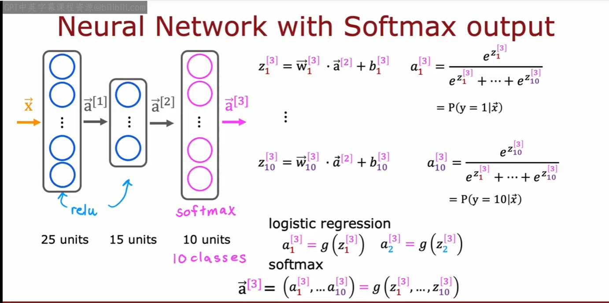

在logistic Regression中，计算$a_1$只需要用到$g(z_1)$，$a_2$只需要用到$g(z_2)$。

而在softmax中，计算$a_1$需要用到$z_1,z_2,....z_{10}$

### 7.4 Imporoved implementation of softmax

- Numerical Roundoff Errors

虽然在数学上，这两种情况是等价的，但在代码中

是存在误差的。

在代码中，使用下面这种，就不会有误差了，只是代码变得稍微不那么易读

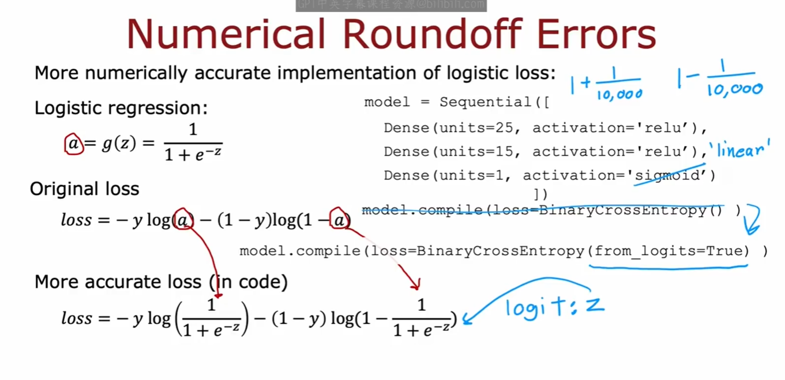

Original loss 相当于 $x=\frac{2}{10000}$，而More accurate loss相当于$x=(1+\frac{1}{10000})-(1-\frac{1}{10000})$

- 应用于softmax

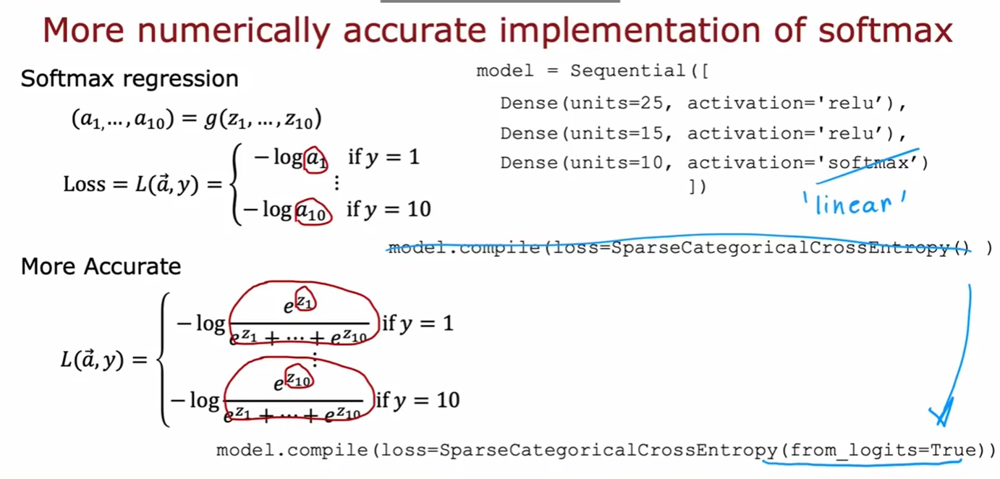

上下两段代码都在做相同的事情，只是下面的数值更精确，不会出现四舍五入的情况，但易读性不如上面

### 7.5 Classification with multiple outputs(Optional)

- 多类分类（multi-class classification）：输出标签可以是两个或更多个

- 多标签分类（multi-label classification）：每个图像有多个标签

传统的方法：创建3个神经网络，output 1个数，输出car、bus、pedestrain

多标签分类：创建1个神经网络，output 1个向量，向量中包含3个数 [car,bus,pedestrain]

## 八、Additional Neural Network Concepts

### 8.1 Advanced Optimization

左图：梯度下降步长太小了，w 或 b 在相同方向上保持移动，Adam算法会自动增加α的值，让步长变大

右图：梯度下降步长太大了，w 或 b 保持震荡，Adam算法会自动缩小α的值，让步长变小

- Adam算法：Adaptive Moment estimation  

Adam算法不使用单一的全局学习率α，它可以自动调节学习率 为每个模型使用不同的学习率。

有11个α

- Code

### 8.2 Additional Layer Types

到目前为止我们使用的都是全连接层（dense layer type），每一层的每个神经元，都是从前一层的所有激活中获取的输入

但在某些工作中，会使用不同的layer。

- Convoutional Layer（卷积层）

例1：

这个例子中，第1个蓝色的神经元 对应1个区域，第二个粉丝的神经元对应4个区域......， 每个神经元都不会查看所有的像素，而是查看图像部分的像素。 

这样做有两个好处：

1. 快速计算
2. 仅需要很少的数据，减少过拟合

例2：

 把心电图的信号分为了$x_1 \sim x_{100}$。

1. 第1个hidden layer / convolutional layer（卷积层）中，有9个神经元。

   第1个神经元只看$x_1 \sim x_{20}$,第2个神经元只看$x_11 \sim x_{30}$，......

2. 第2个hidden layer / convolutional layer（卷积层）中，有3个神经元。

   第1个神经元只看$a_1 \sim a_{5}$,第2个神经元只看$a_3 \sim a_{7}$，......

3. 最后的output layer / Sigmoid layer，输入$\vec{a}^{[2]}$的3个值，输出 是否有心脏病？

> 神经元有很多架构可以选择，比如神经元该看多大的输入窗口，神经元选择多少个。通过有效的选择参数，可以比全连接更有效。

## 九、Backprop Intuition（Optional）

### 9.1 What is a derivative

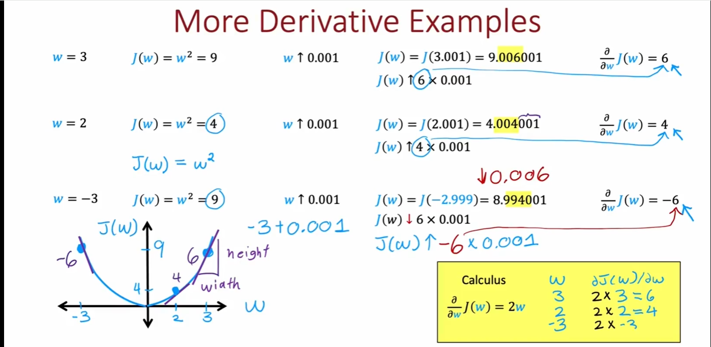

### 9.2 Computation Graph

- 前向传播图

- 反向传播图

一开始想知道 $\frac{\partial j}{\partial w}$，于是需要先知道$\frac{\partial j}{\partial c}$，于是需要先知道$$\frac{\partial j}{\partial b}$$，于是需要先知道$$\frac{\partial j}{\partial a}$$，于是需要先知道$\frac{\partial j}{\partial d}$

之所以使用反向传播图，是因为他很高效，计算一次就能存储起来，下次可以直接用。

有N：10000个参数， P：100000个参数的时候。

只需要计算 N+P=10000 + 100000=110000个步骤，就能计算出导数， 而不是需要每一步都重新计算。

### 9.3 Larger Neural Network Example

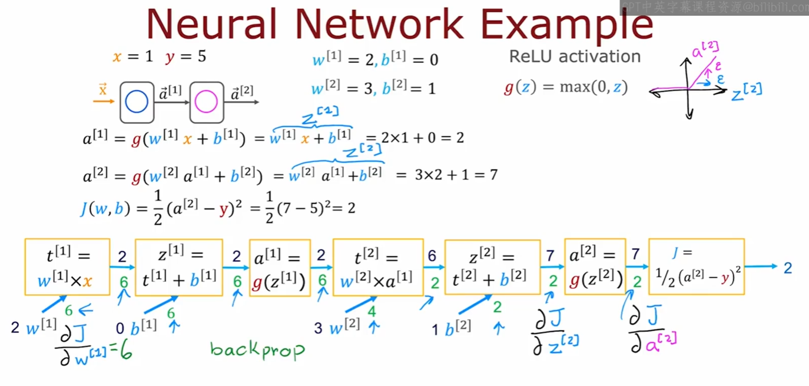

## 十、Advice for applying machien learning

### 10.1 Deciding what to try next

当你需要预测放假时，出现了一个不可接受的错误，你下一步会怎么做？

1. 收集更多数据 ?
2. 尝试减小特征 ?
3. 尝试增加特征 ?
4. 添加更多特征 ?
5. 减小$\lambda$ ?
6. 增加$\lambda$ ?

## 十一、Evaluating and choosing models

### 10.1 Evaluating a model

在预测房屋价格的模型中，发现这个模型太波动了。

仅仅用 size 这一个特征，不太合适，增加特征的话，高维图像怎么画？

- **Evaluating a model**

使用测试集评估模型性能。70%的training set，30%的test set。 一般按照37分 或者28分

当想最小化cost function J 时，可通过下面两个公式来计算误差

在本例中$j_{test}$的误差很小，是红x的点。 而$J_{test}$的误差很大，是紫色的点。

另一个方法，是测量算法误分类的比例有多少，错误的把0分类为1 和 错误的把1分类为0。

### 10.2 Model selection and training/cross validation/test sets

- training set / test set

> 仅把数据分为两个子集 train set / test set 存在的问题

Once parameters $\vec{w},b$ are fit to the training set, the training error $J_{train}(\vec{w},b)$ is likely lower than actual generalization error. 

训练误差可能不是一个很好的指标 来衡量算法在新标本上的表现或泛化能力，特别是对于这个例子，训练误差几乎为0，这远低于实际泛化误差

$J_{test}(\vec{w},b)$ is better estimate of how well the model will generalize to new data compared to $J_{train}(\vec{w},b)$ 

例如：
$$
\begin{aligned}
d=1, \quad & f_{\vec{w},b}(\vec{x}) = w_1x + b \\
d=2, \quad & f_{\vec{w},b}(\vec{x}) = w_1x + w_2x^2 + b \\
d=3, \quad & f_{\vec{w},b}(\vec{x}) = w_1x + w_2x^2 + w_3x^3 + b \\
& \vdots \\
d=10, \quad & f_{\vec{w},b}(\vec{x}) = w_1x + w_2x^2 + \cdots + w_{10}x^{10} + b \\
\end{aligned}
$$
算法表明，当d=5 时 $J_{test}(\vec{w}^{<5>},b^{<5>})$的误差最小。 但问题是如果你仅仅根据test set的结果选择d=5的公式，$J_{test}(\vec{w}^{<5>},b^{<5>})$ 是过于乐观的，低于实际的泛化误差。

w,b are overly optimistic estimate of generalization error on trainining data 

- Training set  / cross validation set / test set

> 更为合理的是 把数据分为 Training set  / cross validation set / test set  这三个子集

training set （训练集） ： 60%。

cross validation set / validation set / development set / dev set （交叉验证集）：20%。

test set （测试集） ：20%。

例：

1. train set上选出合适的w,b 
2. dev set 选出d 即用哪个公式
3. 确定了最终模型后，在test set上进行测试，得到一个相对公平的泛化误差估计值。

## 十二、Bias and variance

### 12.1 Diagnosing bias and variance

### 12.2 Regularization and bais/variacne

### 12.3 Establishing a baseline level of performance

### 12.4 Learning curves

### 12.5 Deciding what to try next revisted

### 12.6 Bias/variance and neural networks

## 十三、Machine learning development process

### 13.1 Iterative loop of ML development

### 13.2 Error analysis

### 13.3 Adding data

### 13.4 Transfer learning : using data from a different task

### 13.5 Full cycle of a machine learning project

### 13.6 Fairness,bias ,and ethics

## 十四、Skewed datasets(optional)

### 14.1 Error metrics for skewed datasets

### 14.2 Trading off precision and recall

## 十五、Decision Trees

### 15.1 Decision Tree Model

### 15.2 Learning Process

## 十六、Decision Tree Learning

### 16.1 Measuring purity

### 16.2 choosing a split : Information Gain

### 16.3 Putting it together

### 16.4 Using one-hot encoding of categorical features

### 16.5 Continuous valued features

### 16.6 Regression Trees（optional）

## 十七、Tree ensembles

### 17.1 Using multiple desicion trees

### 17.2 Sampling with replacement

### 17.3 Random forest algorithm

### 17.4 XGBoost

## 十八、Conclusion

### 18.1 When to use decision trees

