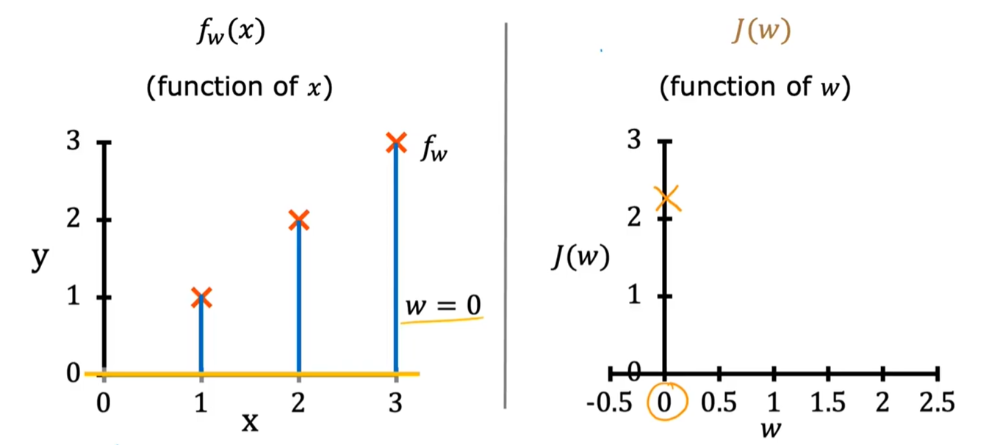

第一部分 有监督的机器学习：回归与分类

## 一、监督式机器学习与非监督式机器学习

### 1. 什么是机器学习？

定义：赋予计算机无需明确编程就有能力进行学习的研究领域——Arthur Samuel

Arthur Samuel编写了一款跳棋程序，通过让计算机下数万局跳棋，学习哪一步是“好棋”，哪些是“臭棋”，从而让计算机成为优秀的跳棋玩家。


思考：计算机下一万局棋 vs 计算机下10局棋，哪个对计算机的帮助大？

当然是一万局棋。**给算法的学习机会更多，算法的表现就越好**


#### 机器学习算法分类

1. 监督学习（Supervised learning）

> 监督学习是机器学习中最常见的类型之一。在这种学习模式下，算法从标记的训练数据中学习，即每个训练样本都有一个与之相关联的输出标签。通过分析训练数据，算法尝试找到输入和输出之间的关系，以便当提供新的、未见过的数据时，能够预测出正确的输出。监督学习主要用于分类和回归问题，例如邮件分类（垃圾邮件或非垃圾邮件）和房价预测。

2. 无监督学习(Unsupervised learning)

> 与监督学习不同，无监督学习处理的是未标记的数据。这意味着训练数据没有提前定义的标签或结果。无监督学习的目标是探索数据本身的结构和模式。常见的无监督学习应用包括聚类（将数据分组为多个类别）和降维（减少数据的复杂性，同时保持其主要特征）。无监督学习有助于识别数据中的隐藏模式或自然分类。

3. 推荐系统(Recommender systems)

> 推荐系统是一种特殊类型的信息过滤系统，旨在预测用户对商品或服务的偏好评级。它们通过分析用户过去的行为（如购买历史、评分、浏览历史）来实现。推荐系统可以使用监督学习、无监督学习或混合方法来构建。它们广泛应用于电子商务、视频共享平台和社交媒体网站，帮助提高用户满意度和保持用户粘性。

4. 强化学习(Reinforcement learing)

> 强化学习是一种算法，其中学习者（代理）通过与环境互动来学习如何在给定情境下做出最佳决策。与监督学习和无监督学习不同，强化学习不依赖于预先标记的数据集。相反，代理通过试错来探索空间，并根据其行为的结果接收奖励或惩罚。这种方法使得强化学习非常适合解决决策过程问题，如自动驾驶汽车、游戏玩家和机器人导航。


#### 学习这门课的目的

学习机器学习算法就像学习如何正确的使用工具最先进的锤子和钻头来建造楼房，避免在错误的方向浪费时间。


### 2. 监督学习（supervised learning）

监督学习(supervised learning algorithms)：学习预测 输入(x)→输出(y) 映射算法。

> 监督学习需要人为的给算法提供实例来学习

| input           | output            | application  |
| --------------- | ----------------- | ------------ |
| 电子邮件        | 垃圾邮件？（0/1） | 垃圾邮件过滤 |
| 音频            | 语音转文本        | 语音识别     |
| 英语            | 中文              | 翻译         |
| 广告、用户 信息 | 点击？（0/1）     | 在线广告     |
| 图像、雷达 信息 | 其他汽车位置      | 自动驾驶     |
| 手机外观划痕图  | 缺陷？（0/1）     | 视觉检查     |

最初：算法学习 输入(x)→输出(y)。

最终：算法 接收全新的输入(x) → 生成全新的输出(y)。


#### 回归算法（regression）（房价预测）

> 回归算法（regression）：从**无限**可能的结果中预测一个数字。
>
> 这个房价可能是1~999999.999，用回归来预测出 房价是180，数值是**连续**的。

横轴是房屋大小，纵轴是价格，我们想知道，当面积为750的时候，价格为多少？


方法一：拟合一条直线，通过直线可以看出，当面积为750的时候，价格为180


方法二：拟合一条曲线，通过曲线可以看出，当面积为750的时候，价格为230


算法因为选择了不同的算法，从而得到了不同预测结果的房价，从本课程的后面，你会看到如何决定拟合一条直线、曲线、或是更复杂的函数到数据上。


#### 分类算法（classfication）（乳腺癌检测）

> **分类算法**：从**有限**可能的结果中预测出类别（0、1、2...）。数值是**离散**的。


一开始收集到很多数据，用0代表良性 、1代表恶性。或者用 ○代表良性、x代表恶性。

然后来了一个新数据，来预测它是良性还是恶性。


总结一下：分类算法（classfication）预测类别（categories）。

categories不一定是数字，他可以是非数字的。例如①预测图片是猫还是狗 ②预测癌症类型早期、中期、晚期

categories也可以是数字的：用0、1、2表示不同的类别。


- 1个input 预测 output

肿瘤尺寸【input 1】 → 肿瘤是良性还是恶性【output 】


- 2个input 预测 output

肿瘤尺寸【input 1】+患者年龄【input 2】→ 肿瘤是良性还是恶性【output】

算法拟合一条边界线，将恶性肿瘤和良性肿瘤区分开。


- 多个input 预测 output

肿瘤团块厚度【input 1】+ 细胞大小【input 2】+ 细胞形状【input 3】........ →  肿瘤是良性还是恶性【output 】


### 3.无监督学习(unsupervised learning)

> 无监督学习(unsupervised learning)：探索数据本身的结构，寻找数据中的模式和关系


**监督学习 vs 无监督学习**


左图是监督学习，有x→y的映射，有标签的数据，知道肿瘤的大小(input)和良性恶性(output)
右图是无监督学习，只有x 没有y，无标签的数据，不知道肿瘤是良性还是恶性的


无监督学习，不被要求对肿瘤做出诊断，因为我们没有y标签，与之相对的，我们的工作是找到一些结构化的模式，发现一些有趣的东西。我们称之为无监督学习，是因为我们不试图监督每个算法，为每个算法提供正确的答案，而是要求算法自己找出数据中有趣的模式或结构。


#### 聚类(Clustering)

> 聚类：处理无标签数据，并自动将他们分组到簇中。


- **例子1：聚类算法-谷歌新闻**

谷歌新闻，就是把成千上万的报道分组到一起


算法在没有监督的情况下，自己找出同一类的新闻，并归类。


- **例子2：聚类算法分析DNA**


每一列代表一个人的基因表达。
通过聚类算法，可以把相似基因的人分为同一组。A组眼睛是蓝色的，B组爱吃蔬菜，C组擅长运动。


- **例子3：客户群体分组**


通过客户信息 为客户进行分组：①想提升技能、知识组 ②想学习AI组 ③想进一步发展职业组


#### 异常检测(Anomaly Detection)

> 异常检测：识别数据集中的异常的观察值。这对于识别欺诈行为、网络入侵、系统故障等非常重要

#### 降维(dimensionality reduction)

> 降维：将大的数据集压缩成小的数据集 减少变量的数量，并尽可能少的丢失数据

## 二、线性回归单变量（Linear Regression with one Variable）

### 1. 线性回归模型

线性回归模型：用一条直线模拟数据，也是当今世界使用最广泛的算法


#### 例：房屋价格预测

> 假设你是个房产中介，如何确定一个房子的价格呢？你能做的事情，就是在已有的房产数据中，构建一个线性回归模型，模型拟合一条直线到数据上，可以看到 当房屋的面积为1250时，价格为220K。


这就是监督学习。你首先通过提供带有正确答案的数据来训练你的模型，你首先提供了房屋的面积和价格。

> - 左边：数据可视化图。  
>
> - 右边：数据表。
>
>   第一个训练示例：x=2104，y=400 → (2104,400)
>   也可表示为：(x^(1)^,y^(1)^)
>
>   第二个训练示例：x=1416，y=232 → (1416,232)
>   也可表示为：(x^(2)^,y^(2)^)
>
>   第i个输入：x^(𝑖)^
>   第i个输出：y^(𝑖)^


#### 监督学习工作流程

将训练集（training set）输入到学习算法（learning algorithm）中，然后你的监督学习算法将生成函数f，f的工作是接收新的输入x并输出一个预测值$\hat{y}$。

f：模型。

x：输入值。

$\hat{y}$：输出值、预测值。


#### f 的数学公式

$$
𝑓𝑤,𝑏(𝑥)=𝑤𝑥+𝑏 \\
或 f(x)=wx+b
$$


选择不同的w和b，会生成不同的拟合函数。


在线性回归中，通过模型训练 由给定的x、y 来确定未知的 w和b，使$\hat{y}$ 尽可能的接近y(𝑖)


### 2. 成本函数公式（平方误差公式）

- Find w,b：$\hat{y}^{(i)}$ is close to $y^{(i)}$ for all $(x^{(i)},y^{(i)})$


- 成本函数：Squared error cost function

成本函数 $J(\theta)$ 用于衡量模型的性能，特别是衡量模型预测值与实际值之间的差异。常用的成本函数之一是均方误差（Mean Squared Error, MSE），其公式如下：
$$
J(w,b) = \frac{1}{2m} \sum_{i=1}^{m} (\hat{y}^{(i)} - y^{(i)})^2\\在这个例子中：
\hat{y}^{(i)}=f_{w,b}(x^{(i)})=wx^{(i)}+b\\
$$
其中：
- m  是训练样本的数量。
- $ \hat{y}^{(i)} $ 是模型对第  i  个训练样本的预测值。
- $ y^{(i)} $ 是第  i  个训练样本的实际值。


### 3. 成本函数直观（简化）

- 回顾一下成本函数

1. 你想要将直线拟合到数据上，因此有了模型：$f_{w,b}(x)=wx+b$
2. 选择不同的 w,b，将得到不同的直线。你想要找到最佳的w,b，使其更好的拟合数据。
4. 测量模型的预测值和实际值的差异，成本函数J：$J(w,b) = \frac{1}{2m} \sum_{i=1}^{m} (\hat{y}^{(i)} - y^{(i)})^2$

5. 目标：使成本函数$J(w,b)$最小


- **简化模型：取b=0，观察$f_w(x)=wx$图像如何变化、J(w)的图像如何变化** 

1. 当w=1，b=0时


$$
当w=1,b=0时\\
J(w,b) = \frac{1}{2m} \sum_{i=1}^{m} (\hat{y}^{(i)} - y^{(i)})^2= \frac{1}{2m} \sum_{i=1}^{m} (wx^{(i)} - y^{(i)})^2 \\=\frac{1}{2m} ([1*1-1]^2+[1*2-2]^2+[1*3-3]^2
=\frac{1}{2*3}(0^2+0^2+0^2)=0
$$


2. 当w=0.5，b=0时
   
   $$
   当w=0.5,b=0时\\
   J(w,b) = \frac{1}{2m} \sum_{i=1}^{m} (\hat{y}^{(i)} - y^{(i)})^2= \frac{1}{2m} \sum_{i=1}^{m} (wx^{(i)} - y^{(i)})^2 \\=\frac{1}{2m} ([0.5*1-1]^2+[0.5*2-2]^2+[0.5*3-3]^2
   =\frac{1}{2*3}((-0.5)^2+(-1)^2+(-1.5)^2)≈0.58
   $$
   


3. 当w=0，b=0时
   

$$
当w=0,b=0时\\
J(w,b) = \frac{1}{2m} \sum_{i=1}^{m} (\hat{y}^{(i)} - y^{(i)})^2= \frac{1}{2m} \sum_{i=1}^{m} (wx^{(i)} - y^{(i)})^2 \\=\frac{1}{2m} ([0*1-1]^2+[0*2-2]^2+[0*3-3]^2
=\frac{1}{2*3}((-1)^2+(-2)^2+(-3)^2)≈2.3
$$


4. 取b=0，通过不断的调整w，得到这样一条成本函数曲线


在取b=0的情况下，若想让成本函数取最小值，则需要令w=1，这样才能得到一条相对比较好的 拟合数据的曲线。


### 4. 成本函数可视化（完整版）

> 上个例子中，我们令b=0，固定了b的位置，简化了成本函数，得到了一个二维曲线图像

现在我们回到完整版的成本函数，包含w,b，不将b设为0，成本函数J变成了三维图形。


底部的 两个坐标轴：w,b。

曲面上的任何一点，都代表了特殊的w和b。

碗的底部高度最低，处于正中心，成本函数J最小，预测效果最好。
碗的碗边高度最高，越远离中心，成本函数J最大，预测效果最差。


用等高线理解，每条等高线代表高度相等，也就是J相同


- 可选实验室


### 5. 可视化示例

- 例1：w=-1.5，b=800


- 例2：w=0，b=360


- 例3：w=-0.15，b=500


- 例4：w=0.13，w=71


## 三、梯度下降（Gradient Descent）

在上一节中，我们尝试不同的参数w和b，试图找到能使成本函数（cost function） $J_{(w,b)}$ 最小的参数，于是有了 梯度下降（gradient descent）


### 1. 梯度下降（Gradient Descnet）概述

梯度下降算法是一种可以使任何函数最小化的算法，不局限于$J_{(w,b)}$，对于任何的函数$J_{(w_1,w_2,w_3....,w_n,b_1,b_2,b_3....b_n)}$都可以找到最小值。

你需要做的，仅仅是给w和b一些猜测的初始值。在线性回归（linear regression）中，初始值不重要，一般设为0。

对于梯度下降算法，你要做的是每次都稍微修改参数w和b，以尝试减少cost function，直到 $J$最终接近（局部）最小值。

需要注意的是，对于某些不是碗形的函数，可能存在多个（局部）最小值


- 梯度下降过程

站在一个丘陵（初始位置），需要下山。

环顾360°，每一步都选择下降最陡的那一步。


- 梯度下降存在的问题

由于初始位置不同，可能迈出不同方向的布，从而达到不同的局部最小值。


### 2. 实现梯度下降（Implement Gradient Descent）

- 梯度下降算法（Gradient Descnet algorithm）

$$
w = w - \alpha \cdot \frac{\partial }{\partial w}J_{(w,b)}\\
b = b - \alpha \cdot \frac{\partial }{\partial b}J_{(w,b)}
$$

1. α：学习率，介于0~1之间，控制下坡的步伐大小。

   > 如果α很大，代表每次下山迈出的步子很大，策略激进，试图取得巨大的进步。
   >
   > 如果α很小，代表每次下山迈出的步子很小，策略保守，试图取得小进步。

2. $\frac{\partial }{\partial w}J_{(w,b)}$：下降步伐的方向。同时与α结合，也决定了下降的步伐大小。


梯度下降算法，就是不断更新w和b，直到算法收敛 达到局部最小值。


- 注意：代码中，w和b 需保持同步跟新


### 3. 梯度下降的直观理解（Gradient Descent Intuition）

问题：学习率α是干什么的？  偏导数$\frac{\partial }{\partial w}J_{(w,b)}$是干什么的？ 为什么当他们相乘，这个结果会更新w,b？


- 一个简化版的例子，只有一个参数w
  $$
  成本函数：J_{(w)}\\
  更新过程：w = w - \alpha \cdot \frac{\partial }{\partial w}J_{(w)}\\
  目标：最小化J_{(w)}
  $$
  

  1. 当初始点在右边这个位置，斜率为正，学习率α又是大于0的，所以 [α·斜率]始终为一个正数，w持续减小，J(w)持续减小，最终到达min J(w)

  


2. 当初始点在左边这个位置，斜率为负，学习率α又是大于0的，所以 [α·斜率]始终为一个负数，w持续增加，J(w)持续减小，最终到达min J(w)


### 4. 学习率α

学习率α的选择对梯度下降有巨大的影响，如果学习率选择不当，梯度下降可能无法工作。

让我们看看，选择的学习率α 过大/过小 会发生什么？ 


- 学习率α过小

如果你的学习率α过小，假设为0.000001，那么你的导数将乘以一个非常小的数，这会导致每一步的步长都非常小，这个过程虽然会持续降低J(w)，但会非常缓慢，要花费很长时间。


- 学习率α过大

如果学习率α过大，会导致步长过大，从而跃过了min J(w)，并且在下一次迭代中，再次选择巨大的步长 跃过min J(w)，实际上 是离min J(w)越来越远的，永远无法达到最小值min J(w)，最终无法收敛 甚至会发散。


- 当初始位置恰好为局部最小值


由于斜率是0，因此无论学习率α的值为多少，都不会改变w的值
$$
w=w-α·0 \\
w=w
$$


- 学习率固定的情况下，最终会达到局部最小值


1. 第一步，斜率$\frac{\partial }{\partial w}J_{(w)}$很大，步长α·$\frac{\partial }{\partial w}J_{(w)}$很大
2. 第二步，斜率$\frac{\partial }{\partial w}J_{(w)}$减小，步长α·$\frac{\partial }{\partial w}J_{(w)}$减小
3. 第三步，斜率$\frac{\partial }{\partial w}J_{(w)}$进一步减小，步长α·$\frac{\partial }{\partial w}J_{(w)}$进一步减小
4. .....
5. 最后一步，接近局部最小值，斜率为0，步长为0，不再更新


### 5. 线性回归中的梯度下降

使用平方误差成本函数（squared error cost function）和梯度下降算法（gradient descent ）来训练线性回归(linear regression)模型，使一条直线拟合我们的数据


线性回归模型（Linear regression model）：$f_{w,b}(x) = wx + b$

成本函数（Cost function）：$J(w, b) = \frac{1}{2m} \sum_{i=1}^{m} (f_{w,b}(x^{(i)}) - y^{(i)})^2$

梯度下降算法（Gradient Descent algorithm）：

​	重复直到收敛{

​		$w = w - \alpha· \frac{\partial}{\partial w} J(w, b)= w - \alpha· \frac{1}{m} \sum_{i=1}^{m} (f_{w,b}(x^{(i)}) - y^{(i)})x^{(i)}$

​		$b = b - \alpha ·\frac{\partial}{\partial b} J(w, b) = b - \alpha \frac{1}{m} \sum_{i=1}^{m} (f_{w,b}(x^{(i)}) - y^{(i)})$

​	}


> - 详细数学公式推导过程（可选）
>
> 1. **成本函数**
>
> $$
> J(w, b) = \frac{1}{2m} \sum_{i=1}^{m} (f_{w,b}(x^{(i)}) - y^{(i)})^2
> $$
> 2. **将线性回归模型$f_{w,b}(x) = wx + b$，代入成本函数**
>    $$
>    J(w, b) = \frac{1}{2m} \sum_{i=1}^{m} (wx^{(i)} + b - y^{(i)})^2
>    $$
>
> ​	3. **对 \( J(w, b) \) 关于 \( w \) 求偏导：**
> $$
> \frac{\partial}{\partial w} J(w, b) = \frac{\partial}{\partial w} \left( \frac{1}{2m} \sum_{i=1}^{m} (wx^{(i)} + b - y^{(i)})^2 \right)\\
> $$
>
> 
>
> 4. **链式法则**
>
> 链式法则是微积分中用于求复合函数导数的重要规则。对于函数 \( $h(u) = u^2$ \)，其中 \( $u = wx^{(i)} + b - y^{(i)}$ \)，链式法则告诉我们：
> $$
> \frac{\partial}{\partial w} h(u) = \frac{\partial h}{\partial u} \cdot \frac{\partial u}{\partial w}
> $$
>
> **应用到当前问题**
>
> 对于每一项 \( $(wx^{(i)} + b - y^{(i)})^2$ \)，我们可以将其看作一个复合函数：
> - 外层函数：\( $h(u) = u^2$ \)，其中 \( $u = wx^{(i)} + b - y^{(i)}$ \)。
> - 内层函数：\( $u = wx^{(i)} + b - y^{(i)}$ \)。
>
> 根据链式法则：
> $$
> \frac{\partial}{\partial w} (wx^{(i)} + b - y^{(i)})^2 = \frac{\partial}{\partial u} (u^2) \cdot \frac{\partial}{\partial w} (wx^{(i)} + b - y^{(i)})
> $$
>
> 
>
> 5. **计算偏导数**
>
> **计算外层函数的导数**
>
> 外层函数是 \( $h(u) = u^2$ \)，其导数为：
> $$
> \frac{\partial}{\partial u} (u^2) = 2u
> $$
>
> **计算内层函数的导数**
>
> 内层函数是 \( $u = wx^{(i)} + b - y^{(i)}$ \)，对 \( w \) 求偏导：
> $$
> \frac{\partial}{\partial w} (wx^{(i)} + b - y^{(i)}) = x^{(i)}
> $$
>
> **合并结果**
>
> 根据链式法则：
> $$
> \frac{\partial}{\partial w} (wx^{(i)} + b - y^{(i)})^2 = 2u \cdot x^{(i)} = 2(wx^{(i)} + b - y^{(i)}) \cdot x^{(i)}
> $$
>
> 6. **代入成本函数**
>
> 将上述结果代入成本函数的偏导数：
> $$
> \frac{\partial}{\partial w} J(w, b) = \frac{1}{2m} \sum_{i=1}^{m} 2(wx^{(i)} + b - y^{(i)}) \cdot x^{(i)}
> $$
>
> 简化后：
> $$
> \frac{\partial}{\partial w} J(w, b) = \frac{1}{m} \sum_{i=1}^{m} (wx^{(i)} + b - y^{(i)}) \cdot x^{(i)}
> $$
>
> 7. **梯度下降更新规则**
>
> 梯度下降的更新规则是：
> $$
> w = w - \alpha \frac{\partial}{\partial w} J(w, b)
> $$
>
> 将偏导数代入：
> $$
> w = w - \alpha \cdot \frac{1}{m} \sum_{i=1}^{m} (wx^{(i)} + b - y^{(i)}) \cdot x^{(i)}
> $$
>
> 8. **最终公式**
>
> 因此，\( w \) 的更新公式为：
> $$
> w = w - \alpha \cdot \frac{1}{m} \sum_{i=1}^{m} (f_{w,b}(x^{(i)}) - y^{(i)}) \cdot x^{(i)}
> $$
>
> 其中：
> - \( $\alpha$ \) 是学习率（控制每次更新的步长）。
> - \( $f_{w,b}(x^{(i)}) = wx^{(i)} + b $\) 是模型对第 \( i \) 个样本的预测值。
> - \( $y^{(i)}$ \) 是第 \( i \) 个样本的实际值。
> - \( $x^{(i)}$ \) 是第 \( i \) 个样本的特征值。
>
> - **梯度方向**：偏导数 \( $\frac{\partial}{\partial w} J(w, b)$ \) 表示 \( J(w, b) \) 在 \( w \) 方向上的变化率。
> - **更新方向**：通过减去 \( $\alpha \cdot \frac{\partial}{\partial w} J(w, b)$ \)，我们朝着使 \( J(w, b) \) 减小的方向更新 \( w \)。
> - **学习率 \( $\alpha$ \)**：控制每次更新的步长。如果 \( \alpha \) 太大，可能会错过最小值；如果 \( \alpha \) 太小，收敛速度会很慢。
>


### 6. 运行梯度下降


1. 一开始，随机选择两个参数 w,b ， 然后得到损失函数 [cost function]=77237


2. 根据梯度下降，w变一点，b变一点，得到更小的损失函数 （cost function）=45401


3. 再次根据梯度下降，w变一点，b变一点，得到更小的损失函数，最终得到最小的损失函数


这个梯度下降的过程，也被称为 批量梯度下降（Batch Gradient descent）。

Batch：在运行的每一步，都会查看所有训练样本（从1到m）。


- 可选实验室（梯度下降）


## 四、线性回归多变量[Linear Regression with Multiple Variables]

### 4.1 多个特征[Multiple features]

让我们看一个线性回归的版本，可以处理多个特征[Multiple features]


- 单变量版本[one features/variables version]


只有一个x（size of the house）用来预测y（price of the house）


$$
model：f_{(w,b)}(x)=wx+b
$$


- 多变量版本[Multiple features/variables version]

|                 | Size in feet<sup>2</sup> | Number of bedrooms | Number of floors | Age of home in years | Price(\$) in \$1000's |
| --------------- | ------------------------ | ------------------ | ---------------- | -------------------- | --------------------- |
|                 | x<sub>1</sub>            | x<sub>2</sub>      | x<sub>3</sub>    | x<sub>4</sub>        | x<sub>5</sub>         |
| x<sup>(1)</sup> | 2104                     | 5                  | 1                | 45                   | 460                   |
| x<sup>(2)</sup> | 1416                     | 3                  | 2                | 40                   | 232                   |
| x<sup>(3)</sup> | 1536                     | 3                  | 2                | 30                   | 315                   |
| x<sup>(4)</sup> | 852                      | 2                  | 1                | 36                   | 178                   |
| ....            | ....                     | ....               | ....             | ....                 | .....                 |

$x_j$：表示第j个特征

n：总共n个特征

$\vec{x}^{(i)}或x^{(i)}$：表示第i个训练数据

> $\vec{x}^{(2)}或x^{(2)}$：表示数组[1416 3 2 40 232]

$x^{(i)}_j$：表示第i个训练数据的 第j个特征

> $x^{(2)}_3$：2


$$
model:f_{(w,b)}(x)=w_1x_1+w_2x_2+w_3x_3+...+w_nx_n+b
$$

> $example: f_{(w,b)}(x)= [0.1×size+4]×[bedrooms+10]×[floors+(-2)×years]+80$

另一种更简化的写法：
$$
f_{(\vec{w},b)}(\vec{x})=w_1x_1+w_2x_2+w_3x_3+...+w_nx_n+b\\
\vec{w}=[w_1,w_2,w_3....w_n]\\
\vec{x}=[x_1,x_2,x_3....x_n]\\因此可以简化为：
f_{(\vec{w},b)}(\vec{x})=\vec{w}·\vec{x}+b
$$


### 4.2 向量化

向量化可以使你的代码更简洁，运行速度也更快

- 使用向量化[Vectorization] <font color="red">正确√</font>

**model使用向量化**
$$
f_{(\vec{w},b)}(\vec{x})=\vec{w}·\vec{x}+b
$$


python代码：

~~~python
f = np.dot(w,x) + b
~~~


原理：底层是硬件的并行运算，速度最快


**梯度下降使用向量化**
$$
\vec{w}=\vec{w} - 0.1 \vec{d}
$$
python代码：

~~~python
w = w - 0.1 * d
~~~


原理：底层并行运算


> - 不使用向量化[without vectorization]   <font color="red">错误x</font>
>
> **model不使用向量化** 
>
> 1. 逐项相加，速度很慢 <font color="red">错误x</font>
>
> $f_{(\vec{w},b)}(\vec{x})=w_1x_1+w_2x_2+w_3x_3+...+w_nx_n+b\\$
>
> ~~~python
> f = w[0]*x[0]+w[1]*x[1]+w[2]*x[2]+b
> ~~~
>
> 
>
> 2. 累加，速度仍然很慢 <font color="red">错误x</font>
>
> $$
> f_{w,b}(x) = \sum_{j=1}^{n} w_j x_j + b
> $$
>
> ~~~python
> f = 0
> for j in range(0, n):
>     f = f + w[j] * x[j]
> f = f + b
> ~~~
>
> 
>
> **梯度下降不使用向量化**<font color="red">错误x</font>
>
> 


### 4.2 多元线性回归的梯度下降

- **多元线性回归**：非向量化表示 vs 向量化表示

|              | 非向量化表示                                                 | 向量化表示                                                   |
| ------------ | ------------------------------------------------------------ | ------------------------------------------------------------ |
| 参数         | $w_1,w_2,...,w_n,b$                                          | $\vec{w}=[w_1,w_2,...,w_n],b$                                |
| 线性回归模型 | $f_{\vec{w},b}(\vec{x}) = w_1x_1 +w_2x_2+...+w_nx_n+b$       | $f_{\vec{w},b}(\vec{x}) =\vec{w}·\vec{x}+b$                  |
| 成本函数     | $J(w_1,w_2,...,w_n,b)$                                       | $J(\vec{w},b)$                                               |
| 梯度下降算法 | $w_j = w_j - \alpha· \frac{\partial}{\partial w_j} J(w_1,w_2,...,w_n,b)$<br />$b = b - \alpha· \frac{\partial}{\partial b} J(w_1,w_2,...,w_n,b)$ | $w_j = w_j - \alpha· \frac{\partial}{\partial w_j} J(\vec{w},b)$<br />$b = b - \alpha· \frac{\partial}{\partial b} J(\vec{w},b)$ |

- **梯度下降算法**：单元线性回归 vs 多元线性回归

1. **单特征/单元（one feature）**  

   $w=w-\alpha· \frac{\partial}{\partial w} J(w,b)=w - \alpha· \frac{1}{m} \sum_{i=1}^{m} (f_{w,b}(x^{(i)}) - y^{(i)})x^{(i)}$

   $b=b-\alpha· \frac{\partial}{\partial b} J(w,b)=b - \alpha· \frac{1}{m} \sum_{i=1}^{m} (f_{w,b}(x^{(i)}) - y^{(i)})$

2. **多特征/多元（n feature）**

   $w_1=w_1-\alpha· \frac{\partial}{\partial w_1} J(\vec{w},b)=w_1 - \alpha· \frac{1}{m} \sum_{i=1}^{m} (f_{\vec{w},b}(\vec{x}^{(i)}) - y^{(i)})x_1^{(i)}$

   $w_2=w_2-\alpha· \frac{\partial}{\partial w_1} J(\vec{w},b)=w_2 - \alpha· \frac{1}{m} \sum_{i=1}^{m} (f_{\vec{w},b}(\vec{x}^{(i)}) - y^{(i)})x_2^{(i)}$

   .......

   $w_n=w_n-\alpha· \frac{\partial}{\partial w_1} J(\vec{w},b)=w_n - \alpha· \frac{1}{m} \sum_{i=1}^{m} (f_{\vec{w},b}(\vec{x}^{(i)}) - y^{(i)})x_n^{(i)}$

​	$b=b-\alpha· \frac{\partial}{\partial b} J(w,b)=b - \alpha· \frac{1}{m} \sum_{i=1}^{m} (f_{\vec{w},b}(\vec{x}^{(i)}) - y^{(i)})$


| Gradient Descent（梯度下降）              | normal equation（正规方程）          |
| ----------------------------------------- | ------------------------------------ |
| 计算复杂度较低，适合处理大规模数据集      | 计算复杂度较高，适合处理小规模数据集 |
| 需要选择学习率（Learning Rate）和迭代次数 | 不需要选择学习率和迭代次数           |
| 复杂度为O(m·n)，m是样本数量，n是特征数量  | 复杂度O(n<sup>3</sup>)               |


### 4.3 特征缩放

- **为什么进行特征缩放？**


如果不在坐标轴上进行缩放， Features的图像 和 Parameters的图像 会变得很窄

而进行缩放以后， 大小则刚刚好


- **特征缩放的方法**

好的，以下是几种常见的特征缩放方法及其详细的数学公式解释：

1. **标准化（Standardization）**

$ z = \frac{x - \mu}{\sigma} $

( x \) 是原始特征值。

( $\mu$ \) 是特征的均值。

( $\sigma$ \) 是特征的标准差。

标准化将特征值调整为均值为0，标准差为1的分布。


2. **最小-最大缩放（Min-Max Scaling）**

$x' = \frac{x - x_{\text{min}}}{x_{\text{max}} - x_{\text{min}}}$

( x ) 是原始特征值。

( $x_{\text{min}}$ ) 是特征的最小值。

( $x_{\text{max}}$ ) 是特征的最大值。

最小-最大缩放将特征值缩放到一个固定范围（通常是0到1）


3. **均值归一化（Mean Normalization）**

$x' = \frac{x - \mu}{x_{\text{max}} - x_{\text{min}}}$

\( x \) 是原始特征值。

( $\mu$ \) 是特征的均值。

( $x_{\text{min}}$ ) 是特征的最小值。

( $x_{\text{max}}$ ) 是特征的最大值。

均值归一化将特征值调整为均值为0，范围在[-1, 1]之间。


3. **最大值缩放（Max Scaling）**

$ x' = \frac{x}{x_{\text{max}}} $

( x \) 是原始特征值。

( $x_{\text{max}}$ ) 是特征的最大值。

最大值缩放将每个特征值除以该特征的最大值，使得所有特征值都缩放到0和1之间。


- **什么时候进行特征缩放？**

值太大或太小时，比如-0.001 ≤ x ≤ 0.001 、 -100 ≤ x ≤ 100


### 4.4 检查梯度下降是否收敛

- **方法一：监控损失函数J的变化**

随着迭代次数的增加，损失函数J应该是越来越小的，找到那个J越来越平稳的地方


- **方法二：自动收敛性测试**

自动收敛性测试（Automatic Convergence Test）是数值分析和计算数学中的一种技术，用于自动判断迭代算法是否已经收敛到一个解。它在许多数值方法中都有应用，例如求解非线性方程、优化问题和线性代数方程组。

**主要步骤**

1. **初始条件设置**：设置初始猜测值和收敛判据（例如，误差阈值）。
2. **迭代过程**：通过迭代公式不断更新解的近似值。
3. **收敛判定**：在每次迭代后，计算当前解与前一次解之间的差异，或者计算当前解的残差。如果差异或残差小于预设的阈值，则认为算法已收敛。
4. **终止条件**：如果满足收敛判据，则终止迭代并输出结果；否则，继续迭代。

**常用的收敛判据**

1. **绝对误差**：\(|x_{k+1} - x_k| < \epsilon\)，其中\(x_k\)和\(x_{k+1}\)分别是第\(k\)次和第\(k+1\)次迭代的解，\(\epsilon\)是预设的误差阈值。
2. **相对误差**：\(\frac{|x_{k+1} - x_k|}{|x_{k+1}|} < \epsilon\)。
3. **残差**：\(|f(x_{k+1})| < \epsilon\)，其中\(f(x)\)是目标函数。

**应用领域**

- **非线性方程求解**：如牛顿法、二分法等。

- **优化问题**：如梯度下降法、牛顿法等。

- **线性代数方程组**：如共轭梯度法、雅可比迭代法等。


**优点**

- **自动化**：减少了人为干预，提高了计算效率。
- **可靠性**：通过严格的数学判据确保结果的准确性。


**局限性**

- **参数选择依赖性**：收敛速度和结果可能依赖于初始猜测值和误差阈值的选择。
- **计算成本**：某些复杂问题可能需要大量的计算资源。

自动收敛性测试在现代科学计算中具有重要的应用价值，通过自动化的方式保证迭代算法的收敛性，提高了计算的效率和准确性。


### 4.5 学习率的选择


**学习率 α 过大**：成本函数 \( J(\vec{w}, b) \) 会在迭代过程中不断增加，参数更新会在最小值附近来回震荡，无法收敛

**较小的学习率α**：当使用较小的学习率α 时，成本函数$J(\vec{w}, b)$ 应该在每次迭代中都减小,最终收敛到全局最小值。


**上图左**：显示了学习率α 过大时，成本函数 $J(\vec{w}, b)$ 随迭代次数的变化情况，表现为震荡或发散。

**上图右**：显示了学习率α 过大时，成本函数  $J(\vec{w}, b)$ 随迭代次数的变化情况，表现为发散。

**下图左**：显示了学习率α 过大时，参数 $w_1$ 在更新过程中的震荡情况。

**下图右**：显示了使用较小的学习率α 时，参数 $w_1$ 在更新过程中逐步收敛到最小值。


- **例子：学习率过大，造成发散**


### 4.6 特征方程(Feature Engineering)


Feature engineering 是指通过对原始数据进行处理和转换，创造出新的特征或变量，以便更好地表示数据中的信息，从而提高机器学习模型的效果。特征是指数据中的可测量属性或变量，例如在房价预测中，特征可能包括房屋面积、房间数量、地理位置等。

- **Feature engineering 的步骤**

1. **数据理解和探索**：首先需要深入理解数据，分析数据的分布、缺失值、异常值等。这一步通常通过数据可视化和统计分析来完成。
   
2. **特征选择**：从原始数据中选择对模型有用的特征。这一步可以通过统计方法、相关性分析或者领域知识来进行。

3. **特征构造**：通过对现有特征进行转换或组合，创建新的特征。例如，将日期特征分解为年、月、日，或者将两个特征相乘生成新的特征。

4. **特征转换**：对特征进行标准化、归一化、编码等处理，使其适合模型的输入要求。例如，对数值型特征进行标准化处理，使其均值为0，标准差为1。

5. **特征降维**：在高维数据中，使用降维技术（如主成分分析PCA）减少特征的数量，同时保留重要的信息。


- **常见的Feature engineering 技术**

**缺失值处理**：填补缺失值或删除含有缺失值的样本。

**类别编码**：将分类变量转换为数值型变量，如独热编码（One-Hot Encoding）。

**数据缩放**：对数值型数据进行标准化（Standardization）或归一化（Normalization）。

**特征组合**：通过加减乘除等操作生成新的特征。

**时间特征提取**：从时间戳中提取年、月、日、小时等信息。

**文本特征提取**：从文本数据中提取词频、TF-IDF等特征。


- **Feature engineering 的重要性**

1. **提高模型性能**：好的特征可以显著提高模型的预测性能。
2. **减少过拟合**：通过选择和构造合适的特征，可以减少模型的复杂度，从而减少过拟合风险。
3. **提高训练效率**：通过降维等方法减少特征数量，可以提高模型训练的速度和效率。


## 五、分类(Classification)

### 5.1 线性回归的局限性

- 二分类(binary classification)：有两种可能的输出


- 线性回归的局限性：无法处理二分类的问题


1. **决策边界（decision boundary）**：
   - 决策边界是分类器用来区分不同类别的阈值。在图中，决策边界由直线 \( $f_{w,b}(x) = wx + b$ \) 表示。
   - 这个直线将特征空间划分为两部分，一部分对应于分类结果为0（“no”），另一部分对应于分类结果为1（“yes”）。

2. **阈值（threshold）**：
   - 在二分类问题中，常用的阈值是0.5。如果模型的输出大于或等于0.5，则分类为1（“yes”）；如果小于0.5，则分类为0（“no”）。

3. **分类器输出**：
   - \( $\hat{y}$ \) 表示模型的预测值。
   - 如果 \( $f_{w,b}(x) < 0.5$ \)，则 \( $\hat{y} = 0$ \)。
   - 如果 \( $f_{w,b}(x) \geq 0.5$ \)，则 \( $\hat{y} = 1$ \)。

4. **存在的问题**

蓝色直线表示一个分类器的决策边界（左边4个o 右边4个x），在0.5处，左边是4个良性，右边是4个恶性。

绿色直线表示另一个分类器的决策边界（左边4个o 右边5个x），在0.5处，左边有4个良性 2个恶性，右边是2个恶性。


图中有些样本被错误分类，即实际为0的样本被分类为1，或者实际为1的样本被分类为0。

> 逻辑回归 (logistic regression):在机器学习中，逻辑回归是一种常用的二分类算法，可以用来处理类似的问题。逻辑回归通过将线性模型的输出映射到0到1之间的概率值来进行分类。


### 5.2 逻辑回归(Logistic Regression)


#### 基本概念

逻辑回归（Logistic Regression）是一种广泛应用于机器学习和统计学中的分类算法。尽管其名称中带有“回归”，但它主要用于分类任务。其核心思想是通过一个线性函数将输入特征映射到一个概率值，然后根据这个概率值进行分类。


#### 数学原理

1. **线性模型**：
   逻辑回归首先构建一个线性模型，即：
   $z = w_1 x_1 + w_2 x_2 + \cdots + w_n x_n + b$
   其中，\( $x_i$ \) 是输入特征，\( $w_i$ \) 是权重，\( b \) 是偏置。
   
   

2. **激活函数**：
   为了将线性模型的输出 \( z \) 转换为一个概率值，逻辑回归使用了 sigmoid 函数（也称为 logistic 函数）：
   $$
   \sigma(z) = \frac{1}{1 + e^{-z}}
   $$
   这个函数将 \( z \) 映射到 \( (0, 1) \) 之间的一个值，表示属于某一类别的概率。

   

3. **决策边界**：
   根据得到的概率值 \( \sigma(z) \)，可以设定一个阈值（通常为 0.5）来进行分类。如果 \( \sigma(z) \geq 0.5 \)，则预测为正类（1）；否则预测为负类（0）。


#### 损失函数

**交叉熵损失函数（Cross-Entropy Loss）**

交叉熵损失函数是一个广泛应用于分类问题的损失函数。它可以用于多分类问题和二分类问题。在多分类问题中，交叉熵损失函数的公式为：

$J(\vec{w}, b) = -\frac{1}{m} \sum_{i=1}^{m} \sum_{k=1}^{K} y_k^{(i)} \log(p_k^{(i)})$


其中：
- \( m \) 是训练样本的数量。
- \( K \) 是类别的数量。
- \( $y_k^{(i)}$ \) 是第 \( i \) 个样本属于类别 \( k \) 的实际标签（one-hot 编码）。
- \( $p_k^{(i)}$ \) 是第 \( i \) 个样本被预测为类别 \( k \) 的概率。


**对数损失函数（Log Loss）**

对数损失函数是交叉熵损失函数在**二分类问题中的特定形式**。在二分类问题中，只有两个类别（通常用 0 和 1 表示），因此交叉熵损失函数可以**简化为对数损失函数**：

$J(\vec{w}, b) = -\frac{1}{m} \sum_{i=1}^{m} \left[ y^{(i)} \log(p^{(i)}) + (1 - y^{(i)}) \log(1 - p^{(i)}) \right]$


其中：
- \( $p^{(i)} = h_{\vec{w}, b} (\vec{x}^{(i)}) = \frac{1}{1 + e^{-(\vec{w} \cdot \vec{x} + b)}}$ \) 是第 \( i \) 个样本被预测为正类的概率。
- \( $y^{(i)}$ \) 是第 \( i \) 个样本的实际标签，取值为 0 或 1。


### 5.3 决策边界

1. Sigmoid函数图像 的决策边界


决策边界的公式：

$z = \vec{w} \cdot \vec{x} + b = 0$

设定一个阈值：

$ f_{\vec{w}, b}(\vec{x}) = 0.5 $

在逻辑回归模型中，Sigmoid函数 \( g(z) \) 定义为：

$g(z) = \frac{1}{1 + e^{-z}}$

当 \( g(z) > 0.5 \) 时，预测值 \( $\hat{y}$ = 1 \)；当 \( g(z) < 0.5 \) 时，预测值 \( $\hat{y}$ = 0 \)。


2. 线性回归决策边界


不同之处在于，其决策边界公式为：$w_1x_1+w_2x_2+b$


3. 不规则形状决策边界


决策边界公式则更为复杂


### 5.4 Cost Function for Logistic Regression（逻辑回归代价函数）

#### Squared Error Cost（平方误差代价函数）

- **定义**：平方误差损失函数通常用于**回归问题**，用于衡量**预测值与真实值之间的差异**。其形式为：
  $$
  J(\mathbf{w}, b) = \frac{1}{2m} \sum_{i=1}^m (f_{\mathbf{w}, b}(\mathbf{x}^{(i)}) - y^{(i)})^2 其中，\( m \) 是样本数量，\( f_{\mathbf{w}, b}(\mathbf{x}^{(i)}) \) 是模型的预测值，\( y^{(i)} \) 是真实值。
  $$

  其中，\( m \) 是样本数量，$f_{\mathbf{w}, b}(\mathbf{x}^{(i)})$ 是模型的预测值，\( $y^{(i)}$ \) 是真实值。

- **性质**：平方误差损失函数是一个凸函数（convex function），这意味着它只有一个全局最小值。优化过程（如梯度下降）可以顺利地找到这个全局最小值。

- **优化目标**：最小化预测值与真实值之间的平方差。

- **应用**：主要用于线性回归（Linear Regression）等回归模型。


#### Logistic Loss Function（逻辑损失函数）

- **定义**：逻辑损失函数通常用于**分类问题**，尤其是二分类问题，用于衡量**预测的概率与真实标签之间的差异**。其形式为：
  $$
  J(\mathbf{w}, b) = -\frac{1}{m} \sum_{i=1}^m \left[ y^{(i)} \log(f_{\mathbf{w},b}(\mathbf{x}^{(i)})) + (1 - y^{(i)}) \log(1 - f_{\mathbf{w},b}(\mathbf{x}^{(i)})) \right]
$$
  
  其中，\( $f_{\mathbf{w},b}(\mathbf{x}^{(i)}) = \frac{1}{1 + e^{-(\mathbf{w}^T \mathbf{x}^{(i)} + b)}}$ \) 是逻辑回归模型的预测概率。
  
  其中，\( $f_{\mathbf{w},b}(\mathbf{x}^{(i)}) = \frac{1}{1 + e^{-(\mathbf{w}^T \mathbf{x}^{(i)} + b)}}$ \) 是逻辑回归模型的预测概率。
  
- **性质**：逻辑损失函数是一个非凸函数（non-convex function），这意味着它可能有多个局部最小值。优化过程可能会陷入局部最小值，而不是找到全局最小值。

- **优化目标**：最小化预测概率与真实标签之间的对数似然差异。

- **应用**：主要用于逻辑回归（Logistic Regression）等分类模型。


- 当预测值为1时


当真实标签 \( $y^{(i)} = 1$ \) 时，损失函数为： $L(f_{\vec{w}, b}(\vec{x}^{(i)}), y^{(i)}) = -\log(f_{\vec{w}, b}(\vec{x}^{(i)})) $$

当 \( $f_{\vec{w}, b}(\vec{x}^{(i)})$ \) 趋近于 1 时，损失趋近于 0。

当 \( $f_{\vec{w}, b}(\vec{x}^{(i)})$ \) 趋近于 0 时，损失趋近于无穷大。


> 横坐标 $\hat{y}$,表示  ，而 \( $f_{\vec{w},b}(\vec{x}^{(i)})$ \) 是模型的输出，即预测值。具体来说：
>
> - \( $\vec{x}^{(i)}$ \) 是第 \( i \) 个样本的输入特征向量。
> - \( $f_{\vec{w},b}(\vec{x}^{(i)})$ \) 是逻辑回归模型对第 \( i \) 个样本的预测值，是通过模型参数 \( $\vec{w}$ \) 和 \( b \) 计算得出的。
>
> 在逻辑回归中，预测值 \( $\hat{y}$ \) 通常表示为：
> \[ $\hat{y}^{(i)} = f_{\vec{w},b}(\vec{x}^{(i)}) = \sigma(\vec{w} \cdot \vec{x}^{(i)} + b)$ \]
> 其中 \( $\sigma$ \) 是 sigmoid 函数，将线性组合的结果转换为 [0, 1] 之间的概率值。
>
> 因此，图中的横坐标 \( $f_{\vec{w},b}(\vec{x}^{(i)})$ \) 实际上就是预测值 \( $\hat{y}^{(i)}$ \)，表示模型对样本 \( $\vec{x}^{(i)}$ \) 的预测结果。


> 当实际标签 \( y = 1 \) 时，
>
> 模型预测的概率 \( p = 0.9 \) 意味着模型认为该样本属于正类（即标签为1）的概率是90%。
>
> 模型预测的概率 \( p = 0.5 \) 意味着模型认为该样本属于正类（即标签为1）的概率是50%。
>
> 模型预测的概率 \( p = 0.1 \) 意味着模型认为该样本属于正类（即标签为1）的概率是10%。
>
> 1. **概率解释**：
>    - \( p = 0.9 \) 表示模型认为该样本属于正类的概率是90%，但这并不直接等同于“有90%的概率预测正确”。概率 \( p \) 是模型基于训练数据和当前参数估计出的置信度，而不是实际准确率。
> 2. **模型信心**：
>    - 高概率（如0.9）表示模型对其预测非常有信心。在这种情况下，模型预测该样本属于正类，并且认为这个预测是高度可靠的。
> 3. **损失值**：
>    - 在 Logistic 损失函数中，当实际标签 \( y = 1 \) 且预测概率 \( p = 0.9 \) 时，损失值计算如下：
>        \[ $\text{Loss} = -\log(p) = -\log(0.9) \approx 0.105$ \]
>    - 这个损失值较小，表示模型的预测与实际标签接近，误差较小。
> 4. **总体准确率**：
>    - 虽然单个样本的预测概率是0.9，但实际预测的准确率还取决于整个数据集的表现。如果模型在大多数样本上都能给出高置信度的正确预测，那么整体准确率就会高。
>
> 总结来说，当实际标签 \( y = 1 \) 且 \( p = 0.9 \) 时，模型对该样本的预测是高度自信的，但这并不直接等同于“有90%的概率预测正确”。概率 \( p \) 反映了模型的置信度，而实际预测的准确率需要通过评估整个数据集上的表现来确定。


- 当预测值为0时


当真实标签 $y^{(i)} = 0 $ 时，损失函数为：$L(f_{\vec{w}, b}(\vec{x}^{(i)}), y^{(i)}) = -\log(1 - f_{\vec{w}, b}(\vec{x}^{(i)}))$

当 \( $f_{\vec{w}, b}(\vec{x}^{(i)})$ \) 趋近于 0 时，损失趋近于 0。

当 \( $f_{\vec{w}, b}(\vec{x}^{(i)})$ \) 趋近于 1 时，损失趋近于无穷大。

> 当实际标签 \( y = 0 \) 时，
>
> 模型预测的概率 \( p = 0.9 \) 意味着模型认为该样本属于正类（即标签为1）的概率是90%。
>
> 模型预测的概率 \( p = 0.5 \) 意味着模型认为该样本属于正类（即标签为1）的概率是50%。
>
> 模型预测的概率 \( p = 0.1 \) 意味着模型认为该样本属于正类（即标签为1）的概率是10%。


#### Simplified Cost Function（逻辑回归 简化损失函数）

- 简化版 Loss Function 和 Cost Function


## 六、Gradient Descent(梯度下降)

### 6.1 Gradient Descent Implemention(梯度下降实现)

#### 逻辑回归的梯度下降实现


1. **成本函数（Cost Function）**：
$$
   J(\vec{w}, b) = -\frac{1}{m} \sum_{i=1}^{m} \left[ y^{(i)} \log \left( f_{\vec{w}, b} (\vec{x}^{(i)}) \right) + (1 - y^{(i)}) \log \left( 1 - f_{\vec{w}, b} (\vec{x}^{(i)}) \right) \right]
$$
   
   
2. **梯度下降的更新步骤**：
   
   - 重复执行以下步骤，直到收敛：
$$
     \text{repeat } \{ j = 1 \ldots n \}
     $$

   - 更新权重 \( $w_j$ \)：
     $$
     w_j = w_j - \alpha \frac{\partial}{\partial w_j} J(\vec{w}, b)
     $$
     其中，梯度 $\frac{\partial}{\partial w_j} J(\vec{w}, b)$ 的计算公式为：
     $$
     \frac{\partial}{\partial w_j} J(\vec{w}, b) = \frac{1}{m} \sum_{i=1}^{m} \left( f_{\vec{w}, b} (\vec{x}^{(i)}) - y^{(i)} \right) x_j^{(i)}
     $$
     其中，梯度 \($\frac{\partial}{\partial w_j} J(\vec{w}, b)$\) 的计算公式为：
     $$
     \frac{\partial}{\partial w_j} J(\vec{w}, b) = \frac{1}{m} \sum_{i=1}^{m} \left( f_{\vec{w}, b} (\vec{x}^{(i)}) - y^{(i)} \right) x_j^{(i)}
     $$
     
- 更新偏置 \( b \)：
     $$
     b = b - \alpha \frac{\partial}{\partial b} J(\vec{w}, b)
     $$
     其中，梯度 $\frac{\partial}{\partial b} J(\vec{w}, b)$ 的计算公式为：
     $$
     \frac{\partial}{\partial b} J(\vec{w}, b) = \frac{1}{m} \sum_{i=1}^{m} \left( f_{\vec{w}, b} (\vec{x}^{(i)}) - y^{(i)} \right)
     $$
     其中，梯度 \($\frac{\partial}{\partial b} J(\vec{w}, b)$\) 的计算公式为：
     $$
     \frac{\partial}{\partial b} J(\vec{w}, b) = \frac{1}{m} \sum_{i=1}^{m} \left( f_{\vec{w}, b} (\vec{x}^{(i)}) - y^{(i)} \right)
     $$
     
     
     

3. **同时更新（Simultaneous Updates）**：
   
   - 在每次迭代中，同时更新所有的权重 \( $w_j$ \) 和偏置 \( b \)。

这张图展示了梯度下降算法的核心思想和具体步骤，用于优化线性模型的参数。


#### 线性回归的梯度下降 vs 逻辑回归的梯度下降

线性回归和逻辑回归都是常用的机器学习算法，它们都可以通过梯度下降法来优化模型参数。尽管两者的目标不同，但梯度下降的基本思想是相同的，即通过迭代地调整模型参数来最小化成本函数。下面是它们之间的具体比较：

##### 1. 成本函数（Cost Function）

- **线性回归**：
  线性回归的成本函数是均方误差（Mean Squared Error, MSE），其形式为：、
  $$
  J(\vec{w}, b) = \frac{1}{2m} \sum_{i=1}^{m} \left( h_{\vec{w}, b}(\vec{x}^{(i)}) - y^{(i)} \right)^2
  \\
  其中，h_{\vec{w}, b}(\vec{x})  是线性模型的预测值。
  $$
  
- **逻辑回归**：
  逻辑回归的成本函数是交叉熵损失（Cross-Entropy Loss），其形式为：
$$
 J(\vec{w}, b) = -\frac{1}{m} \sum_{i=1}^{m} \left[ y^{(i)} \log \left( f_{\vec{w}, b} (\vec{x}^{(i)}) \right) + (1 - y^{(i)}) \log \left( 1 - f_{\vec{w}, b} (\vec{x}^{(i)}) \right) \right]\\
$$


  其中， f_{\vec{w}, b}(\vec{x})  是逻辑回归模型的预测概率。


##### 2. 模型输出（Model Output）

- **线性回归**：
  线性回归的模型输出是一个连续值：

$$
 h_{\vec{w}, b}(\vec{x}) = \vec{w}^{T}· \vec{x} + b
$$
 - **逻辑回归**：
    逻辑回归的模型输出是一个概率值，通过一个逻辑函数（如 sigmoid 函数）将线性组合映射到 [0, 1] 区间：

$$
  f_{\vec{w}, b}(\vec{x}) = \frac{1}{1 + e^{-(\vec{w}^T \vec{x} + b)}}
$$
##### 3. 梯度计算（Gradient Computation）

- **线性回归**：
  对于线性回归，成本函数的梯度计算如下：

$$
 \frac{\partial}{\partial w_j} J(\vec{w}, b) = \frac{1}{m} \sum_{i=1}^{m} \left( h_{\vec{w}, b}(\vec{x}^{(i)}) - y^{(i)} \right) x_j^{(i)}
  \\

  \frac{\partial}{\partial b} J(\vec{w}, b) = \frac{1}{m} \sum_{i=1}^{m} \left( h_{\vec{w}, b}(\vec{x}^{(i)}) - y^{(i)} \right)
$$

 - **逻辑回归**：
    对于逻辑回归，成本函数的梯度计算如下：

$$
\frac{\partial}{\partial w_j} J(\vec{w}, b) = \frac{1}{m} \sum_{i=1}^{m} \left( f_{\vec{w}, b}(\vec{x}^{(i)}) - y^{(i)} \right) x_j^{(i)}
  \\
  \frac{\partial}{\partial b} J(\vec{w}, b) = \frac{1}{m} \sum_{i=1}^{m} \left( f_{\vec{w}, b}(\vec{x}^{(i)}) - y^{(i)} \right)
$$
  ##### 4. 更新规则（Update Rule）

- **线性回归**：

$$
 w_j = w_j - \alpha \frac{\partial}{\partial w_j} J(\vec{w}, b)
  \\

  b = b - \alpha \frac{\partial}{\partial b} J(\vec{w}, b)
$$

- **逻辑回归**：

$$
 w_j = w_j - \alpha \frac{\partial}{\partial w_j} J(\vec{w}, b)
  \\

  b = b - \alpha \frac{\partial}{\partial b} J(\vec{w}, b)
$$

 


##### 总结

- **相似点**：
  - 两者都使用梯度下降法来最小化成本函数。
  - 更新规则形式相同，都是根据梯度下降的方向调整参数。

- **不同点**：
  - 成本函数不同：线性回归使用均方误差，逻辑回归使用交叉熵损失。
  - 模型输出不同：线性回归输出连续值，逻辑回归输出概率值。
  - 梯度计算的细节不同，尽管形式上看起来相似，但由于成本函数的不同，具体的计算公式有所差异。

通过这些比较，可以看出线性回归和逻辑回归在使用梯度下降法时的异同点，理解这些有助于更好地应用这两种算法。


## 七、过度拟合问题

### 7.1 过度拟合


左边：高偏差（high bias），模型过于简单，无法捕捉数据的复杂模式。

中间：良好的泛化能力（generalization），复杂度适中，能够捕捉数据的主要模式。

右边：高方差（high variance），模型过于复杂 捕捉到了数据中的噪声和偶然性。


### 7.2 解决办法（正则化）

1. 增加数据量：有条件限制

2. 减少多项式特征：面积$x_1$、地段$x_2$、咖啡店数量$x_3$、停车场数量$x_4$..... 几百个特征值，太多了。

   但减少特征值 又可能删掉了有用的特征值 毕竟感觉都有用

3. **正规化(regularization)**：温和的缩小特征值 → 设置为0.0001。而不是完全删除 → 设置为0。


### 7.3 正则化代价函数

正则化（Regularization）是一种防止模型过拟合（overfitting）的方法。过拟合是指模型在训练数据上表现很好，但在新数据上表现不佳的情况。正则化通过在成本函数中加入一个惩罚项（regularization term），使得模型参数的值保持较小，从而简化模型，减少过拟合的风险。

#### 1. 正则化的基本思想

正则化的基本思想是通过在成本函数中加入一个惩罚项，使得模型参数的值保持较小，从而简化模型，减少过拟合的风险。常见的正则化方法有两种：
- **L2 正则化（Ridge Regression）**：在成本函数中加入所有权重参数平方和的惩罚项。
- **L1 正则化（Lasso Regression）**：在成本函数中加入所有权重参数绝对值和的惩罚项。

#### 2. 成本函数中的正则化项

对于线性回归模型，未正则化的成本函数为：
$$
J(\vec{w}, b) = \frac{1}{2m} \sum_{i=1}^{m} \left( f_{\vec{w}, b}(\vec{x}^{(i)}) - y^{(i)} \right)^2
\\
其中， f_{\vec{w}, b}(\vec{x}) = \vec{w}^T \vec{x} + b 。
\\
加入 L2 正则化项后的成本函数为：\\

J(\vec{w}, b) = \frac{1}{2m} \sum_{i=1}^{m} \left( f_{\vec{w}, b}(\vec{x}^{(i)}) - y^{(i)} \right)^2 + \frac{\lambda}{2m} \sum_{j=1}^{n} w_j^2

其中，\lambda 是正则化参数，用于控制正则化项的权重。
$$

#### 3. 正则化的效果

- **更简单的模型**：正则化项会使得权重 \( $w_j$ \) 的值趋向于零，从而得到一个更简单的模型。
- **减少过拟合**：通过限制模型的复杂度，正则化可以减少模型对训练数据的过拟合，使得模型在新数据上的表现更好。


#### 4. 图示解释

- **小权重值**：正则化使得权重 \( $w_3 \approx 0$ \)，\( $w_4 \approx 0$ \)，从而简化模型。
- **特征数量**：有 \( n = 100 \) 个特征。
- **正则化项**：\($\frac{\lambda}{2m} \sum_{j=1}^{n} w_j^2$\) 是正则化项，\($\lambda$\) 是正则化参数。

通过正则化，你可以确保模型不会过于复杂，从而提高模型在新数据上的泛化能力。


#### 5. 数学解释

在梯度下降更新过程中，加入正则化项后的梯度计算如下：

- **更新权重 \($w_j$\)**：
  $$
  w_j := w_j - \alpha \left( \frac{\partial}{\partial w_j} J(\vec{w}, b) + \frac{\lambda}{m} w_j \right)
  $$

  其中，\($\frac{\partial}{\partial w_j} J(\vec{w}, b)$\) 是原始成本函数的梯度，\($\frac{\lambda}{m} w_j$\) 是正则化项对 \($w_j$\) 的梯度。

正则化项的梯度 \($\frac{\lambda}{m} w_j$\) 会使得权重 \($w_j$\) 在每次更新时都向零靠近，从而限制了参数的大小，防止模型过拟合。


#### 6. 应用正则化预测房价

假设你有100个特征（如房屋的大小、卧室数量、楼层数、年龄、平均收入、距离咖啡店的距离等）来预测房价。你可以使用正则化来防止模型过拟合。具体步骤如下：

1. **定义模型**：
   $$
   f_{\vec{w}, b}(\vec{x}) = w_1 x_1 + w_2 x_2 + \cdots + w_{100} x_{100} + b
   $$
   
   
   
2. **定义成本函数**：
   $$
   J(\vec{w}, b) = \frac{1}{2m} \sum_{i=1}^{m} \left( f_{\vec{w}, b}(\vec{x}^{(i)}) - y^{(i)} \right)^2 + \frac{\lambda}{2m} \sum_{j=1}^{100} w_j^2
   $$
   其中：

   - $\lambda$ 是正则化参数，用于控制正则化项的权重。
   - m是训练样本的数量。
   - $w_j$是第 j 个特征的权重。

   正则化项 \($\frac{\lambda}{2m} \sum_{j=1}^{n} w_j^2$\) 对所有权重参数 \($w_j$\) 施加了同一程度的惩罚。具体来说，每个权重 \($w_j$\) 都会被惩罚 \($\frac{\lambda}{2m} w_j^2$\) 的量。这意味着正则化项会根据 \($\lambda$\) 的大小和样本数量 \(m\) 来影响权重参数的更新。

   

3. **训练模型**：
   目的是使用梯度下降法，**最小化成本函数$J(\vec{w}, b)$**，更新参数 $\vec{w}$  和 b 

   

4. **调整正则化参数**：
   通过交叉验证选择合适的正则化参数 \($\lambda$\)，以确保模型在新数据上的表现最佳。

- 当λ过小，λ=0时，相当于惩罚项不存在，函数会过度拟合。


- 当λ过大，$λ=10^{10}$时，为了最小化成本函数，会使惩罚项过大，让$w_j=0$，函数变为了
  $$
  f_{\vec{w}, b}(\vec{x}) = w_1 x_1 + w_2 x_2 + \cdots + w_{100} x_{100} + b=^{令w_j=0}=f_{\vec{w}, b}(\vec{x}) =  b
  $$
  

- 当λ合适时，恰好平衡，为了最小化成本函数，让参数较小

  


#### 7. 正则化线性回归


1. 为了实现梯度下降，我们需要不断更新 $w_j$ 和 $b$。

2. 更新过程中，我们实际上是计算梯度 $\frac{\partial}{\partial w_j} J(\vec{w}, b)$ 和 $\frac{\partial}{\partial b} J(\vec{w}, b)$，其中：
   $$
   \frac{\partial}{\partial w_j} J(\vec{w}, b) = \frac{1}{m} \sum_{i=1}^{m} \left( f_{\vec{w}, b}(\vec{x}^{(i)}) - y^{(i)} \right) x_j^{(i)}
   \\
   \frac{\partial}{\partial b} J(\vec{w}, b) = \frac{1}{m} \sum_{i=1}^{m} \left( f_{\vec{w}, b}(\vec{x}^{(i)}) - y^{(i)} \right)
   $$
   
3. 然后，我们在梯度下降更新过程中加入正则化项，以防止过拟合。

   - 对于权重 $w_j$：

   $$
   \frac{\partial }{\partial w_j}J_{\text{reg}}(\vec{w}, b) = \frac{\partial }{\partial w_j}J(\vec{w}, b) + \lambda w_j
   $$

   - 对于偏置 $b$（通常不对偏置项进行正则化，但为了完整性这里提及）：
     $$
     \frac{\partial J_{\text{reg}}(\vec{w}, b)}{\partial b} = \frac{\partial J(\vec{w}, b)}{\partial b}
     $$
   
4. 更新权重和偏置：
   $$
   w_j = w_j - \alpha \left( \frac{\partial J_{\text{reg}}(\vec{w}, b)}{\partial w_j} \right)
   \\
   b = b - \alpha \left( \frac{\partial J_{\text{reg}}(\vec{w}, b)}{\partial b} \right)
   $$
   


#### 8. 正则化逻辑回归


#### 9. 补充：公式解释

- 成本函数加一个惩罚项，相当于参数$w_j × 0.9998$

  

- 偏导数公式推导

  


# 第二部分：高级学习算法

## 一、神经网络

### 1.1 神经网络介绍


神经网络（Neural Network）是由多个层（layer）组成的，每一层都包含若干个神经元（neurons）。在这张图中，我们可以看到神经网络的三个主要部分：输入层（input layer）、激活层（activations）和输出层（output layer）。以下是对这三个部分的介绍：

1. **输入层（Input Layer）**：
   - 输入层是神经网络的第一层，用于接收外部数据。在这张图中，输入层包含四个输入变量：价格（price）、运输成本（shipping cost）、市场营销（marketing）和材料（material）。
   - 这些输入变量被传递到神经网络中进行处理。

2. **激活层（Activations）**：
   - 激活层也称为隐藏层（hidden layer），它位于输入层和输出层之间。激活层中的神经元接收输入层的数据，并通过激活函数（activation function）进行处理，生成激活值（activation values）。
   
   - 在这张图中，激活层包含三个神经元，分别表示负担能力（affordability）、意识（awareness）和感知质量（perceived quality）。

   - 激活层可以有多个神经元和多层，每一层的输出作为下一层的输入，下图是有3个隐藏层的神经网络。
   
     
   
     第一个隐藏层有4个神经元，会输出4个激活值的向量 到第二个隐藏层
   
     第二个隐藏层有5个神经元，会输出5个激活值的向量 到第三个隐藏层
   
     第三个隐藏层有3个神经元，会输出3个激活值的向量 到第输出层
   
     
   
3. **输出层（Output Layer）**：
   
   - 输出层是神经网络的最后一层，它生成最终的预测结果。在这张图中，输出层只有一个神经元，用于预测成为畅销产品的概率（probability of being a top seller）。
   - 输出层的神经元接收来自激活层的输入，并生成最终的输出值。

总结来说，神经网络通过输入层接收数据，经过激活层的处理，最终在输出层生成预测结果。每一层的神经元通过连接权重和激活函数进行计算，从而实现复杂的模式识别和预测任务。


神经网络的一个重要优势是它能够自动从数据中学习特征，而不需要人工设置特征。这与传统的机器学习方法有显著区别，传统方法通常需要人工进行特征工程（feature engineering），即手动选择和设计特征。

以下是神经网络自动学习特征的几个关键点：

1. **自动特征提取**：
   - 在神经网络中，尤其是深度神经网络（Deep Neural Networks），隐藏层（hidden layers）可以自动提取数据中的高层次特征，而不需要人工进行特征工程。每一层的神经元通过前一层的输出进行计算，从而逐步提取更抽象的特征。
   - 例如，在图像识别任务中，初始层可能会提取边缘和纹理等低级特征，而更深层则可能提取形状和对象等高级特征。

2. **减少人工干预**：
   - 由于神经网络能够自动学习特征，减少了人工干预的需求。这不仅提高了模型的效率，还减少了人为偏差带来的风险。
   - 特征工程通常需要领域专家的知识，而神经网络能够在一定程度上减少对专家知识的依赖。

3. **端到端学习**：
   - 神经网络可以进行端到端学习（end-to-end learning），即直接从原始数据到最终输出的全过程学习。这种方式使得模型能够更好地适应复杂任务，因为它能够同时优化特征提取和模型训练过程。
   - 例如，在自然语言处理任务中，神经网络可以直接从文本数据中学习到语义特征，而不需要手动设计特征。

尽管神经网络在自动特征学习方面具有优势，但在某些情况下，人工特征工程仍然有其价值。例如，在数据量较小或特定领域知识丰富的情况下，人工设计的特征可能会提升模型的性能。此外，理解和解释神经网络自动学习到的特征仍然是一个挑战，因此在某些应用中，人工特征工程仍然是有用的补充。


### 1.2 神经网络的层


神经网络的输入向量$\vec{x}$经过权重和偏置的加权求和后，通过激活函数g(z) 计算出第一个隐藏层的激活值$\vec{a}^{[1]}$,然后$\vec{a}^{[1]}$作为第二层的输入，传递给第二层，继续计算......


### 1.3 例子：手写数字识别


 


### 1.4 TensorFlow中的数据

- 格式


1. `x = np.array([[200, 17]])` 创建了一个 1x2 的二维数组。
2. `x = np.array([[200], [17]])` 创建了一个 2x1 的二维数组。
3. `x = np.array([200, 17])` 创建了一个一维数组（向量）。


- 激活向量


- 图示展示了一个简单的神经网络，输入向量 \($\vec{x}$\) 经过第一层网络后的激活向量 \($\vec{a}^{[1]}$\)。

- 代码部分：

  - `x = np.array([[200.0, 17.0]])`：定义了一个输入向量。

  - `layer_1 = Dense(units=3, activation='sigmoid')`：定义了一个包含3个单元且使用Sigmoid激活函数的全连接层，全连接层的权重和偏置参数会在初始化时随机生成。

  - `a1 = layer_1(x)`：将输入向量 \($\vec{x}$\) 传递给第一层，得到输出 \(a1\)。

  - `tf.Tensor([[0.2, 0.7, 0.3]], shape=(1, 3), dtype=float32)`：展示了 \(a1\) 的张量表示，值为[0.2, 0.7, 0.3]，形状为(1, 3)，数据类型为float32。

    > [0.2, 0.7, 0.3] 是 $\vec{x}$使用Sigmoid激活函数 使用随机的权重和偏置参数生成的，每次结果都不一样，可能下次就是[0.1,0.6,0.8]  再下次就是[0.5,0.9,0.3]了

  - `a1.numpy()`：将 \(a1\) 张量转换为NumPy数组，结果为 `array([[0.2, 0.7, 0.3]], dtype=float32)`。

- 创建神经网络的过程：

  1. 输入数值，这里是`x = np.array([[200.0, 17.0]])`
  2. 创建第一层`layer_1 = Dense(units=3, activation='sigmoid')`
  3. 计算出$\vec{a}^{[1]}$。`a1 = layer_1(x)`


- 图示展示了一个简单的神经网络，输入向量 \($\vec{x}$\) 经过第二层网络后的激活向量 \($\vec{a}^{[2]}$\)。
- 代码部分：
  - `layer_2 = Dense(units=1, activation='sigmoid')`：定义了一个包含1个单元且使用Sigmoid激活函数的全连接层，全连接层的权重和偏置参数会在初始化时随机生成。
  
  - `a2 = layer_2(a1)`：将第一层的输出 \(a1\) 作为输入传递给第二层，得到第二层的输出 \(a2\)。
  
  - `tf.Tensor([[0.8]], shape=(1, 1), dtype=float32)`：展示了 \(a2\) 的张量表示，值为0.8，形状为(1, 1)，数据类型为float32。
  
    > 0.8  也是\vec{a}^{[1]} 通过Sigmoid函数的随机参数、偏置 而随机生成的
  
  - `a2.numpy()`：将 \(a2\) 张量转换为NumPy数组，结果为 `array([[0.8]], dtype=float32)`。

- 创建神经网络的过程：
  1. 输入数值，这里是$\vec{a}^{[1]}$
  2. 创建第二层`layer_2 = Dense(units=1, activation='sigmoid')`
  3. 计算出$\vec{a}^{[2]}$。`a2 = layer_2(a1)`


### 1.5 构建神经网络的代码


- 一种更简便的代码


### 1.6 三种常见的激活函数


这张图片展示了三种常见的激活函数：线性激活函数、Sigmoid激活函数和ReLU激活函数。以下是每种激活函数的详细说明：

1. **线性激活函数 (Linear Activation Function)**：
   - 公式：\( g(z) = z \)
   - 图形：一条通过原点的直线，斜率为1。
   - 特点：输出与输入成线性关系，没有任何非线性变换。

2. **Sigmoid激活函数 (Sigmoid Activation Function)**：
   - 公式：\( g(z) = \frac{1}{1 + e^{-z}} \)
   - 图形：S型曲线，在 \( z \) 趋近于正无穷和负无穷时， \( g(z) \) 分别趋近于1和0。
   - 特点：输出范围在0到1之间，适合用于二分类问题，但容易出现梯度消失问题。

3. **ReLU激活函数 (Rectified Linear Unit)**：
   - 公式：\( g(z) = \max(0, z) \)
   - 图形：当 \( z \) 小于0时，输出为0；当 \( z \) 大于等于0时，输出为 \( z \)。
   - 特点：计算简单，收敛速度快，但可能导致一些神经元“死亡”（即输出始终为0）。

这些激活函数在神经网络中起着重要的作用，决定了神经元的输出如何传递到下一层。选择合适的激活函数可以显著影响模型的性能。


# 二、激活函数

### 2.1 选择激活函数


隐藏层：通常使用 ReLU 激活函数，以解决梯度消失问题并提高模型的非线性表达能力。
输出层：根据任务类型选择适当的激活函数，例如二分类问题使用 sigmoid，回归问题使用 linear 或 relu。


### 2.2 为什么要使用激活函数


如果所有层都是线性的，整个网络等同于线性回归模型，无法捕捉到复杂的非线性关系。


建议不要在隐藏层中使用线性激活函数，而是使用ReLU激活函数。


### 2.3 softmax函数


- softmax的损失函数


- 带softmax输出的神经网络


Softmax 是一种用于多分类问题的激活函数，通常用于神经网络的输出层，以将输出值转换为概率分布。具体来说，Softmax 函数将一个包含未归一化对数概率的向量 z 转换为一个归一化的概率分布向量 a。每个元素 a[i] 表示输入属于第 i 类的概率。

在图中，Softmax 函数的数学表达式如下：
$$
a_i^{[3]} = \frac{e^{z_i^{[3]}}}{\sum_{j=1}^{10} e^{z_j^{[3]}}}
$$
其中：
- \( $z_i^{[3]}$ \) 是第 i 类的未归一化对数概率。
- \( $a_i^{[3]}$ \) 是第 i 类的归一化概率，即输入属于第 i 类的概率。
- 分母是所有类别的未归一化对数概率的指数和，用于归一化，使得所有概率之和为 1。

在图中，Softmax 函数的输出层有 10 个单元（对应 10 个类别）。通过 Softmax 函数，每个单元的输出值被转换为一个概率，所有输出值的和为 1。这样，输出层的每个单元的值表示输入属于对应类别的概率。

Softmax 函数的主要优点是：
1. **概率分布**：它将输出值转换为概率分布，便于解释和使用。
2. **归一化**：输出值被归一化为 0 到 1 之间，并且所有输出值的和为 1。

在多分类任务中，Softmax 函数通常与交叉熵损失函数一起使用，以优化模型的参数，使得预测结果更准确。


### 2.4 解决pyton精度损失问题(代码)

- **二分类问题**


1. **Logistic 回归**:
   - **公式**:
     - \( $a = g(z) = \frac{1}{1 + e^{-z}}$ \)
     - 损失函数 \( $\text{loss} = -y \log(a) - (1-y) \log(1-a)$ \)
   - **模型定义**:
     - 三层 Dense 层，最后一层使用 sigmoid 激活函数。
   - **编译模型**:
     - 使用 `BinaryCrossEntropy` 作为损失函数。
2. **更准确的实现**:
   - **公式**:
     - \( $\text{loss} = -y \log\left(\frac{1}{1 + e^{-z}}\right) - (1-y) \log\left(1 - \frac{1}{1 + e^{-z}}\right)$ \)
   - **模型定义**:
     - 三层 Dense 层，最后一层使用 `linear` 激活函数。
   - **编译模型**:
     - 使用 `BinaryCrossEntropy` 作为损失函数，并设置 `from_logits=True`。


**<font size="5">Logistic Regression</font>**

Logistic 回归的公式如下：
$$
a = g(z) = \frac{1}{1 + e^{-z}}
$$
其中：
- \( z \) 是线性组合的结果。
- \( g(z) \) 是 sigmoid 函数，用于将线性组合的结果转换为概率。

**<font size="5">原始损失函数</font>**

原始的二分类交叉熵损失函数（logistic 损失函数）表示为：
$$
\text{loss} = -y \log(a) - (1 - y) \log(1 - a)
$$
其中：
- \( y \) 是真实标签（0 或 1）。
- \( a \) 是预测的概率（由 sigmoid 函数计算得到）。

**<font size="5">更准确的损失函数（代码实现）</font>**

为了提高数值稳定性，可以直接在代码中使用未归一化的对数概率 \( z \) 来计算损失函数，而不是使用经过 sigmoid 函数处理后的 \( a \)。这样可以避免在计算过程中可能出现的数值溢出或下溢问题。

更准确的损失函数表示为：
$$
\text{loss} = -y \log\left(\frac{1}{1 + e^{-z}}\right) - (1 - y) \log\left(1 - \frac{1}{1 + e^{-z}}\right)
$$

通过这种方式，可以直接使用线性输出 \( z \) 来计算损失，而不用先通过 sigmoid 函数计算 \( a \)。

**<font size="5">代码实现</font>**

在代码实现中，可以通过设置 `from_logits=True` 参数来告诉损失函数直接使用线性输出 \( z \) 而不是经过 sigmoid 函数处理后的 \( a \)。这样可以提高数值稳定性。

```python
model = Sequential([
    Dense(units=25, activation='relu'),
    Dense(units=15, activation='relu'),
    Dense(units=1, activation='linear')  # 使用线性激活函数而不是 sigmoid
])

model.compile(loss=BinaryCrossEntropy(from_logits=True))
```

**<font size="5">总结</font>**

- **原始损失函数**：基于 sigmoid 函数的输出 \( a \) 计算损失。
- **更准确的损失函数**：直接基于线性输出 \( z \) 计算损失，提高数值稳定性。
- **代码实现**：通过设置 `from_logits=True` 参数来使用更准确的损失计算方法。

通过这种方式，可以避免在计算过程中可能出现的数值不稳定问题，特别是在处理极大或极小的数值时。

这两张图展示了在不同的分类问题中，通过使用 `linear` 激活函数（即不使用激活函数）并在损失函数中设置 `from_logits=True`，可以实现更数值稳定的损失计算。这种方法避免了在模型中使用 softmax 或 sigmoid 激活函数，从而减少了数值不稳定性的问题。


- **多分类问题**


1. **Softmax 回归**:
   - **公式**: 
     - \( $a_i = g(z_i)$ \)
     - 损失函数 \( $L(\hat{a}, y) = -\log(a_i)$ \) （如果 \( y = i \)）
   - **模型定义**:
     - 三层 Dense 层，最后一层使用 softmax 激活函数。
   - **编译模型**:
     - 使用 `SparseCategoricalCrossEntropy` 作为损失函数。
2. **更准确的实现**:
   - **公式**:
     - \( $L(\hat{a}, y) = -\log\left(\frac{e^{z_i}}{\sum e^{z_j}}\right)$ \) （如果 \( y = i \)）
   - **模型定义**:
     - 三层 Dense 层，最后一层使用 `linear` 激活函数。
   - **编译模型**:
     - 使用 `SparseCategoricalCrossEntropy` 作为损失函数，并设置 `from_logits=True`。


1. **Softmax回归公式**：
   - \( $(a_1, \ldots, a_{10}) = g(z_1, \ldots, z_{10})$ \)
   - 损失函数 \( $L(\tilde{a}, y)$ \) 的计算：
     - 如果 \( y = 1 \)，则损失为 \( $-\log(a_1)$ \)
     - 如果 \( y = 10 \)，则损失为 \( $-\log(a_{10})$ \)

2. **更精确的计算方法**：
   - 使用指数函数和归一化项来计算损失：
     - 如果 \( y = 1 \)，则损失为 \( $-\log\left(\frac{e^{z_1}}{e^{z_1} + \ldots + e^{z_{10}}}\right)$ \)
     - 如果 \( y = 10 \)，则损失为 \( $-\log\left(\frac{e^{z_{10}}}{e^{z_1} + \ldots + e^{z_{10}}}\right)$ \)

3. **Keras模型定义和编译**：
   - 使用Sequential模型，包含三个Dense层：
     - 第一层：25个单元，ReLU激活函数
     - 第二层：15个单元，ReLU激活函数
     - 第三层：10个单元，原文中使用softmax激活函数，但被修改为linear激活函数
   - 使用`sparse_categorical_crossentropy`作为损失函数，并设置`from_logits=True`。

这些内容主要是为了说明如何在实现Softmax回归时，通过调整模型的定义和损失函数的计算方式来提高数值稳定性和精度。


### 2.5 多标签分类(multi-label classification)

- 多标签问题：一个图片中有多个标签


这张图片展示了两种不同的神经网络训练方法，用于多分类任务（识别汽车、公交车和行人）。

**<font size="5">分别训练三个神经网络</font>**

在图片的上半部分，展示了分别训练三个神经网络的方法：
1. **单独的神经网络**：每个神经网络负责一个类别的识别任务（汽车、公交车、行人）。
2. **输入数据**：每个神经网络接收相同的输入数据 \( $\vec{x}$ \)。
3. **网络输出**：每个神经网络的输出 \( $\vec{a}^{[3]}$ \) 对应一个类别的概率。例如，第一个网络输出汽车的概率，第二个网络输出公交车的概率，第三个网络输出行人的概率。

**<font size="5">训练一个神经网络，具有三个输出</font>**

在图片的下半部分，展示了训练一个神经网络，具有三个输出的方法：
1. **单一神经网络**：一个神经网络同时处理所有类别的识别任务。
2. **输入数据**：输入数据 \( $\vec{x}$ \) 经过神经网络的多层处理，得到中间激活值 \( $\vec{a}^{[1]}$ \) 和 \( $\vec{a}^{[2]}$ \)。
3. **网络输出**：最终输出层 \( $\vec{a}^{[3]}$ \) 包含三个节点，每个节点对应一个类别的概率（汽车、公交车、行人）。这些输出节点使用 sigmoid 激活函数，表示每个类别的概率。

**<font size="5">总结</font>**

- **分别训练三个神经网络**：每个网络独立处理一个类别的识别任务。
- **训练一个神经网络，具有三个输出**：一个网络同时处理所有类别的识别任务，通过输出层的多个节点分别表示每个类别的概率。

第二种方法（训练一个神经网络，具有三个输出）通常更为高效，因为它可以共享中间层的计算，提高模型的整体性能和训练效率。


### 2.6 Adam(Adaptive Moment estimation)


学习率可能会过小 或者 过大，而Adam可以自动修正学习率α。

Adam不是使用固定的α，它对不同的模型使用不同的α


假设这里有10个模型，那么从α1~α10，每个α的值都是不一样的。


- 代码实现


### 2.7 卷积神经网络

卷积层（Convolutional Layer）是卷积神经网络（CNN）的核心组成部分，其主要功能是从输入数据中提取特征。以下是卷积层示意图的详细解释：

1. **输入图像（Input Image）**：
   - 左侧的网格表示输入图像或特征图（Feature Map），每个格子代表一个像素或特征值。
   - 例如，一个3x3的网格可以表示一个3x3的灰度图像，其中每个单元格包含一个像素值。

2. **卷积核（Filter/Kernel）**：
   - 卷积核是一个较小的矩阵（如3x3或5x5），在输入图像上滑动（卷积操作）。
   - 每个卷积核有自己的权重，这些权重在训练过程中更新。
   - 在示意图中，卷积核在输入图像上滑动，并在每个位置计算点积。

3. **卷积操作（Convolution Operation）**：
   - 卷积核在输入图像上逐步滑动，并在每个位置执行点积运算。
   - 点积的结果形成一个新的矩阵，称为特征图（Feature Map）。
   - 例如，卷积核在输入图像的左上角滑动时，计算该位置的点积，并将结果存储在输出特征图的对应位置。

4. **特征图（Feature Map）**：
   - 卷积操作的结果形成一个新的矩阵，称为特征图。
   - 特征图捕捉输入图像中的局部特征，如边缘、角点等。
   - 多个卷积核可以应用于同一个输入图像，以提取不同的特征，生成多个特征图。

5. **激活函数（Activation Function）**：
   - 卷积操作后的结果通常会通过一个非线性激活函数（如ReLU）进行处理，以引入非线性。
   - 激活函数将负值变为零，保留正值，从而增加模型的表达能力。

6. **池化层（Pooling Layer）**（示意图中未显示，但通常与卷积层一起使用）：
   - 池化层用于减少特征图的尺寸，降低计算复杂度，防止过拟合。
   - 常见的池化操作包括最大池化（Max Pooling）和平均池化（Average Pooling）。

通过上述过程，卷积层能够有效地提取输入图像中的局部特征，并逐层构建更高层次的特征表示，使得卷积神经网络在图像识别、物体检测等任务中表现出色。


这张图片展示了如何使用卷积层处理一维信号（如心电图，EKG）的过程。以下是详细解释：

**输入信号**

- **EKG信号**：图中展示了一个心电图信号，长度为100个数据点（x1, x2, ..., x100）。
- **信号旋转**：为了便于展示，信号图像被旋转了90度。

**卷积操作**

- **输入段**：信号被分成多个段，每段包含20个数据点。例如，第一段是x1到x20，第二段是x11到x30，依此类推。
- **卷积核**：卷积核在这些段上滑动，提取特征。每个段的卷积操作生成一个新的特征图。

**卷积层输出**

- **特征图**：每个段经过卷积操作后生成一个特征图。图中的圆圈表示这些特征图中的值。
- **9个单位**：在卷积层中，生成了9个特征图（a1[1]到a9[1]）。

**后续处理**

- **第二层卷积**：这些特征图进一步通过第二层卷积处理，生成新的特征图（a1[2]到a3[2]）。
- **激活函数**：最后的特征图通过激活函数（如sigmoid），生成最终的输出。

**总结**

1. **输入信号**：长度为100的数据点。
2. **分段处理**：信号被分成多个段，每段包含20个数据点。
3. **卷积操作**：卷积核在每个段上滑动，生成特征图。
4. **多层卷积**：特征图通过多层卷积处理，生成最终的输出。

这种方法通过卷积层提取信号中的局部特征，并逐步构建更高层次的特征表示，最终用于分类、检测等任务。


### 2.8 评估模型

**第一步：先把数据，分为30%的测试集，70%的训练集**


第二步：使用成本函数J来评估


### 2.9 交叉验证集(cross validation set) / 开发集(development set)


预测房价，我们给出了10种方案，方案一(d=1)有一个w和一个b，方案二(d=2)有两个w和一个b..................

算出这10种方案的成本函数J，得知只有 d=5时的成本函数J最小， 于是理所应当的选择了d=5这种情况。

问题是：可能是过度拟合，结果太乐观了。


- cross valiadattion set / development set


1. **训练模型**  

   **目的**：使用训练集(training set)来训练模型。

   **操作**：选择60%的数据作为训练集，用于训练模型和调整模型参数。

2. **评估模型**

   **目的**：使用交叉验证集（Cross Validation Set）来评估模型的性能，避免过拟合，并找到最优的超参数配置。

   **操作：**

   - 选择20%的数据作为交叉验证集。
   - 在交叉验证集上评估模型的性能。
   - 根据交叉验证集上的评估结果，调整超参数（如正则化参数、模型复杂度等）
   - 这个过程通常会重复多次，尝试不同的超参数配置，直到找到在交叉验证集上表现最好的配置。

3. **最终评估**

   **目的**：使用测试集（Test Set）来进行最终的模型评估，确保模型在完全独立的数据上的表现。

   **操作：**

   - 选择20%的数据作为测试集。
   - 在测试集上评估模型的最终性能。

   

> 当数据量太小，小于1万时，可以使用**K折交叉验证（K-Fold Cross Validation）**
>
> 1. **步骤**：
>    - 将数据集分成 K 个等大小的子集（折）。
>    - 每次使用 K-1 个子集作为训练集，剩下的一个子集作为验证集。
>    - 重复 K 次，每次选择不同的子集作为验证集。
>    - 最终，计算 K 次验证结果的平均值作为模型的性能指标。
>
> 2. **优点**：
>    - 每个数据点都有机会作为训练集和验证集的一部分，充分利用数据。
>    - 减少了由于数据划分不同而导致的模型性能波动。
>


- 3个衡量误差的算法


- 示例


3个model，有不同的隐藏层，不同的成本函数J， 选择最小的那一个(D=2)


### 2.10 偏差(Bias)和方差(variance)


左边是1个多项式(d=1)；中间是2个多项式(d=2)；右边是4个多项式(d=4)。

d=1拟合能力很差，训练集J<sub>train</sub>和交叉验证集J<sub>cv</sub>的误差很高。d=4过度拟合，虽然，J<sub>train</sub>的误差很低，但是，J<sub>cv</sub>的误差很高

d=2的拟合能力刚刚好，J<sub>train</sub>和J<sub>cv</sub>的误差都恰到好处


degree of lolynomial d：多项式次数。

可以看到，随着多项式次数的增加，一开始J<sub>train</sub>和J<sub>cv</sub>都很高，降到某一个临界点后，出现过度拟合的情况，虽然J<sub>train</sub>下降了，可J<sub>cv</sub>反而在上升。


实际过程中，也可能出现 一部分过拟合，一部分欠拟合的情况


### 2.11 正则化和偏差方差

- 使用正则化处理数据时：
- - λ过大 意味着增加λ的影响 而减小参数的影响，从而出现欠拟合
  - λ过小 意味着减小λ的影响 而增加参数的影响，从而出现过拟合
  - cross valiadation set的作业，就是不断调整λ的值，使误差处于最小值。


### 2.12 建立基准性能级别


Baseline performance ： 人类能做到的最好的情况


### 2.13 学习曲线


随着训练集m<sub>train</sub>的增大，J<sub>train</sub>的误差渐渐变大，J<sub>cv</sub>的误差渐渐变小。

1. 当样本量很少的时候，J<sub>train</sub>处于过拟合的状态，虽然J<sub>train</sub>的误差很低，但是J<sub>cv</sub>的误差很高
2. 当样本量变大的时候，J<sub>train</sub>的误差升高，而J<sub>cv</sub>的误差却降低了。
3. 如右图所示，为了拟合渐渐变大的数据，模型的参数会变得越来越复杂J<sub>train</sub>的误差上升，J<sub>cv</sub>的误差下降。


- High bias(高偏差)，欠拟合


拟合函数过于简单，整个函数欠拟合。

虽然随着训练数据的增加 效果会变好，但和人类水平仍有较大差距

这种情况下，单纯的增加数据量是没有意义的，问题出在拟合函数上


- HIgh variance (高方差)，过拟合


过拟合这种情况，会随着数据量的增加，表现越来越好，接近甚至超过人类


### 2.14 Debugging a learning algorithm


1. **增加训练样本（Get more training examples）**：
   - 解决高方差问题（fixes high variance）
   - 增加训练数据可以帮助模型更好地泛化，从而减少过拟合。
2. **尝试更小的特征集（Try smaller sets of features）**：
   - 解决高方差问题（fixes high variance）
   - 减少特征数量可以降低模型的复杂度，从而减少过拟合。
3. **尝试获取更多的特征（Try getting additional features）**：
   - **目的**：通过引入新的、不同类型的特征来丰富模型的输入。
   - **原理**：获取更多的特征通常意味着引入与现有特征不同的新特征，这些新特征可以来自于不同的数据源或通过不同的方法提取。例如，如果你在预测房价，除了现有的房屋面积、卧室数量等特征外，还可以引入邻近学校的评分、交通便利性等新特征。这些新特征可以提供更多的信息，使模型能够更好地理解和拟合数据。
   - **效果**：增加模型对数据的描述能力，通过引入新的信息来减少欠拟合。
4. **尝试添加多项式特征（Try adding polynomial features）**：
   - **目的**：通过对现有特征进行非线性变换来生成新的特征。
   - **原理**：添加多项式特征是对现有特征进行非线性组合，例如生成特征的平方、立方或交叉项。例如，对于特征 ($x_1$) 和 ($x_2$)，可以生成 ($x_1^2$)、($x_2^2$)、($x_1 x_2$) 等多项式特征。这些新特征可以帮助模型捕捉到数据中的非线性关系，从而提高模型的拟合能力。
   - **效果**：通过增加现有特征的非线性组合来提高模型的复杂度和拟合能力，减少欠拟合。
5. **尝试减小正则化参数 λ（Try decreasing λ）**：
   - 解决高偏差问题（fixes high bias）
   - 减小正则化参数可以降低正则化项的影响，增加前面参数项的影响，使模型更复杂，从而减少欠拟合。
6. **尝试增大正则化参数 λ（Try increasing λ）**：
   - 解决高方差问题（fixes high variance）
   - 增大正则化参数可以增加正则化项的影响，减少前面参数项的影响，使模型更简单，从而减少过拟合。


- 解决方法

首选 增加、减小 正则化参数λ。

> 毕竟数据不是随便就能拿到手的，而增加、减少 特征 都不太合适


