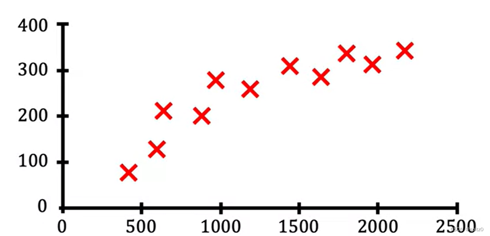
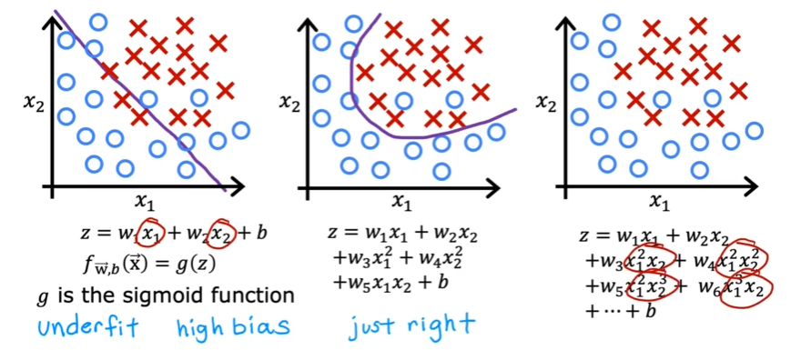

```
<head>
    <script src="https://cdn.mathjax.org/mathjax/latest/MathJax.js?config=TeX-AMS-MML_HTMLorMML" type="text/javascript"></script>
    <script type="text/x-mathjax-config">
        MathJax.Hub.Config({
            tex2jax: {
            skipTags: ['script', 'noscript', 'style', 'textarea', 'pre'],
            inlineMath: [['$','$']]
            }
        });
    </script>
</head>
```


* TOC
{:toc}


# 第一周

## 一、Machine Learning Overview

### 1. What is Machine Learning？

定义：赋予计算机无需明确编程就有能力进行学习的研究领域——Arthur Samuel

Arthur Samuel编写了一款跳棋程序，通过让计算机下数万局跳棋，学习哪一步是“好棋”，哪些是“臭棋”，从而让计算机成为优秀的跳棋玩家。


思考：计算机下一万局棋 vs 计算机下10局棋，哪个对计算机的帮助大？

当然是一万局棋。**给算法的学习机会更多，算法的表现就越好**


- 机器学习算法分类

1. 监督学习（Supervised learning）

> 监督学习是机器学习中最常见的类型之一。在这种学习模式下，算法从标记的训练数据中学习，即每个训练样本都有一个与之相关联的输出标签。通过分析训练数据，算法尝试找到输入和输出之间的关系，以便当提供新的、未见过的数据时，能够预测出正确的输出。监督学习主要用于分类和回归问题，例如邮件分类（垃圾邮件或非垃圾邮件）和房价预测。

2. 无监督学习(Unsupervised learning)

> 与监督学习不同，无监督学习处理的是未标记的数据。这意味着训练数据没有提前定义的标签或结果。无监督学习的目标是探索数据本身的结构和模式。常见的无监督学习应用包括聚类（将数据分组为多个类别）和降维（减少数据的复杂性，同时保持其主要特征）。无监督学习有助于识别数据中的隐藏模式或自然分类。

3. 推荐系统(Recommender systems)

> 推荐系统是一种特殊类型的信息过滤系统，旨在预测用户对商品或服务的偏好评级。它们通过分析用户过去的行为（如购买历史、评分、浏览历史）来实现。推荐系统可以使用监督学习、无监督学习或混合方法来构建。它们广泛应用于电子商务、视频共享平台和社交媒体网站，帮助提高用户满意度和保持用户粘性。

4. 强化学习(Reinforcement learing)

> 强化学习是一种算法，其中学习者（代理）通过与环境互动来学习如何在给定情境下做出最佳决策。与监督学习和无监督学习不同，强化学习不依赖于预先标记的数据集。相反，代理通过试错来探索空间，并根据其行为的结果接收奖励或惩罚。这种方法使得强化学习非常适合解决决策过程问题，如自动驾驶汽车、游戏玩家和机器人导航。


- 学习这门课的目的

学习机器学习算法就像学习如何正确的使用工具最先进的锤子和钻头来建造楼房，避免在错误的方向浪费时间。


### 2. Supervised learning

监督学习(supervised learning algorithms)：学习预测 输入(x)→输出(y) 映射算法。

> 监督学习需要人为的给算法提供实例来学习

| input           | output            | application  |
| --------------- | ----------------- | ------------ |
| 电子邮件        | 垃圾邮件？（0/1） | 垃圾邮件过滤 |
| 音频            | 语音转文本        | 语音识别     |
| 英语            | 中文              | 翻译         |
| 广告、用户 信息 | 点击？（0/1）     | 在线广告     |
| 图像、雷达 信息 | 其他汽车位置      | 自动驾驶     |
| 手机外观划痕图  | 缺陷？（0/1）     | 视觉检查     |

最初：算法学习 输入(x)→输出(y)。

最终：算法 接收全新的输入(x) → 生成全新的输出(y)。


#### Regression（house price predict）

> 回归算法（regression）：从**无限**可能的结果中预测一个数字。
>
> 这个房价可能是1~999999.999，用回归来预测出 房价是180，数值是**连续**的。

横轴是房屋大小，纵轴是价格，我们想知道，当面积为750的时候，价格为多少？




方法一：拟合一条直线，通过直线可以看出，当面积为750的时候，价格为180


方法二：拟合一条曲线，通过曲线可以看出，当面积为750的时候，价格为230


算法因为选择了不同的算法，从而得到了不同预测结果的房价，从本课程的后面，你会看到如何决定拟合一条直线、曲线、或是更复杂的函数到数据上。


#### Classfication（Breast cancer detection）

> **分类算法**（classfication）：从**有限**可能的结果中预测出类别（0、1、2...）。数值是**离散**的。


一开始收集到很多数据，用0代表良性 、1代表恶性。或者用 ○代表良性、x代表恶性。

然后来了一个新数据，来预测它是良性还是恶性。


总结一下：分类算法（classfication）预测类别（categories）。

categories不一定是数字，他可以是非数字的。例如①预测图片是猫还是狗 ②预测癌症类型早期、中期、晚期

categories也可以是数字的：用0、1、2表示不同的类别。


- 1个input 预测 output

肿瘤尺寸【input 1】 → 肿瘤是良性还是恶性【output 】


- 2个input 预测 output

肿瘤尺寸【input 1】+患者年龄【input 2】→ 肿瘤是良性还是恶性【output】

算法拟合一条边界线，将恶性肿瘤和良性肿瘤区分开。


- 多个input 预测 output

肿瘤团块厚度【input 1】+ 细胞大小【input 2】+ 细胞形状【input 3】........ →  肿瘤是良性还是恶性【output 】


### 3.Unsupervised Learning

> 无监督学习(unsupervised learning)：探索数据本身的结构，寻找数据中的模式和关系


- **Supervised learning vs Unsupervised learning**


左图是监督学习，有x→y的映射，有标签的数据，知道肿瘤的大小(input)和良性恶性(output)
右图是无监督学习，只有x 没有y，无标签的数据，不知道肿瘤是良性还是恶性的


无监督学习，不被要求对肿瘤做出诊断，因为我们没有y标签，与之相对的，我们的工作是找到一些结构化的模式，发现一些有趣的东西。我们称之为无监督学习，是因为我们不试图监督每个算法，为每个算法提供正确的答案，而是要求算法自己找出数据中有趣的模式或结构。


#### Clustering

> 聚类(Clustering)：处理无标签数据，并自动将他们分组到簇中。


- **例子1：聚类算法-谷歌新闻**

谷歌新闻，就是把成千上万的报道分组到一起


算法在没有监督的情况下，自己找出同一类的新闻，并归类。


- **例子2：聚类算法分析DNA**


每一列代表一个人的基因表达。
通过聚类算法，可以把相似基因的人分为同一组。A组眼睛是蓝色的，B组爱吃蔬菜，C组擅长运动。


- **例子3：客户群体分组**


通过客户信息 为客户进行分组：①想提升技能、知识组 ②想学习AI组 ③想进一步发展职业组


#### Anomaly Detection

> 异常检测(Anomaly Detection)：识别数据集中的异常的观察值。这对于识别欺诈行为、网络入侵、系统故障等非常重要

#### dimensionality reduction

> 降维(dimensionality reduction)：将大的数据集压缩成小的数据集 减少变量的数量，并尽可能少的丢失数据

## 二、Linear Regression with one Variable

> 线性回归单变量（Lenar Regression with one Varibale）

### 1. Linear Regression Model

线性回归模型（Linear Regression Model）：用一条直线模拟数据，也是当今世界使用最广泛的算法


- **example：house price predict**

> 假设你是个房产中介，如何确定一个房子的价格呢？你能做的事情，就是在已有的房产数据中，构建一个线性回归模型，模型拟合一条直线到数据上，可以看到 当房屋的面积为1250时，价格为220K。


这就是监督学习。你首先通过提供带有正确答案的数据来训练你的模型，你首先提供了房屋的面积和价格。

> - 左边：数据可视化图。  
>
> - 右边：数据表。
>
>   第一个训练示例：x=2104，y=400 → (2104,400)
>   也可表示为：(x^(1)^,y^(1)^)
>
>   第二个训练示例：x=1416，y=232 → (1416,232)
>   也可表示为：(x^(2)^,y^(2)^)
>
>   第i个输入：x^(𝑖)^
>   第i个输出：y^(𝑖)^


- **Supervised Learning Workflow**

> 监督学习工作流程

将训练集（training set）输入到学习算法（learning algorithm）中，然后你的监督学习算法将生成函数f，f的工作是接收新的输入x并输出一个预测值$\hat{y}$。

f：模型。

x：输入值。

$\hat{y}$：输出值、预测值。


- How to represent f ?

$$
𝑓𝑤,𝑏(𝑥)=𝑤𝑥+𝑏 \\
或 f(x)=wx+b
$$


选择不同的w和b，会生成不同的拟合函数。


在线性回归中，通过模型训练 由给定的x、y 来确定未知的 w和b，使$\hat{y}$ 尽可能的接近y(𝑖)


### 2. Cost Function

> 成本函数公式（平方误差公式）

- Find w,b：$\hat{y}^{(i)}$ is close to $y^{(i)}$ for all $(x^{(i)},y^{(i)})$


- 成本函数：Squared error cost function

成本函数 $J(\theta)$ 用于衡量模型的性能，特别是衡量模型预测值与实际值之间的差异。常用的成本函数之一是均方误差（Mean Squared Error, MSE），其公式如下：
$$
J(w,b) = \frac{1}{2m} \sum_{i=1}^{m} (\hat{y}^{(i)} - y^{(i)})^2\\在这个例子中：
\hat{y}^{(i)}=f_{w,b}(x^{(i)})=wx^{(i)}+b\\
$$
其中：

- m  是训练样本的数量。
- $ \hat{y}^{(i)} $ 是模型对第  i  个训练样本的预测值。
- $ y^{(i)} $ 是第  i  个训练样本的实际值。


#### 2.1 Cost Function Intuition

> 成本函数直觉

- 回顾一下成本函数

1. 你想要将直线拟合到数据上，因此有了模型：$f_{w,b}(x)=wx+b$
2. 选择不同的 w,b，将得到不同的直线。你想要找到最佳的w,b，使其更好的拟合数据。
3. 测量模型的预测值和实际值的差异，成本函数J：$J(w,b) = \frac{1}{2m} \sum_{i=1}^{m} (\hat{y}^{(i)} - y^{(i)})^2$

4. 目标：使成本函数$J(w,b)$最小


- **简化模型：取b=0，观察$f_w(x)=wx$图像如何变化、J(w)的图像如何变化** 

1. 当w=1，b=0时


$$
当w=1,b=0时\\
J(w,b) = \frac{1}{2m} \sum_{i=1}^{m} (\hat{y}^{(i)} - y^{(i)})^2= \frac{1}{2m} \sum_{i=1}^{m} (wx^{(i)} - y^{(i)})^2 \\=\frac{1}{2m} ([1*1-1]^2+[1*2-2]^2+[1*3-3]^2
=\frac{1}{2*3}(0^2+0^2+0^2)=0
$$


2. 当w=0.5，b=0时
   
   $$
   当w=0.5,b=0时\\
   J(w,b) = \frac{1}{2m} \sum_{i=1}^{m} (\hat{y}^{(i)} - y^{(i)})^2= \frac{1}{2m} \sum_{i=1}^{m} (wx^{(i)} - y^{(i)})^2 \\=\frac{1}{2m} ([0.5*1-1]^2+[0.5*2-2]^2+[0.5*3-3]^2
   =\frac{1}{2*3}((-0.5)^2+(-1)^2+(-1.5)^2)≈0.58
   $$


3. 当w=0，b=0时
   

$$
当w=0,b=0时\\
J(w,b) = \frac{1}{2m} \sum_{i=1}^{m} (\hat{y}^{(i)} - y^{(i)})^2= \frac{1}{2m} \sum_{i=1}^{m} (wx^{(i)} - y^{(i)})^2 \\=\frac{1}{2m} ([0*1-1]^2+[0*2-2]^2+[0*3-3]^2
=\frac{1}{2*3}((-1)^2+(-2)^2+(-3)^2)≈2.3
$$


4. 取b=0，通过不断的调整w，得到这样一条成本函数曲线


在取b=0的情况下，若想让成本函数取最小值，则需要令w=1，这样才能得到一条相对比较好的 拟合数据的曲线。


#### 2.2 Visualizing the Cost Function

> 可视化成本函数

> 上个例子中，我们令b=0，固定了b的位置，简化了成本函数，得到了一个二维曲线图像

现在我们回到完整版的成本函数，包含w,b，不将b设为0，成本函数J变成了三维图形。


底部的 两个坐标轴：w,b。

曲面上的任何一点，都代表了特殊的w和b。

碗的底部高度最低，处于正中心，成本函数J最小，预测效果最好。
碗的碗边高度最高，越远离中心，成本函数J最大，预测效果最差。


用等高线理解，每条等高线代表高度相等，也就是J相同


- 可选实验室


#### 2.3 Visualization examples

> 可视化示例

- 例1：w=-1.5，b=800


- 例2：w=0，b=360


- 例3：w=-0.15，b=500


- 例4：w=0.13，w=71


### 3. Gradient Descent

> 梯度下降（Gradient Descent）

在上一节中，我们尝试不同的参数w和b，试图找到能使成本函数（cost function） $J_{(w,b)}$ 最小的参数，于是有了 梯度下降（gradient descent）


#### 3.1 Gradient Descnet Overview

> 梯度下降概述（Gradient Descnet）

梯度下降算法是一种可以使任何函数最小化的算法，不局限于$J_{(w,b)}$，对于任何的函数$J_{(w_1,w_2,w_3....,w_n,b_1,b_2,b_3....b_n)}$都可以找到最小值。

你需要做的，仅仅是给w和b一些猜测的初始值。在线性回归（linear regression）中，初始值不重要，一般设为0。

对于梯度下降算法，你要做的是每次都稍微修改参数w和b，以尝试减少cost function，直到 $J$最终接近（局部）最小值。

需要注意的是，对于某些不是碗形的函数，可能存在多个（局部）最小值


- 梯度下降过程

站在一个丘陵（初始位置），需要下山。

环顾360°，每一步都选择下降最陡的那一步。


- 梯度下降存在的问题

由于初始位置不同，可能迈出不同方向的布，从而达到不同的局部最小值。


#### 3.2 Implement Gradient Descent

>  实现梯度下降（Implement Gradient Descent）

- 梯度下降算法（Gradient Descnet algorithm）

$$
w = w - \alpha \cdot \frac{\partial }{\partial w}J_{(w,b)}\\
b = b - \alpha \cdot \frac{\partial }{\partial b}J_{(w,b)}
$$

1. α：学习率，介于0~1之间，控制下坡的步伐大小。

   > 如果α很大，代表每次下山迈出的步子很大，策略激进，试图取得巨大的进步。
   >
   > 如果α很小，代表每次下山迈出的步子很小，策略保守，试图取得小进步。

2. $\frac{\partial }{\partial w}J_{(w,b)}$：下降步伐的方向。同时与α结合，也决定了下降的步伐大小。


梯度下降算法，就是不断更新w和b，直到算法收敛 达到局部最小值。


- 注意：代码中，w和b 需保持同步跟新


#### 3.3 Gradient Descent Intuition

> 梯度下降的直观理解（Gradient Descent Intuition）

问题：学习率α是干什么的？  偏导数$\frac{\partial }{\partial w}J_{(w,b)}$是干什么的？ 为什么当他们相乘，这个结果会更新w,b？


- 一个简化版的例子，只有一个参数w
  $$
  成本函数：J_{(w)}\\
  更新过程：w = w - \alpha \cdot \frac{\partial }{\partial w}J_{(w)}\\
  目标：最小化J_{(w)}
  $$


  1. 当初始点在右边这个位置，斜率为正，学习率α又是大于0的，所以 [α·斜率]始终为一个正数，w持续减小，J(w)持续减小，最终到达min J(w)

  


2. 当初始点在左边这个位置，斜率为负，学习率α又是大于0的，所以 [α·斜率]始终为一个负数，w持续增加，J(w)持续减小，最终到达min J(w)


#### 3.4 Learning Rate （α）

> 学习率α

学习率α的选择对梯度下降有巨大的影响，如果学习率选择不当，梯度下降可能无法工作。

让我们看看，选择的学习率α 过大/过小 会发生什么？ 


- 学习率α过小

如果你的学习率α过小，假设为0.000001，那么你的导数将乘以一个非常小的数，这会导致每一步的步长都非常小，这个过程虽然会持续降低J(w)，但会非常缓慢，要花费很长时间。


- 学习率α过大

如果学习率α过大，会导致步长过大，从而跃过了min J(w)，并且在下一次迭代中，再次选择巨大的步长 跃过min J(w)，实际上 是离min J(w)越来越远的，永远无法达到最小值min J(w)，最终无法收敛 甚至会发散。


- 当初始位置恰好为局部最小值


由于斜率是0，因此无论学习率α的值为多少，都不会改变w的值
$$
w=w-α·0 \\
w=w
$$


- 学习率固定的情况下，最终会达到局部最小值


1. 第一步，斜率$\frac{\partial }{\partial w}J_{(w)}$很大，步长α·$\frac{\partial }{\partial w}J_{(w)}$很大
2. 第二步，斜率$\frac{\partial }{\partial w}J_{(w)}$减小，步长α·$\frac{\partial }{\partial w}J_{(w)}$减小
3. 第三步，斜率$\frac{\partial }{\partial w}J_{(w)}$进一步减小，步长α·$\frac{\partial }{\partial w}J_{(w)}$进一步减小
4. .....
5. 最后一步，接近局部最小值，斜率为0，步长为0，不再更新


#### 3.5 Gradient Descent for Linear Regression

> 线性回归中的梯度下降

使用平方误差成本函数（squared error cost function）和梯度下降算法（gradient descent ）来训练线性回归(linear regression)模型，使一条直线拟合我们的数据


线性回归模型（Linear regression model）：<font color="blue">$f_{w,b}(x) = wx + b$</font>

成本函数（Cost function）：<font color="blue">$J(w, b) = \frac{1}{2m} \sum_{i=1}^{m} (f_{w,b}(x^{(i)}) - y^{(i)})^2$</font>

梯度下降算法（Gradient Descent algorithm）：

​	重复直到收敛(同时更新){

​		<font color="blue">$w = w - \alpha· \frac{\partial}{\partial w} J(w, b)= w - \alpha· \frac{1}{m} \sum_{i=1}^{m} (f_{w,b}(x^{(i)}) - y^{(i)})x^{(i)}$</font>

​		<font color="blue">$b = b - \alpha ·\frac{\partial}{\partial b} J(w, b) = b - \alpha \frac{1}{m} \sum_{i=1}^{m} (f_{w,b}(x^{(i)}) - y^{(i)})$</font>

​	}


> - 详细数学公式推导过程（可选）
>
> 1. **成本函数**
>
> $$
> J(w, b) = \frac{1}{2m} \sum_{i=1}^{m} (f_{w,b}(x^{(i)}) - y^{(i)})^2
> $$
>
> 2. **将线性回归模型$f_{w,b}(x) = wx + b$，代入成本函数**
>    $$
>    J(w, b) = \frac{1}{2m} \sum_{i=1}^{m} (wx^{(i)} + b - y^{(i)})^2
>    $$
>
> ​	3. **对 \( J(w, b) \) 关于 \( w \) 求偏导：**
> $$
> \frac{\partial}{\partial w} J(w, b) = \frac{\partial}{\partial w} \left( \frac{1}{2m} \sum_{i=1}^{m} (wx^{(i)} + b - y^{(i)})^2 \right)\\
> $$
>
> 
>
> 4. **链式法则**
>
> 链式法则是微积分中用于求复合函数导数的重要规则。对于函数 \( $h(u) = u^2$ \)，其中 \( $u = wx^{(i)} + b - y^{(i)}$ \)，链式法则告诉我们：
> $$
> \frac{\partial}{\partial w} h(u) = \frac{\partial h}{\partial u} \cdot \frac{\partial u}{\partial w}
> $$
>
> **应用到当前问题**
>
> 对于每一项 \( $(wx^{(i)} + b - y^{(i)})^2$ \)，我们可以将其看作一个复合函数：
>
> - 外层函数：\( $h(u) = u^2$ \)，其中 \( $u = wx^{(i)} + b - y^{(i)}$ \)。
> - 内层函数：\( $u = wx^{(i)} + b - y^{(i)}$ \)。
>
> 根据链式法则：
> $$
> \frac{\partial}{\partial w} (wx^{(i)} + b - y^{(i)})^2 = \frac{\partial}{\partial u} (u^2) \cdot \frac{\partial}{\partial w} (wx^{(i)} + b - y^{(i)})
> $$
>
> 
>
> 5. **计算偏导数**
>
> **计算外层函数的导数**
>
> 外层函数是 \( $h(u) = u^2$ \)，其导数为：
> $$
> \frac{\partial}{\partial u} (u^2) = 2u
> $$
>
> **计算内层函数的导数**
>
> 内层函数是 \( $u = wx^{(i)} + b - y^{(i)}$ \)，对 \( w \) 求偏导：
> $$
> \frac{\partial}{\partial w} (wx^{(i)} + b - y^{(i)}) = x^{(i)}
> $$
>
> **合并结果**
>
> 根据链式法则：
> $$
> \frac{\partial}{\partial w} (wx^{(i)} + b - y^{(i)})^2 = 2u \cdot x^{(i)} = 2(wx^{(i)} + b - y^{(i)}) \cdot x^{(i)}
> $$
>
> 6. **代入成本函数**
>
> 将上述结果代入成本函数的偏导数：
> $$
> \frac{\partial}{\partial w} J(w, b) = \frac{1}{2m} \sum_{i=1}^{m} 2(wx^{(i)} + b - y^{(i)}) \cdot x^{(i)}
> $$
>
> 简化后：
> $$
> \frac{\partial}{\partial w} J(w, b) = \frac{1}{m} \sum_{i=1}^{m} (wx^{(i)} + b - y^{(i)}) \cdot x^{(i)}
> $$
>
> 7. **梯度下降更新规则**
>
> 梯度下降的更新规则是：
> $$
> w = w - \alpha \frac{\partial}{\partial w} J(w, b)
> $$
>
> 将偏导数代入：
> $$
> w = w - \alpha \cdot \frac{1}{m} \sum_{i=1}^{m} (wx^{(i)} + b - y^{(i)}) \cdot x^{(i)}
> $$
>
> 8. **最终公式**
>
> 因此，\( w \) 的更新公式为：
> $$
> w = w - \alpha \cdot \frac{1}{m} \sum_{i=1}^{m} (f_{w,b}(x^{(i)}) - y^{(i)}) \cdot x^{(i)}
> $$
>
> 其中：
>
> - \( $\alpha$ \) 是学习率（控制每次更新的步长）。
> - \( $f_{w,b}(x^{(i)}) = wx^{(i)} + b $\) 是模型对第 \( i \) 个样本的预测值。
> - \( $y^{(i)}$ \) 是第 \( i \) 个样本的实际值。
> - \( $x^{(i)}$ \) 是第 \( i \) 个样本的特征值。
>
> - **梯度方向**：偏导数 \( $\frac{\partial}{\partial w} J(w, b)$ \) 表示 \( J(w, b) \) 在 \( w \) 方向上的变化率。
> - **更新方向**：通过减去 \( $\alpha \cdot \frac{\partial}{\partial w} J(w, b)$ \)，我们朝着使 \( J(w, b) \) 减小的方向更新 \( w \)。
> - **学习率 \( $\alpha$ \)**：控制每次更新的步长。如果 \( \alpha \) 太大，可能会错过最小值；如果 \( \alpha \) 太小，收敛速度会很慢。


#### 3.6 Running Gradient Descent

> 运行梯度下降

1. 一开始，随机选择两个参数 w,b ， 然后得到损失函数 [cost function]=77237


2. 根据梯度下降，w变一点，b变一点，得到更小的损失函数 （cost function）=45401


3. 再次根据梯度下降，w变一点，b变一点，得到更小的损失函数，最终得到最小的损失函数


这个梯度下降的过程，也被称为 批量梯度下降（Batch Gradient descent）。

Batch：在运行的每一步，都会查看所有训练样本（从1到m）。


- 可选实验室（梯度下降）


## 三、Linear Regression with Multiple Variables

> 线性回归多变量[Linear Regression with Multiple Variables]

### 1. Multiple features

> 多个特征[Multiple features]

让我们看一个线性回归的版本，可以处理多个特征[Multiple features]


- 单变量版本[one features/variables version]


只有一个x（size of the house）用来预测y（price of the house）


$$
model：f_{(w,b)}(x)=wx+b
$$


- 多变量版本[Multiple features/variables version]

|                 | Size in feet<sup>2</sup> | Number of bedrooms | Number of floors | Age of home in years | Price(\$) in \$1000's |
| --------------- | ------------------------ | ------------------ | ---------------- | -------------------- | --------------------- |
|                 | x<sub>1</sub>            | x<sub>2</sub>      | x<sub>3</sub>    | x<sub>4</sub>        | x<sub>5</sub>         |
| x<sup>(1)</sup> | 2104                     | 5                  | 1                | 45                   | 460                   |
| x<sup>(2)</sup> | 1416                     | 3                  | 2                | 40                   | 232                   |
| x<sup>(3)</sup> | 1536                     | 3                  | 2                | 30                   | 315                   |
| x<sup>(4)</sup> | 852                      | 2                  | 1                | 36                   | 178                   |
| ....            | ....                     | ....               | ....             | ....                 | .....                 |

$x_j$：表示第j个特征

n：总共n个特征

$\vec{x}^{(i)}或x^{(i)}$：表示第i个训练数据

> $\vec{x}^{(2)}或x^{(2)}$：表示数组[1416 3 2 40 232]

$x^{(i)}_j$：表示第i个训练数据的 第j个特征

> $x^{(2)}_3$：2


$$
model:f_{(w,b)}(x)=w_1x_1+w_2x_2+w_3x_3+...+w_nx_n+b
$$

> $example: f_{(w,b)}(x)= [0.1×size+4]×[bedrooms+10]×[floors+(-2)×years]+80$

另一种更简化的写法：
$$
f_{(\vec{w},b)}(\vec{x})=w_1x_1+w_2x_2+w_3x_3+...+w_nx_n+b\\
\vec{w}=[w_1,w_2,w_3....w_n]\\
\vec{x}=[x_1,x_2,x_3....x_n]\\ \\
因此可以简化为：
f_{(\vec{w},b)}(\vec{x})=\vec{w}·\vec{x}+b
$$

### 2. Vectorization

向量化[Vectorization]可以使你的代码更简洁，运行速度也更快

- 使用向量化[Vectorization] <font color="red">正确√</font>

**model使用向量化**
$$
f_{(\vec{w},b)}(\vec{x})=\vec{w}·\vec{x}+b
$$


python代码：

~~~python
f = np.dot(w,x) + b
~~~


原理：底层是硬件的并行运算，速度最快


**梯度下降使用向量化**
$$
\vec{w}=\vec{w} - 0.1 \vec{d}
$$
python代码：

~~~python
w = w - 0.1 * d
~~~


原理：底层并行运算


> - 不使用向量化[without vectorization]   <font color="red">错误x</font>
>
> **model不使用向量化** 
>
> 1. 逐项相加，速度很慢 <font color="red">错误x</font>
>
> $f_{(\vec{w},b)}(\vec{x})=w_1x_1+w_2x_2+w_3x_3+...+w_nx_n+b\\$
>
> ~~~python
> f = w[0]*x[0]+w[1]*x[1]+w[2]*x[2]+b
> ~~~
>
> 
>
> 2. 累加，速度仍然很慢 <font color="red">错误x</font>
>
> $$
> f_{w,b}(x) = \sum_{j=1}^{n} w_j x_j + b
> $$
>
> ~~~python
> f = 0
> for j in range(0, n):
>     f = f + w[j] * x[j]
> f = f + b
> ~~~
>
> 
>
> **梯度下降不使用向量化**<font color="red">错误x</font>
>
> 


### 3. Gradient Descent for Multiple Regression

>  多元线性回归的梯度下降


> - **Univariate Regression**
>
> Parameters : $w,b$
>
> Linear regression model：<font color="blue">$f_{w,b}(x) = wx + b$</font>
>
> Cost function：<font color="blue">$J(w, b) = \frac{1}{2m} \sum_{i=1}^{m} (f_{w,b}(x^{(i)}) - y^{(i)})^2$</font>
>
> Gradient Descent algorithm：
>
> ​	repeat{
>
> ​		<font color="blue">$w = w - \alpha· \frac{\partial}{\partial w} J(w, b)= w - \alpha· \frac{1}{m} \sum_{i=1}^{m} (f_{w,b}(x^{(i)}) - y^{(i)})x^{(i)}$</font>
>
> ​		<font color="blue">$b = b - \alpha ·\frac{\partial}{\partial b} J(w, b) = b - \alpha \frac{1}{m} \sum_{i=1}^{m} (f_{w,b}(x^{(i)}) - y^{(i)})$</font>
>
> ​	}


- **Multiple Regression**

|                         | unVector notation                                            | Vector notation                                              |
| ----------------------- | ------------------------------------------------------------ | ------------------------------------------------------------ |
| Parameters              | $w_1,w_2,...,w_n,b$                                          | <font color="blue">$\vec{w}=[w_1,w_2,...,w_n],b$</font>      |
| Linear Regression Model | $f_{\vec{w},b}(\vec{x}) = w_1x_1 +w_2x_2+...+w_nx_n+b$       | <font color="blue">$f_{\vec{w},b}(\vec{x}) =\vec{w}·\vec{x}+b$</font> |
| Cost function           | $J(w_1,w_2,...,w_n,b)$                                       | <font color="blue">$J(\vec{w},b)$</font>                     |
| Gradient descent repeat | $w_j = w_j - \alpha· \frac{\partial}{\partial w_j} J(w_1,w_2,...,w_n,b)$<br />$b = b - \alpha· \frac{\partial}{\partial b} J(w_1,w_2,...,w_n,b)$ | <font color="blue">$w_j = w_j - \alpha· \frac{\partial}{\partial w_j} J(\vec{w},b)$<br />$b = b - \alpha· \frac{\partial}{\partial b} J(\vec{w},b)$</font> |

**梯度下降算法**

1. one feature

   $w=w-\alpha· \frac{\partial}{\partial w} J(w,b)=w - \alpha· \frac{1}{m} \sum_{i=1}^{m} (f_{w,b}(x^{(i)}) - y^{(i)})x^{(i)}$

   $b=b-\alpha· \frac{\partial}{\partial b} J(w,b)=b - \alpha· \frac{1}{m} \sum_{i=1}^{m} (f_{w,b}(x^{(i)}) - y^{(i)})$

2. n feature

   $w_1=w_1-\alpha· \frac{\partial}{\partial w_1} J(\vec{w},b)=w_1 - \alpha· \frac{1}{m} \sum_{i=1}^{m} (f_{\vec{w},b}(\vec{x}^{(i)}) - y^{(i)})x_1^{(i)}$

   $w_2=w_2-\alpha· \frac{\partial}{\partial w_1} J(\vec{w},b)=w_2 - \alpha· \frac{1}{m} \sum_{i=1}^{m} (f_{\vec{w},b}(\vec{x}^{(i)}) - y^{(i)})x_2^{(i)}$

   .......

   $w_n=w_n-\alpha· \frac{\partial}{\partial w_1} J(\vec{w},b)=w_n - \alpha· \frac{1}{m} \sum_{i=1}^{m} (f_{\vec{w},b}(\vec{x}^{(i)}) - y^{(i)})x_n^{(i)}$

​	$b=b-\alpha· \frac{\partial}{\partial b} J(w,b)=b - \alpha· \frac{1}{m} \sum_{i=1}^{m} (f_{\vec{w},b}(\vec{x}^{(i)}) - y^{(i)})$


### 4. Normal equation

> Normal equation：An alterative to gradient descent
>
> 正规方程：一种梯度下降的替代算法

这章的内容不用学，只需要了解，有点python库，会在底层用这种方法就可以了。

An algorithm that is only applicable to linear regression,better than gradient descent , used to find w,b without iteration

> 一种相对于梯度下降，更好的算法，用来找到w，b，并且不需要迭代，但只适用于线性回归

1. Only for linear regression
2. Solve for w,b without iterations

**Disadvantages:**

1. Doesn't generalize to other learning algorithms
2. Slow when number of features is large( n > 10000)

**What you need to know:**

1. Normal equation method may be used in machine learning libraries that implement linear regression
2. Gradient descent is the recommended method for finding parameters w,b

> 当你使用机器学习库 并调用线性回归算法，底层会使用正规方程来求解w和b

正规方程只是线性回归算法下的特解，而梯度下降则是适用于很多算法的通解。


## 四、Practical Tips for Linear Regression

### 1. Feature Scalling Introduction

Feature Scalling：当你有不同特征取值范围差异很大时，可能会导致梯度下降运行缓慢，此时通过重新缩放不同的特征，使他们的取值在可比较的范围内，可以显著加快梯度下降的速度。

> when you have differdent features that take on very different range of values,it can cause gradient descent to run solowy. But rescalling the different features so they all take on comparable range of values can speed up gradient descent significantly 


**有一个模型**：$price = w_1x_1 + w_2x_2 + b ，范围：x_1:300 \sim~2000,x_2:0\sim5$ 

此时来了一个新的数据 House：$x_1=2000,x_2=5,price=5000k$。 这个新数据的参数$w_1,w_2$选择多少比较合适？

1. $w_1=50,w_2=0.1,b=50$： 此时price = 50 * 2000 + 0.1 * 5 + 50 = 100,050,500
2. $w_1=0.1,w_2=50,b=50$： 此时price = 0.1 * 2000 + 50 * 5 + 50 = 500K

其中的要点是，当$x_1$大时，选择的$w_1$就小，选择$x_2$小时，选择的$w_2$就大。


**画出 Features图 和 Parameters图** 


Features图：参数的范围

Parameter图：椭圆形的等高线

​	w<sub>1</sub>的微小变化，会对预测价格产生很大影响，因为w<sub>1</sub>通常乘以一个很大的数

​	w<sub>2</sub>的很大变化，会对预测价格产生很小的影响，因为w<sub>2</sub>通常乘以一个很小的数

如果你直接用原始训练数据运行梯度下降，可能会发生这种情况：因为等高线又高又窄，梯度下降过程中，会再寻找最小值的路径之间反复横跳很长时间。


**解决方法：对特征进行缩放（scale the features）**


这意味着对你的训练数据进行某种变换，使x<sub>1</sub>的范围 0 ~ 1，x<sub>2</sub>的范围 0 ~ 1。

使数据在相同的范围 0 ~ 1，直接进行取值。等高线也更像圆，而不是椭圆


> 1. 一开始的椭圆很窄，再找成本函数的最小值的过程中，可能用力过猛，一不小心就超过了，然后又回头，结果又用力过猛，又超过了，需要非常细微的控制步长。
> 2. Feature Scalling后，变成了圆，这样步长就好控制多了。


### 2. Feature Scalling implement

将取值范围不同的特征，缩放到具有可比较的范围中，鼓励对数据进行特征缩放。


- **方法一：Mean normalization(均值归一化)**

$$
x' = \frac{x - \mu}{\text{max} - \text{min}}
$$

\( x \) 是原始特征值

\( $\mu$ \) 是特征的均值

\( $\text{max}$ \) 是特征的最大值

\( $\text{min}$ \) 是特征的最小值


**例**
$$
x_1特征取值范围：300 ≤x_1≤2000，\\x_1特征的平均值：\mu_1=600\\ 
均值归一化：x_1 = \frac{x_1-μ_1}{2000-300}\\
均值归一化后，x_1取值范围：-0.18≤x_1≤0.82\\\\
x_2特征取值范围：0 ≤x_2≤5\\ 
x_2特征的平均值：\mu_2=2.3\\ 
均值归一化：x_2 = \frac{x_2-μ_2}{2000-300}\\
均值归一化后，x_1取值范围：-0.18≤x_1≤0.82
$$


- **方法二：Z-score normalization**

$$
z = \frac{x - \mu}{\sigma}
$$

\( x \) 是原始特征值

\( $\mu$ \) 是特征的均值

\( $\sigma$ \) 是特征的标准差


**例**
$$
x_1特征取值范围：300 ≤x_1≤2000，\\x_1特征的平均值：\mu_1=600\\ 
x_1特征的标准差：\sigma_1=450\\
均值归一化：x_1 = \frac{x_1-μ_1}{\sigma_1}\\
均值归一化后，x_1取值范围：-0.67≤x_1≤3.1\\\\
x_2特征取值范围：0 ≤x_2≤5\\ 
x_2特征的平均值：\mu_2=2.3\\ 
均值归一化：x_2 = \frac{x_2-μ_2}{\sigma_2}\\
x_1特征的标准差：\sigma_2=1.4\\
均值归一化后，x_1取值范围：-1.6≤x_1≤1.9
$$


- **feature scalling  ranges**

| -1 ≤ x<sub>j</sub> ≤ 1        | acceptable ranges   |
| ----------------------------- | ------------------- |
| -3 ≤ x<sub>j</sub> ≤ 3        | acceptable ranges   |
| -0.3≤ x<sub>j</sub> ≤ 0.3     | acceptable ranges   |
| 0 ≤ x<sub>j</sub> ≤ 3         | okay,no rescalling  |
| -2≤ x<sub>j</sub> ≤ 0.5       | okay,no rescalling  |
| -100≤ x<sub>j</sub> ≤ 100     | too large → rescale |
| -0.001≤ x<sub>j</sub> ≤ 0.001 | too small → rescale |
| 98.6 ≤ x<sub>j</sub> ≤ 105    | too large → rescale |


### 3. Checking Gradient Descent for Convergence

在运行梯度下降时，如何判断它正在收敛？如何判断它是否正在帮助你找到成本函数的全局最小值？

> 收敛：找到了表示J最小值的参数

- 方法一：画图观察（推荐）

画个**学习曲线（Learning curve）**的图。


x轴代表迭代次数，y轴代表成本函数。

可以发现，迭代0 ~ 100次的时候，下降很快。迭代100 ~ 200次的时候，下降依然很快。迭代200 ~ 300 次的时候，下降慢一些了。 迭代300 ~ 400 次的时候，不再显著下降 而是趋于平稳 。

如果J在某次迭代后，不减反增，说明学习率α太大了，或者代码中可能存在错误。

梯度下降收敛所需要的迭代次数 在不同应用中差异很大，有的应用30次以后 就收敛了，而有的应用则需要1000次、10000次才能收敛。


- 方法二：自动收敛测试（automatic convergence test）

令 ε 表示为一个很小的数值：0.001。

如果 J 在每次迭代后，梯度下降的量 < *ε*，则称为收敛（上图中迭代300 ~ 400次的位置 ，已经趋于平稳了，也就代表收敛）


但有一个问题是，选择ε的阈值相当困难，因此**更推荐方法一的查看图表，来判断是否收敛**


### 4. Choosing the Learning Rate

如何选择合适的学习率α？如果学习率α太小 它运行的会很慢，而如果学习率α太大 它可能根本不会收敛


- 学习率α太大 或 程序有BUG


- 学习率太大


- 学习率太小


学习率α足够小，每次迭代，J都会下降，但需要很多次才能达到收敛


- 建议的学习率α 取值

可以先把0.001、0.01、0.1、1 都试一遍


得到一个合适的学习率α， 比如说0.01。

然后在0.01的基础上，每次都乘以3，变成0.03，再乘以3，变成0.09，直到找到更合适的学习率。


### 5. Feature Engineering

选择正确的特征，是算法有效工作的关键。

Feature Engineering：Using intution to design new features , by transforming or combining orginal features.


原始数据中，房子有两个特征 x<sub>1</sub>房子长度， x<sub>2</sub>房子宽度。

因此一开始的方程设计为：$f_{\vec{w},b}(\vec{x}) = w_1x_1 +w_2x_2+b$


后来你有一种直觉，觉得面积 x<sub>3</sub>=x<sub>1</sub>x<sub>2</sub>，更合理。

于是有了第二版的方程：$f_{\vec{w},b}(\vec{x}) = w_1x_1 +w_2x_2+w_3x_3 +b$

这就是feature engineering。


### 6. Polynomial Regression（多项式线性回归）

多项式回归，可以让曲线、非线性函数 拟合到数据中。


一开始你看到这样的数据，可能想拟合一条直线
$$
f_{\vec{w},b}(\vec{x}) = w_1x_1 b
$$
然后发现直线效果不太好，想要拟合一条曲线
$$
f_{\vec{w},b}(\vec{x}) = w_1x_1 +w_2x_2^2+b
$$
然后发现二次函数效果仍然不太好，因此想拟合一条三次函数
$$
f_{\vec{w},b}(\vec{x}) = w_1x_1 +w_2x_2^2+w_3x_3^3+b
$$
接下来，你可能发现效果仍然不太好，因此需要拟合更高次的函数


在这种情况下：x<sub>1</sub>是面积，x<sub>2</sub>是面积的二次方，x<sub>3</sub>是面积的三次方。  

**一定要进行特征缩放**


# 第三周

## 五、Classification

### 1. Motivation

上周学习了线性回归，用来预测一个数值。这周将学习分类（classification） 其中输出y只能取可能性之一，而不是无限范围内的任何数。 


- **线性回归并不是分类问题的良好算法。**


这种常规的情况，当然可以用线性回归来解决， 设定一个阈值，小于0.5的是良性，大于0.5的是恶性。


但当在右边添加一个额外的数据点时，线性回归的最佳拟合直线会向右偏移，变成<font color="green">绿线</font>，若还把阈值设置为0.5，则会把<font color="green">竖着的绿线 </font>左边的点都判定为良性， 右边都判定为恶性。 这不是我们想要的，添加的额外数据点不应该改变我们关于如何分类恶性与良性肿瘤的结论，不应该让 决策边界（decision boundary）向右偏移。


### 2. Logistic Regression

> 逻辑回归可以很好的解决上一节的问题
>
> 
>
> 用逻辑回归，会生成一个S型的曲线

逻辑回归适合二分类问题


- **sigmoid / Logistic  function model ：**


逻辑回归的模型可以表示为：
$$
f_{\vec{w},b}(\vec{x})=\sigma(\vec{w}·\vec{x}+b)
$$

wx+*b* 是线性回归部分，w 是权重，b 是偏置。

g(z) 是 Sigmoid 函数，定义为：
$$
\sigma(z)=\frac{1}{1+e^{-z}},0<\sigma(z)<1 \\
$$

因此逻辑回归的完整模型可以表示为：

$$
f_{\vec{w},b}(\vec{x})=\sigma(\vec{w}·\vec{x}+b)=\frac{1}{1+e^{-\vec{w}·\vec{x}+b}}
$$


逻辑回归的输出，是y=1的概率。

在这个例子中 x是肿瘤大小，y是肿瘤 0良性 / 1恶性，如果logistic regression算出$f_{\vec{w},b}(\vec{x})$=0.7，则代表y=1的概率是70%，y=0的概率是30%


Probability that y is 1 , given input $\vec{x}$ , parameters $\vec{w},b$
$$
f_{\vec{w},b}(\vec{x}) = P(y = 1|\vec{x}; \vec{w},b)
$$


### 3. Decision Boundary

$$
f_{\vec{w},b}(\vec{x})=g(\vec{w}·\vec{x}+b)=\frac{1}{1+e^{-\vec{w}·\vec{x}+b}}= P(y = 1|\vec{x}; \vec{w},b)
$$

预测值最终一定是 0或1，而不能是 "70%的概率为1" 这种模糊的表达。

设定一个阈值，比如说0.5，$f_{\vec{w},b}(\vec{x})$>0.5 则判断为1，$f_{\vec{w},b}(\vec{x})$<0.5 则判断为0。


$$
f_{\vec{w},b}(\vec{x})≥0.5\\
g(z)≥0.5\\
z≥0\\
\vec{w}·\vec{x}≥0\\
\\
∴当\vec{w}·\vec{x}≥0时，可以判断：\hat{y}=1\\
∴当\vec{w}·\vec{x}≤0时，可以判断：\hat{y}=0
$$


**决策边界（Decision boundary）** 公式
$$
z=\vec{w}·\vec{x}+b=0
$$


- **例1**：linear decision boundary


假设方程为：
$$
f_{\vec{w},b}(\vec{x})=g(z)=g(w_1x_1+w_2x_2+b)
$$
并假设：w<sub>1</sub> = 1,w<sub>2</sub> = 1,b = -3
$$
z=x_1+x_2-3
$$
根据决策边界公式：
$$
z=\vec{w}·\vec{x}+b=0
$$
此例的决策边界为：
$$
z=x_1+x_2-3=0\\
x_1+x_2=3
$$


紫色的线即为决策边界

z≥0时，即$x_1+x_2≥3$时，预测值为1

z≤0时，即$x_1+x_2≤3$时，预测值为0


- **例2**：non-linear decision boundary


假设方程为：
$$
f_{\vec{w},b}(\vec{x})=g(z)=g(w_1x_1^2+w_2x_2^2+b)
$$
并假设：w<sub>1</sub> = 1,w<sub>2</sub> = 1,b = -1
$$
z=x_1^2+x_2^2-1
$$
根据决策边界公式：
$$
z=\vec{w}·\vec{x}+b=0
$$
此例的决策边界为：
$$
z=x_1^2+x_2^2-1=0\\
x_1^2+x_2^2=1
$$


紫色的圆即为决策边界

z≥0时，即$x_1^2+x_2^2≥1$时，预测值为1

z≤0时，即$x_1^2+x_2^2≤1$时，预测值为0


- 例3：更高阶的 non-linear decision boundary

$$
f_{\vec{w},b}(\vec{x})=g(z)=g(w_1x_1+w_2x_2+w_3x_1^2+w_5x_1x_2+w_5x_2^2+...+b)
$$


### 4. Cost Function for Logistic Regression

> 代价函数提供了一种方法 用来衡量特定参数对训练数据的拟合程度，从而使你能够尝试选择更好的参数。但平方误差代价函数对于逻辑回归来说，并不是一个理想的代价函数，并且我们会介绍一种不同的代价函数，它可以帮助我们为逻辑回归选择更好的参数。


以下是逻辑回归模型的训练集。

> 每一行对应着一位患者去看医生得到的诊断结果，我们用m表示训练样本数量，每一个样本有一个或多个特诊，例如肿瘤大小、病人年龄，总计有n个特征，我们把这些特征称为x<sub>1 </sub>~ x<sub>n</sub>。由于这是一个二分类任务，目标标签只有两个值 0或1。最终，逻辑回归模型由这个方程定义


接下来的问题是，给定了训练集，如何选择参数w，b ？


#### 4.1 回顾 Squared error cost / loss function

> loss function 就是 cost fucntion的$\frac{1}{m}$

**Squared error cost  function**
$$
J(\vec{w}, b) = \frac{1}{2m} \sum_{i=1}^{m} (f_{\vec{w},b}(\vec{x}^{(i)}) - y^{(i)})^2
$$

cost function：代价函数用于衡量模型对**整个训练集**的预测值 *f*(*x*) 与真实标签 y 之间的差异。


**Squared error loss  function**
$$
J(\vec{w}, b) = \frac{1}{2m} \sum_{i=1}^{m} (f_{\vec{w},b}(\vec{x}^{(i)}) - y^{(i)})^2 = \frac{1}{m} \sum_{i=1}^{m}\bigg[ \frac{1}{2}(f_{\vec{w},b}(\vec{x}^{(i)}) - y^{(i)})^2\bigg] \\
L = \frac{1}{2}(f_{\vec{w},b}(\vec{x}^{(i)}) - y^{(i)})^2
$$
L (loss function)：损失函数用于衡量模型对**单个样本**的预测值 *f*(*x*) 与真实标签 y 之间的差异。


##### 4.1.1 Squared error cost function：linear regression

**Squared error cost function**
$$
J(\vec{w}, b) = \frac{1}{2m} \sum_{i=1}^{m} (f_{\vec{w},b}(\vec{x}^{(i)}) - y^{(i)})^2
$$
**model：linear regression 适合处理连续问题。**
$$
f_{\vec{w},b}(\vec{x}) = \vec{w} \cdot \vec{x} + b
$$
**梯度下降图形：convex cost function(凸代价函数)**


##### 4.1.2 Squared error cost function：logistic regression

**Squared error cost function**
$$
J(\vec{w}, b) = \frac{1}{2m} \sum_{i=1}^{m} (f_{\vec{w},b}(\vec{x}^{(i)}) - y^{(i)})^2
$$
**model：logistic regression 适合二分类问题预测**
$$
f_{w,b}(x) = \frac{1}{1 + e^{-(w \cdot x + b)}}
$$
**梯度下降图形：non-convex cost function(非凸代价函数)**，是一个波浪，有很多局部最小值。<font color="blue">对逻辑回归来说，平方误差代价公式，并不是一个好的选择。</font>


> 根据具体问题选择合适的损失函数形式，可以使non-convex cost function(非凸代价函数)变成convex cost function(凸代价函数)


#### 4.2 Logistic loss function

- **Logistic loss function**（对数损失，更适合二分类问题）

$$
L(f_{w,b}(x^{(i)}, y^{(i)})) = 
\begin{cases} 
-\log(f_{w,b}(x^{(i)})) & \text{if } y^{(i)} = 1 \\
-\log(1 - f_{w,b}(x^{(i)})) & \text{if } y^{(i)} = 0 
\end{cases}
$$


**if y=1**
$$
L(f_{w,b}(x^{(i)}, y^{(i)})) =-\log(f_{w,b}(x^{(i)}))
$$


当真实标签是1，而算法预测为1时，损失为0.

当真实标签是1，而算法预测为0.5时，损失不算很高

当真实标签是1，而算法预测为0.1时，损失非常非常高


**if y=0**
$$
L(f_{w,b}(x^{(i)}, y^{(i)})) =-\log(1 - f_{w,b}(x^{(i)}))
$$


当真实标签是0，而算法预测为0时，损失为0.

当真实标签是0，而算法预测为1时，损失非常非常高，接近无穷


通过计算二阶导，可证明logistic regression 是凸函数。


#### 4.3 Simplified loss function

**Simplified loss function**
$$
L(f_{w,b}(x^{(i)}, y^{(i)})) = -y^{(i)}\log\big(f_{w,b}(x^{(i)})\big) - \big(1-y^{(i)})\log(1-f_{w,b}(x^{(i)})\big)
$$


**逆推导Full loss fucntion的过程**
$$
\text{if } y^{(i)}=1: \\
&L(f_{w,b}(x^{(i)}, y^{(i)})) =-1\log\big(f_{w,b}(x^{(i)})\big)\\
\text{if } y^{(i)}=0:\\
&L(f_{w,b}(x^{(i)}, y^{(i)}))=- \big(1-0)\log(1-f_{w,b}(x^{(i)})\big) \\
\text{合并得到full loss function}:\\
&L(f_{\vec{w},b}(\vec{x}^{(i)}, y^{(i)})) = 
\begin{cases} 
-\log(f_{\vec{w},b}\big(\vec{x}^{(i)})\big) & \text{if } y^{(i)} = 1 \\
-\log\big(1 - f_{\vec{w},b}(\vec{x}^{(i)})\big) & \text{if } y^{(i)} = 0 
\end{cases}
$$


#### 4.4 Simplified cost function

由于**Simplified loss function**的公式为：
$$
L(f_{w,b}(x^{(i)}, y^{(i)})) = -y^{(i)}\log\big(f_{w,b}(x^{(i)})\big) - \big(1-y^{(i)})\log(1-f_{w,b}(x^{(i)})\big)
$$
因此**Simplified cost function**的公式为：
$$
\begin{aligned}
J(\vec{w}, b) &= \frac{1}{m}\sum_{i=1}^{m}[L(f_{w,b}(\vec{x}^{(i)}), y^{(i)})]\\
&= -\frac{1}{m}\sum_{i=1}^{m}[y^{(i)}\log(f_{w,b}(\vec{x}^{(i)})) + (1-y^{(i)})\log(1-f_{w,b}(\vec{x}^{(i)}))]
\end{aligned}
$$


> 具体推导过程，参考最大似然估计


### 5. Gradient Descent(Logistic Regression)

#### 5.1 Gradient Descent Implementation

为了拟合逻辑回归模型的参数，我们将尝试找到参数w,b的值 以最小化 cost function J(w,b)，我们将通过梯度下降实现这点。


我们的目的是Find $\vec{w},b$， 完成这些步骤后。

input一个新的$\vec{x}$ 例如肿瘤大小和患者年龄，output$f_{w,b}(x) = \frac{1}{1 + e^{-(w \cdot x + b)}}$

模型可以做出预测 ,估计y=1的概率$P(y = 1|\vec{x}; \vec{w}, b)$


#### 5.2 **Logistic Regression Gradient descent**

逻辑回归模型（Logistic Regression model）：<font color="blue">$f_{\vec{w},b}(\vec{x})=\frac{1}{1+e^{-\vec{w}·\vec{x}+b}}$</font>

代价函数（cost function）: <font color="blue">$J(w, b) = -\frac{1}{m} \sum_{i=1}^{m} \left[ y^{(i)} \log(f_{w, b}(x^{(i)})) + (1 - y^{(i)}) \log(1 - f_{w, b}(x^{(i)})) \right]$</font>

逻辑回归梯度下降算法（Gradient Descent algorithm for logistic regression）：	

​	repeat:(simultaneous updates) {

​		<font color="blue">$w_j = w_j - \alpha \frac{\partial}{\partial w_j} J(\vec{w}, b)= w_j - \alpha\bigg[\frac{1}{m} \sum_{i=1}^{m} \left( f_{\vec{w}, b}(\vec{x}^{(i)}) - y^{(i)} \right) x_j^{(i)} \bigg]$</font>

​		<font color="blue">$b = b - \alpha \frac{\partial}{\partial b} J(\vec{w}, b)=b -\alpha \bigg[\frac{1}{m} \sum_{i=1}^{m} \left( f_{\vec{w}, b}(\vec{x}^{(i)}) - y^{(i)} \right) \bigg]$</font>

​	}


#### 5.3 **对比 linear regression Gradient Descent**

线性回归模型（Linear regression model）：<font color="blue">$f_{(\vec{w},b)}(\vec{x})=\vec{w}·\vec{x}+b$</font>

成本函数（Cost function）：<font color="blue">$J(w, b) = \frac{1}{2m} \sum_{i=1}^{m} (f_{w,b}(x^{(i)}) - y^{(i)})^2$</font>

梯度下降算法（Gradient Descent algorithm）：

​	重复直到收敛{

​		<font color="blue">$w = w - \alpha· \frac{\partial}{\partial w} J(w, b)= w - \alpha· \frac{1}{m} \sum_{i=1}^{m} (f_{w,b}(x^{(i)}) - y^{(i)})x^{(i)}$</font>

​		<font color="blue">$b = b - \alpha ·\frac{\partial}{\partial b} J(w, b) = b - \alpha \frac{1}{m} \sum_{i=1}^{m} (f_{w,b}(x^{(i)}) - y^{(i)})$</font>

​	}


- **Logistic Regression Gradient descent 和 linear regression Gradient Descent 区别点：**

Linear Regression : $f_{\overrightarrow{w},b}(\overrightarrow{x}) = \overrightarrow{w} \cdot \overrightarrow{x} + b $

Logistic Regression : $f_{\overrightarrow{w},b}(\overrightarrow{x}) = \frac{1}{1 + e^{-(\overrightarrow{w} \cdot \overrightarrow{x} + b)}}$


### 6. Same conecepts

- Monitor gradient descentg (learning curve)
- Vectorized implementation
- Feature scaling


### 7. Regularization to Reduce Overfitting

#### 7.1 The problem of Overfitting

- 什么是过拟合？

当模型过于复杂（如高阶多项式）时，它会过度拟合训练数据中的噪声和细节，导致在新数据上表现差。例如，用户提供的模型中加入了高次项（如 $x^3,x^4$），若这些项的权重（$w_3,w_4$）过大，模型会过度依赖高阶特征，失去泛化能力。


- 线性回归中的 Unfit / just right / overfit


| **Does not fit the training set well(对训练集拟合不好) / Underfit(欠拟合) / high bias（高方差）** | **Fits training set pretty well（对训练集拟合很好） / just right(刚好合适) / Generalization（泛化）** | **Fits the training set extremely well(对训练集拟合得过于好)/ Overfit(过拟合) /High variance(高方差)** |
| ------------------------------------------------------------ | ------------------------------------------------------------ | ------------------------------------------------------------ |


- 分类问题中的Underfit / just right / overfit



| **Does not fit the training set well(对训练集拟合不好) / Underfit(欠拟合) / high bias（高方差）**(g is the sigmoid function) | **Fits training set pretty well（对训练集拟合很好） / just right(刚好合适) / Generalization（泛化）** | **Fits the training set extremely well(对训练集拟合得过于好)/ Overfit(过拟合) /High variance(高方差)** |
| ------------------------------------------------------------ | ------------------------------------------------------------ | ------------------------------------------------------------ |


#### 7.2 Addressing Overfitting


- **方法一：Collect more training examples**


非常有效的方式，但前提是有这么多数据可以用


- **方法二：Select features to include/exclude**

一开始可能有很多特征：size、bedrooms、floors、age、ave income 、 distance to coffee shop、price。

由于缺乏有效训练，因此可能会overfit。

解决办法是通过直觉，选择几个你觉得有效的特征——特征选择（feature selection）

此时数据就有可能just right了。

但这种算法有个缺陷：算法丢弃了一些特征信息。 原本有100个feature的，你不想通过丢弃一些特征 从而丢弃一部分信息


- **<font color="red">方法三：Regularization（正则化）</font>**

方法二feature selection中 是直接消除特征，而在方法三regularization中 是温和减少特征的影响。

Regularization中 鼓励算法缩小参数的值 惩罚模型复杂度 限制高阶项权重。保留所有特征的同时，防止特征产生过大影响，导致过拟合。

例如：$f(x)=w_1+w_2+10000w_3+10000w_4+b$,通过正则化 迫使$w$保持较小值

通常来说，只需要减少$w_1 \sim w_n$的参数，而是否正则化 b 对结果影响不大。


#### 7.3 Cost Function with Regularization

##### 7.3.1 Intution

- just right


$$
\underset{\vec{w},b}{\text{min }}J(\vec{w}, b) = \frac{1}{2m} \sum_{i=1}^{m} (f_{\vec{w},b}(\vec{x}^{(i)}) - y^{(i)})^2
$$
由于模型复杂度较低，不太容易过拟合训练数据中的噪声。

最小化成本函数：优化过程通常不会导致过拟合，因为模型本身不够复杂。


- overfit


高阶项使模型能够拟合训练数据中的更多细节和噪声，增加了过拟合的风险

最小化成本函数：优化过程可能导致模型过度拟合训练数据，特别是在数据量有限的情况下。

因此需要修改成本函数，在其中加上$1000w_3^2、1000w_4^2$，用来惩罚该模型
$$
\underset{\vec{w},b}{\text{min }}J(\vec{w}, b) = \frac{1}{2m} \sum_{i=1}^{m} (f_{\vec{w},b}(\vec{x}^{(i)}) - y^{(i)})^2+1000w_3^2+1000w_4^2
$$
 在你想最小化成本函数时 唯一的办法就是使$w_3、w_4$变小（正则化），否则$1000w_3^2、1000w_4^2$会非常大。假设使$w_3=0.001、w_4=0.002$，在你最小化该函数时，会得到$w_3≈0、w_4≈0$实际上，几乎消除了特征$x^3、x^4$的影响，也就是消除了这两个项，如果我们这么做，得到的拟合数据会更接近二次函数，只包含一点点来自$x^3、x^4$的微小影响。
$$
w_1x+w_2x^2+\cancel{w_3x^3}+\cancel{w_4x^4}+b
$$

$$
J_{\text{min}}(\vec{w}, b) = \frac{1}{2m} \sum_{i=1}^{m} (f_{\vec{w},b}(\vec{x}^{(i)}) - y^{(i)})^2+\cancel{1000w_3^2}+\cancel{1000w_4^2}
$$

这种方法既包含了所有的参数，拟合效果又比单纯的二次函数要好，这也是正则化背后的思想


##### 7.3.2 Regularization

| size          | bedrooms      | floors        | age           | avg income    | ...  | distance to coffee shop |
| ------------- | ------------- | ------------- | ------------- | ------------- | ---- | ----------------------- |
| x<sub>1</sub> | x<sub>2</sub> | x<sub>3</sub> | x<sub>4</sub> | x<sub>5</sub> | ...  | x<sub>100</sub>         |
| w<sub>1</sub> | w<sub>2</sub> | w<sub>3</sub> | w<sub>4</sub> | w<sub>5</sub> | ...  | w<sub>100</sub>         |

有一百个特征，不知道哪些是重要的特征，哪个应该被惩罚。

因此正则化的方式是通过添加正则化参数 $\frac{\lambda}{2m}\sum_{j=1}^{n} w_i^2$ 来惩罚所有特征($w_j$)，使其变成拟合一个更平滑，更简单，不太容易过拟合的函数。
$$
\underset{\vec{w},b}{\text{min }}J(\vec{w}, b) = \frac{1}{2m}\bigg[ \sum_{i=1}^{m} (f_{\vec{w},b}(\vec{x}^{(i)}) - y^{(i)})^2+\frac{\lambda}{2m}\sum_{j=1}^{n} w_j^2\bigg],(\lambda>0)
$$
> 为了更好的求导，都除以2m
>
> 另外，是否正则化b 区别都不大
> $$
> \underset{\vec{w},b}{\text{min }}J(\vec{w}, b) = \frac{1}{2m}\bigg[ \sum_{i=1}^{m} (f_{\vec{w},b}(\vec{x}^{(i)}) - y^{(i)})^2+\frac{\lambda}{2m}\sum_{j=1}^{n} w_j^2+\frac{\lambda}{2m}b \bigg],(\lambda>0)
> $$

1. $\sum_{i=1}^{m} (f_{\vec{w},b}(\vec{x}^{(i)}) - y^{(i)})^2$：均方误差。最小化这一项鼓励算法通过预测值和实际值之间的平方差来拟合训练数据。

2. $\frac{\lambda}{2m}\sum_{j=1}^{n} w_j^2$：正则化项。最小化这一项，算法试图保持$w_j$较小，这将倾向于减少过拟合

3. $\lambda$：指定了两个目标之间的相对重要性，或两个目标之间的相对权衡。

   3.1 若$\lambda$=0，则不使用正则化，会过度拟合。

   

   3.2 若$\lambda$非常大 $\lambda$=10，则其他特征$w_ix≈0$， $f(x)=\cancel{w_1x}+\cancel{w_2x^2}+\cancel{w_3x^3}+\cancel{w_4x^4}+b$，相当于f(x)=b，因此算法会拟合出一条直线

   

   3.2 若$\lambda$刚好合适 不大不小时，才会拟合一条恰当的曲线


#### 7.4 Graident Descent( Regularized Linear Regression )

线性回归模型 ：<font color="blue">$f_{(\vec{w},b)}(\vec{x})=\vec{w}·\vec{x}+b$</font>

正则化代价函数 : <font color="blue">$\underset{\vec{w},b}{\text{min }} J(\vec{w}, b) = \frac{1}{2m}\bigg[ \sum_{i=1}^{m} (f_{\vec{w},b}(\vec{x}^{(i)}) - y^{(i)})^2+\frac{\lambda}{2m}\sum_{j=1}^{n} w_j^2\bigg],(\lambda>0)$</font>

正则化线性回归梯度下降算法：	

​	repeat : {

​		<font color="blue">$w_j = w_j - \alpha \frac{\partial}{\partial w_j} J(w, b)=w_j - \alpha \bigg[  \frac{1}{m} \sum_{i=1}^m (f_{w,b}(\vec{x}^{(i)}) - y^{(i)})x^{(i)}_{j} + \frac{\lambda}{m}w_{j} \bigg] $</font>

​		<font color="blue">$b = b - \alpha \frac{\partial}{\partial b} J(w, b)=b - \alpha \bigg[ \frac{1}{m} \sum_{i=1}^m (f_{\vec{w},b}(\vec{x}^{(i)}) - y^{(i)})\bigg] $</font>

​	}同时更新


- 可选内容

观察一下$w_j$的更新步骤：

1. 正则化梯度下降过程：$w_j =w_j \bigg [ 1 - \alpha \frac{\lambda}{m} \bigg]- \alpha  \frac{1}{m} \sum_{i=1}^m (f_{w,b}(\vec{x}^{(i)}) - y^{(i)})x^{(i)}_{j}   $
2. 非正则化梯度下降过程：$w_j = \bigg[ w_j  \bigg]- \alpha  \frac{1}{m} \sum_{i=1}^m (f_{w,b}(\vec{x}^{(i)}) - y^{(i)})x^{(i)}_{j}   $

假设$\alpha=0.01,\lambda=1,m=50$则 $w_j \bigg [ 1 - \alpha \frac{\lambda}{m} \bigg]=w_j \bigg [ 1 - 0.002 \bigg]=0.9998w_j$，相当于每次更新时，都先缩小$w_j$到0.9998倍
