# 第一周 Cluster

# 一、Clustering

## 1.1 What is clustering?

clustering（聚类算法）：查看一组数据点，自动找出相关联或相似的数据点，找出关于这个数据有趣的结构。

- 监督学习

有x有y，根据x预测y

- 无监督学习

找出相似的组

- 无监督学习应用

1. 相似新闻分类
2. 市场人群分类
3. DNA分析
4. 天文数据分析

## 1.2 K-means intuition

- K-means clustering algorithm （K均值 聚类算法）

K-means clustering algorithm只做两件事：①将点分给聚类中心 ②移动聚类中心

要求算法把这个分为两组

先随机选两个点，作为两个不同cluster centroids

1. 第一步：遍历30个训练样本，检查每个点是更接近x，还是更接近 x，分配每个点到最近的 cluster centroids

   

2. 第二步：计算所有红色点的平均位置，将x移动到平均位置，作为新的x位置。

   计算所有蓝色点的平均位置，将x移动到平均位置，作为新的x位置。

   

4. 重复第一步：再次遍历30个训练样本，检查每个点是更接近x的新位置，还是更接近 x的新位置，分配每个点到最近的 cluster centroids

   

5. 重复第二步：计算红色点平均位置，计算蓝色点平均位置。

6. 循环第一步、第二步。

7. 继续执行这两个步骤，直到发现点的颜色或cluster centroids不再发生任何变化。

   

## 1.3 K-means algorithm

- 边界情况

如果cluster被分配了0个training examples

常见的做法是，直接消除这个没有被分配到任何样本的cluster x。 另一种做法是 重新随机初始化这个cluster，希望它下一次能分配到training examples

- 应用

用K-means algorithm统计人群，做出三款 S、M、L 尺寸的衣服。

## 1.4 Optimization objective

**K-means cost function**：每个训练样本$x^{(i)}$与分配给它的聚类中心位置$u_{c^{(i)}}$直接的平均平方距离。

每一步都尝试更新cluster centroids的位置，以不断减少这个代价函数 J

> K-means cost function 也叫 Distortion function（失真函数）

## 1.5 Initializing K-means

K-means algorithm的第一步是选择随机的位置作为聚类初始猜测，选择$\mu_1 \sim \mu_k$，但如何实际进行这种随机猜测呢？

在运行K-means时，你应该选择 聚类数量k < 样本数量m。

> 因为聚类数量比样本数量大没有意义，那样就不会有足够的训练样本来为每个聚类中心至少分配一个训练样本

随机选择K个training examples ，设置$\mu_1,\mu_2,\mu_3.... \mu_k$ = K examples

> 也就是随机选几个点，作为cluster

- 看一个例子 

这三个随机初始化，每一个都是cost function的局部最小值。

而不同的初始化，会得到不同的结果，有的随机初始化选择很好，有的则不好。

你可以多次运行K-means algorithm（本例中是3次），得到3个不同的cluster，然后选择这3个cluster 中 最低的cost function

- Random initialization

随机初始化 50~1000次，通常比只尝试1次随机初始化 结果更好，而超过1000次 收益递减。

通过这种方法，能获得good choice of cluster on top，而不是底部这些不太好的局部最小值

## 1.6 Choosing the Number of Clusters

如何决定使用多少个cluster？ 2个？3个？5个？10个？

同一个数据让不同的人分类，有人会看到2个cluster，有人会看到4个cluster，因为是无监督学习 没有正确答案。

- 方法一（不推荐）：Elbow

Elbow method：选择cost function 下降速度最快的那一段的终点 作为k，就像手肘一样。

但在很多情况下，曲线是平滑的，那么为了最小化cost function，只能选择最大的K

- 方法二：根据业务需求决定

你需要把T恤分成3个尺码，就选3个cluster， 你需要把T恤分成5个尺码，就选5个cluster。

你可以把分成3个 和 分成5个 都试一遍，然后在成本和需求直接进行权衡。

就像压缩图像 需要在 节省空间与像素直接进行权衡

# 二、Anomaly Detection

## 2.1 Finding unusual events

Anomaly Detection algorithms（异常检测算法） 会查看一个未标记的正常事件数据集，并从中学习如何检测或标记异常事件。

- 飞机发动机异常检测

飞机有很多特征$x_1$=heat generated，$x_2$=vibration intensity，....。

现有一个数据集Dataset:{$x^{(1)},x^{(2)},...,x^{(m)}$}，包含了已经制造的m台正常的发动机，并收集了这些发动机的$x_1和x_2$特征。

Anomaly Detection algorithms的问题是，在学习算法看到这些m个例子后，如何判断一个新发动机$x_{test}$是否和这m个正常发动机相似？或者这个新发动机油什么奇怪的地方 导致性能可疑？

如果$x_{test}$在x的位置，则看起来正常。在x的位置 则需要仔细检测。

现在的问题是，如何用算法解决这个问题？

- Density estimation（密度估计）

当你得到这些m个例子的训练集时，你首先要建立一个p(x)的概率模型，学习算法将尝试找出特征$x_1和x_2$在数据集中的哪些值具有高概率，哪些值不具有高概率。

本例中，蓝色圆心的位置具有高概率，绿色圆心的概率稍低，紫色圆心的概率更低，而紫色圆心外面的概率最低。

在算法学习了p(x)的概率模型后，当你给一个新的$x_{test}$，算法将计算$p(x_{test})$。

如果$p(x_{test})$小于某个非常小的数，$p(x_{test})< \epsilon$，即$x_{test}$在紫色圆心外，这将是一个异常。

如果$p(x_{test})≥ \epsilon$，那这将是正常情况。

- Anomaly detection  example

计算$x^{i}$为用户特征，这个特征包括，用户多久登录一次？访问了多少网页？进行了多少次交易？发了多少帖子？打字速度是多少？

这样就能检测到可疑的活动，更仔细的筛选账户，以确保没有欺诈行为。

还能用来检测制造业的产品制造情况， 监控数据中心的计算机 看是否被黑客入侵。

## 2.2 Gaussian(Normal) Distribution

为了应用异常检测，我们需要使用gaussian distribution（高斯分布），也称为normal distribution（正态分布）

无数个样本组成的概率图。

- gaussian distribution example

- 参数解释

## 2.3 Algorithm

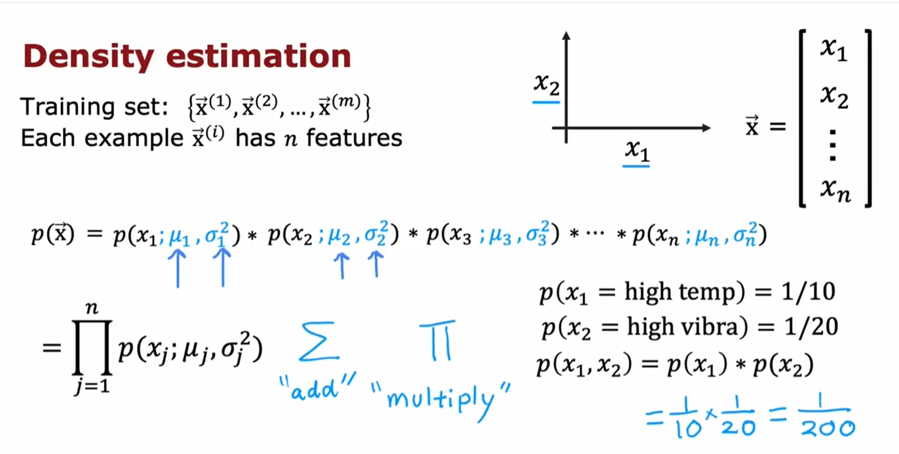

你有一个training set :$x_1$ 到 $x_m$。其中每个样本x有n个特征，所以每个样本x是一个包含n个数字的向量。

在飞机发动机的例子中 有两个特征 heat 和 vibration，因此n=2， $\vec{x}$是一个二维向量。而在有的例子中，可能有几百个特征。

给定这个training set，我们想进行density estimation（密度估计）,这意味着我们将构建一个模型，估计p(x)的概率。
$$
\vec{x}=[x_1,x_2,...,x_n] \\
p(\vec{x})=p(x_1;\mu_1,\sigma_1^2)*p(x_2;\mu_2,\sigma_2^2)*p(x_3;\mu_3,\sigma_3^2)*...*p(x_n;\mu_n,\sigma_n^2)
$$
$x_1,x_2,...,x_n$统计是独立的，但事实证明，即使特征不是统计独立的，这个算法也能很好的工作

> 至于为什么是乘以概率，这有一个例子可以建立直觉：
>
> 一个飞机的发动机，高热的概率 p(high heat )=$\frac{1}{10}$，高振动的概率 p(high vibration )=$\frac{1}{20}$
>
> 同时heat 和 高vibration的概率很低，p(high heat , high vibration) = $\frac{1}{200}$

- Anomaly detection algortihm

1. 第一步：选择特征$x_i$，你认为这些特征可能暗示异常样本

2. 第二步：为数据集的n个特征拟合参数 $\mu_1,...,\mu_n,\sigma_1^2,...,\sigma_n^2$
   $$
   \mu_j = \frac{1}{m} \sum_{i=1}^m x_j^{(i)}
   \qquad\qquad
   \sigma_j^2 = \frac{1}{m} \sum_{i=1}^m \left( x_j^{(i)} - \mu_j \right)^2 \\
   $$
   向量化方式：
   $$
   \vec{\mu} = \frac{1}{m} \sum_{l=1}^m \vec{x}^{(l)}\qquad\qquad\vec{\mu} = \begin{bmatrix} \mu_1 \\ \mu_2 \\ \vdots \\ \mu_n \end{bmatrix}
   $$
   通过在未标记的训练集上估计这些参数，现在计算出了所有模型的参数

3. 第三步：当给你一个新的样本$x_{test}$，你要做的是计算$p(x)$看看是大还是小
   $$
   
   $$
   $p(x)$是从j=1 到 j=n 各个特征概率的乘积。$x_j$是新样本的第j个特征，$\mu_j和\sigma_j$是前一步计算的参数

4. 最后一步：看看$p(x)$是否小于 $\epsilon$

   如果 $p(x)<\epsilon$ 则判断为异常。

算法直觉：如果这个样本的 一个或多个特征 相对于训练集的特征 非常大或非常小，它往往会标记这个样本为异常，对每个特征$x_j$ 都在拟合一个高斯分布，如果新样本p(x)非常大或非常小，则标记异常。如果p(x)乘积中的一个项非常小，把他们相乘时 整个乘积也会非常小，因此p(x)也会很小。这个算法可以检测新样本p(x)是否有特别大或特别小的异常特征。

- Anomaly detection example

每个特征（$x_1$)、($x_2$）都有一个高斯分布，将$p(x_1)和p(x_2)$相乘，你会得到p(x)的三维曲面图，其中的任何一点上，高度$p(x)=p(x_1)*p(x_2)$，高度越高 p(x)的概率越大， 中间的概率最高

两个测试样本：$\epsilon=0.02$

1. $p(x^{(1)}_{text})=0.426 ≮ \epsilon$，正常样本。
2. $p(x^{(2)}_{text})=0.0021 < \epsilon$，异常样本

## 2.4 Developing and evaluating an anomaly detection system

一些开发异常检测系统的实用技巧，关键想法是，如果你有一种方法能评估开发过程中的系统，你将能更快的做出决策、改进系统。

当你在开发learning algorithm，选择不同的 features 、选择不同的parameters values，像$\epsilon$   ，决定是否以某种方式更改特征或 增加$\epsilon$ 减少$\epsilon$ 或其他参数时，如果你有一种能评估learnign algorithm 那么做这些决策会更容易。

- **The importance of real-number evaluation**

这种方法称为real number evaluation，这意味着你能以某种方法快速改变algorithm，改变feature，改变parameter ，并且有一种方法计算出一个数字，告诉你algorithm变得更好 还是更坏，那么决定是否坚持该算法更改会更容易。

这在一场检测中经常这样做，尽管我们主要讨论的是unlabeled data,我要稍微改变这个假设，假设我们有一些labeled data，包括少量之前观察到的异常，也许在制造飞机发动机几年后，你只见过几个异常的飞机发动机。对于你知道是异常的例子，用y=1表示异常，用y=0表示正常。

Anomaly detection algorithm将学习的训练集仍然是这个未标注training data：$x^{(1)},x^{(2)},...,x^{(m)}$

我把这些例子都视为正常的例子 y=0， 即使在实践中 这个training data滑入几个异常的例子，anomaly detection algorithm通常也会表现良好。

为了实时real number evaluation,如果你的anomalous examples很小，创建一个cross-validation set、test set 是有用的，cross-validation set、test set中都包含a few anomalous examples （y=1）+ mostly normal examples（y=0）。同样 在实践中，如果有一些实际上是异常的例子被错误的标记为y=0，anomaly detection algorithm仍然会表现良好。 

- **Aircraft engines monitoring example**

**方法一：Training set 、cross-validation set、test set**

>  适用于2~50个已知的异常

| 数量    | label               | 解释         |
| ------- | ------------------- | ------------ |
| 10000个 | y=0（good engines） | 正常引擎     |
| 20      | y=1 （anomalous）   | 有缺陷的引擎 |

Training set ： 6000 good engines（y=0）

cross-validation set：2000 good engines（y=0） + 10 anomalous （y=1）

test set：2000 good engines（y=0） + 10 anomalous （y=1）

1. 在training set上训练算法，拟合这个6000个样本的gaussian distributions。

2. 用gaussian distributions在cross-validation set上查看它正确了标记多少异常。
3. 使用cross-validation set来微调algorithm的$\epsilon、x_j$，看看能否检测出这10个异常， 而不是检测的异常太多或太少。 
4. 在test set上测试

**方法二：Training set 、cross-validation set。 去除test set**

> 适用于异常样本非常少（2个）的情况

> 缺点是，在用cross-validation set调整算法后，你可能会在cross-validation set中过拟合$\epsilon、x_j$，并且你没有一个公平的方法来判断它在未来实例中的表现，因为你没有测试集，但当你数据很少时，这可能是你最好的选择

| 数量    | label               | 解释         |
| ------- | ------------------- | ------------ |
| 10000个 | y=0（good engines） | 正常引擎     |
| 2       | y=1 （anomalous）   | 有缺陷的引擎 |

Training set ： 6000 good engines（y=0）

cross-validation set：4000 good engines（y=0） + 2 anomalous （y=1）

1. 在training set上训练算法，拟合这个6000个样本的gaussian distributions。

2. 用gaussian distributions在cross-validation set上查看它正确了标记多少异常。
3. 使用cross-validation set来微调algorithm的$\epsilon、x_j$，看看能否检测出这10个异常， 而不是检测的异常太多或太少。 

- Algorithm evalution

p（x）仅从负样本（negative examples，y=0）中学习，正样本仅用于cross-validation set和test set的参数调优、模型评估

## 2.5 Anamaly detection vs. supervised learning

当有一些 positive examples（y=1） 和 大量negative examples（ y=0），你应该在什么时候使用anomaly detection？ 什么时候使用 supervised learning？

| Anomaly detection                                            | Supervised learning                                          |
| ------------------------------------------------------------ | ------------------------------------------------------------ |
| 少量的positive examples（y=1），通常为0~20个                 | 大量的positive examples（y=1），20个也可以                   |
| 大量的negative examples（y=0）                               | 大量的negative examples（y=0）                               |
| 适用于：不同类型的异常，不同类型的正样本，anomaly detection更合适，算法很难从少量正样本中学习到异常的样子，未来的异常和我们迄今为止看到的任何异常也不同。 因为Anomaly detection是通过学习负样本来建模的，任何与正常情况偏离很大的情况，都会被标记为异常 | 适用于：有足够的正样本来让算法了解正样本的样子，并假设未来的正样本与训练集中的正样本相似 |
| 例子：层出不穷的诈骗，每隔几个月，都会出现新的诈骗方式       | 例子：垃圾邮件检测，垃圾邮件都类似，你接下来几天收到的垃圾邮件，和过去几年收到的垃圾邮件相似 |

- 更多的例子

## 2.6 Choosing what features to use

在构建anomaly detection algorithm时，选择好的参数很重要。

在supervised learning中，如果特征不正确，或者有一些与问题无关的特征，这通常也没关系，因为算法有监督信号，即足够的y标签，算法可以自行决定ignore feature、rescale feature，充分利用你提供的特征。

但对于anomaly detection，它仅从无标签数据中学习时，算法很难决定忽略哪些特征，因此谨慎的选择特征是非常重要的。

- Non-gaussion feature

1. **确保提供的数据是高斯分布**

如果不是高斯分布，也可以通过数据变化，使其分布接近高斯分布。

变成高斯分布的方法：

1. $log(x)：x_1 → log(x_1)$ 
2. $log(x_2+c)：x_2 → log(x_2+1)$
3. 取平方根：$\sqrt{x_3}$
4. 取立方根 ：$\sqrt[3]{x_4}$

python库中，有直接的函数可以调用：plt.hist()

2. **在你训练完检测算法后，如果在cross-validation set 和 test set上表现不佳，可以进行错误分析，看看算法在哪些地方表现不佳，并改进**

我们希望：

对多数normal examples x， p(x) ≥ $\epsilon$

对少数anomalous examples x，p(x) ≤ $\epsilon$

常见的问题是：

p(x) 对 normal examples 和 anomalous examples 都很大

这个anomaly 样本和其他normal 样本看起来都相似， p(x)也大于$\epsilon$，一个异常样本被错误的归类在正常样本里面，通常情况下我会查看这个样本，试图弄清楚是什么让我认为它是异常的，即使这个特征$x_1$（交易数量）的取值与其他样本相似， 如果我能识别出一些新的特征，比如$x_2$（打字速度），发现$x_2$（打字速度）和其他样本不一致 可以明显的区分正常样本和异常样本，那么添加这个特征可以改进算法的表现。

建立$x_1$和$x_2$的二维图形后，建立高斯分布，发现该样本大幅偏离normal examples，从而标记为异常

例：Monitoring computers in a data center

假设你在构建一个异常检测系统，来监控计算机集群是否正常运行

$x_1$：memory use of computer （内存使用量）

$x_2$：number of disk accesses/sec （每秒磁盘访问量）

$x_3$：CPU load （CPU负载）

$x_4$：network traffic （网络流量）

可以通过组合旧特征来创建新特征。例如发现CPU load  和 network traffic都不异常，异常的是在high CPU load的同时 low network traffic，这时可创建$x_5=\frac{\text{CPU load}}{\text{network traffic}}$ 或者$x_6=\frac{(\text{CPU load})^2}{\text{network traffic}}$ 这个新特征将帮助异常检测算法标记出这种特定的异常情况

通过使用不同的特征，使p(x)在normal examples很大，在anomaly examples很小。

# 第二周：Recommentder System

# 三、Recommender System

## 3.1 Making recommendations

每次访问像亚马逊这样的在线购物网站，这些网站会推荐他们认为你可能想购买的东西。

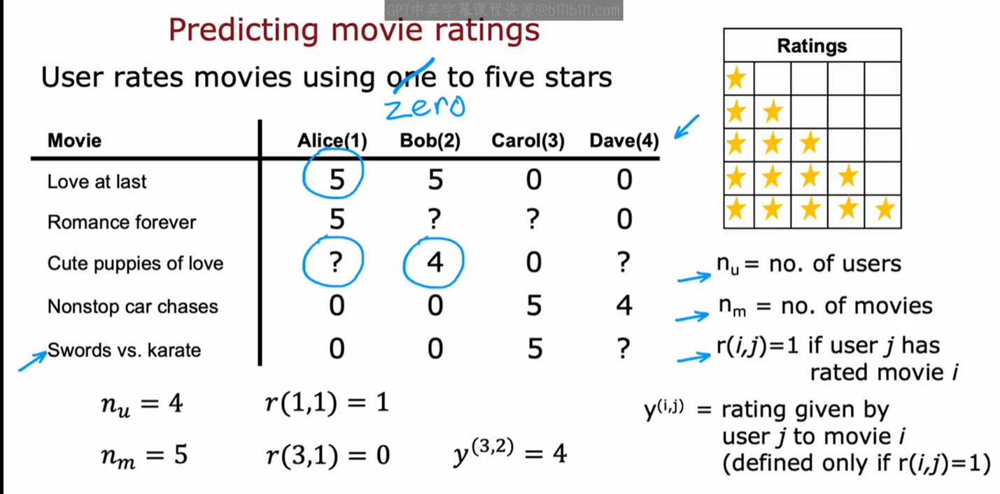

# 四、Collaborative Filtering

## 4.1 Using per-item features

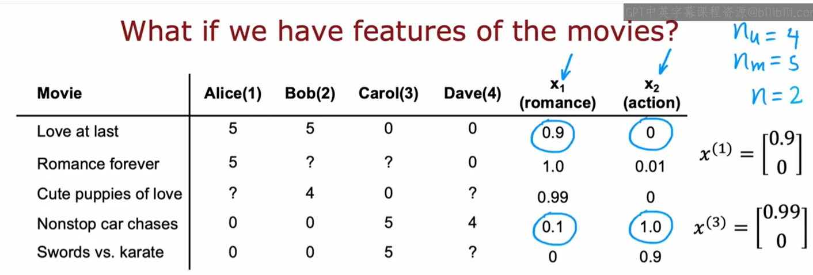

添加了两个新的电影特征：$x_1$电影有多少浪漫元素，$x_2$电影有多少动作元素。

并可以把这两个新特征表示为向量的形式。

**对于用户1 ：预测Alice（1）对电影 Cute puppies of love 的评分**
$$
假设预测公式为：w^{(1)}·x^{(i)}+b^{(1)}，即线性回归公式
\\假设：w^{(1)} = \begin{bmatrix} 5 \\ 0 \end{bmatrix}, \, b^{(1)} = 0 
\\又根据：x^{(3)} = \begin{bmatrix} 0.99 \\ 0 \end{bmatrix} \\
因此预测出分数为：w^{(1)}·x^{(3)}+b^{(1)}=4.95\\
观察Alice（1）对\text{romance}电影都打了很高的分数，因此这是个合理的分数
$$
抽象一下：预测用户j对电影i的评分公式为$w^{(j)}·x^{(i)}+b^{(j)}$

- **Cost function：w,b**

> 衡量模型预测值w,b 与 实际值 w,b 之间的误差

Notation：

$r(i,j)=1$：如果用户j会电影i评分 则记为1，若没有打分 则记为0。

$y(i,j)$：用户i对电影j的评分（如果有评分）。

$w^{(j)},b^{(j)}$：用户j的参数。

$x^{(i)}$：电影i的特征向量。

用户j对电影i的评分预测公式：$w^{(j)}·x^{(i)}+b^{(j)}$

$m^{(j)}$：用户j评分的电影数量。如果用户1评价了4部电影，则$m^{(1)}$=4，用户2评价了3部电影，则$m^{(2)}$=3。

根据用户j对电影的评分，来to learn parameters $w^{(j)},b^{(j)}$：

根据所有的用户对电影的评分，来to learn parameters $w^{(1)},b^{(1)},w^{(2)},b^{(2)},...,w^{(n_u)},b^{(n_u)}$：

## 4.2 Collaborative filtering algorithm

在上个视频中，你看到了，如果每部电影都有特征，例如$x_1和x_2$告诉你电影有多romance和action，你可以使用线性回归来学习预测电影评分，但如果没有$x_1和x_2$的数值呢？让我们看看如何从数据中学习或得出这些特征$x_1和x_2$

假设我们已经以某种方法学习了4个用户的参数

预测公式：$w^{(j)}·x^{(i)}+b^{(j)}$

又因为已经有分数了：
$$
w^{(1)}·x^{(1)}≈5\\
w^{(2)}·x^{(1)}≈5\\
w^{(3)}·x^{(1)}≈0\\
w^{(4)}·x^{(1)}≈0\\
$$
可以推导出：
$$
x^{(1)} = \begin{bmatrix} 1 \\ 0 \end{bmatrix}
$$
同理可推出：$x^{(2)}、x^{(3)}、x^{(4)}、x^{(5)}$

- **Cost function：$x^{(i)}$**

> 衡量模型预测值$x^{(i)}$ 与 实际值$x^{(i)}$ 之间的误差

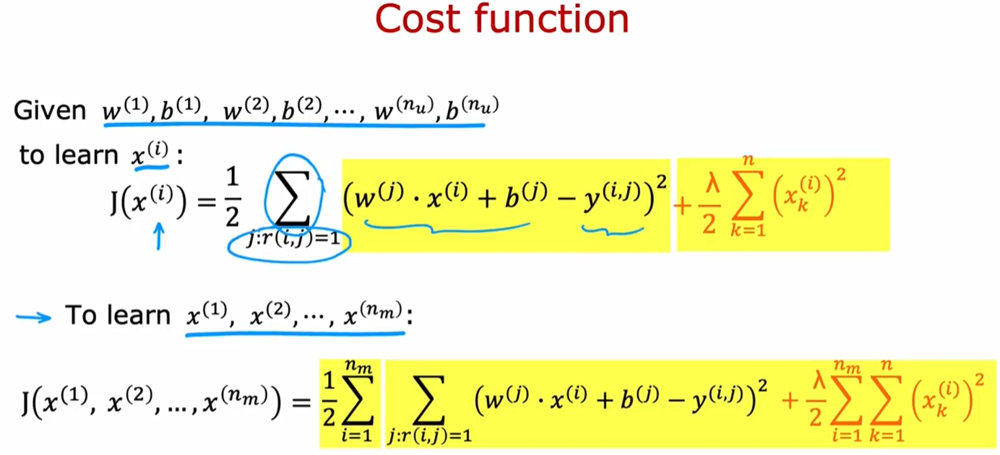

- **Collaborative filtering(协同过滤算法)**

> 协同过滤这个名字像一种感觉，因为多个用户对同一部电影进行了评分，有点像写作，给你一种这部电影可能是什么样的感觉，这让你可以猜测这部电影的适当特征是什么，这反过来又让你可以预测其他尚未对同一部电影进行评分的用户将来可能会如何评分，这种协同过滤是从多个用户那里收集数据，这是用户之间的协作，来帮助你预测未来其他用户评分

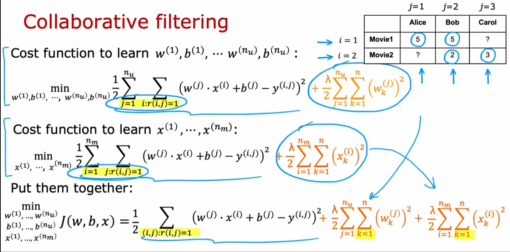

**协同过滤算法的梯度下降**

## 4.3 Binary labels:favs,likes and clikes

推荐系统或协同过滤算法的重要应用中许多涉及二元标签，而不是用户给出的0~5星评分，而是以某种方式表达他们喜欢或不喜欢某个项目，让我们看看如何将我们看到的算法推广到这种设置中

这是一个二元协同过滤的例子，1代表like，0代表dislike，？代表还没有看过，问题是 如何将协同过滤算法用到这个上面？

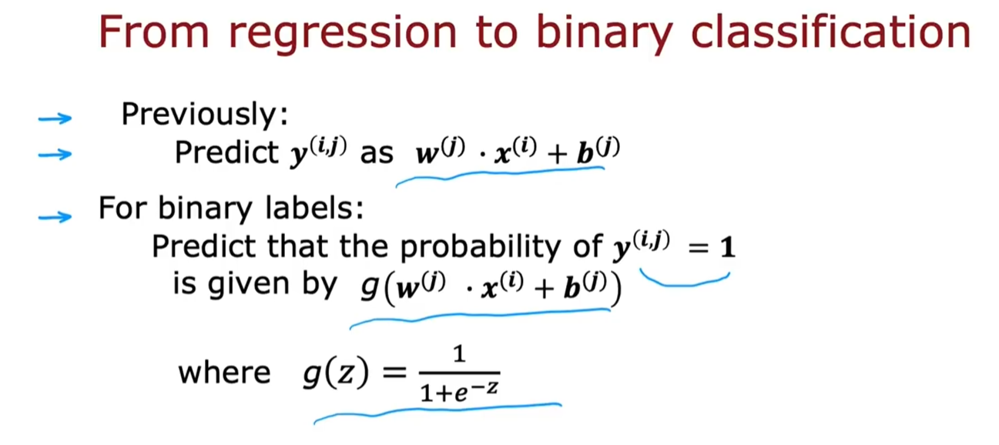

previously是预测评分

现在是预测y=1（用户like）的概率

- Cost function for binary application

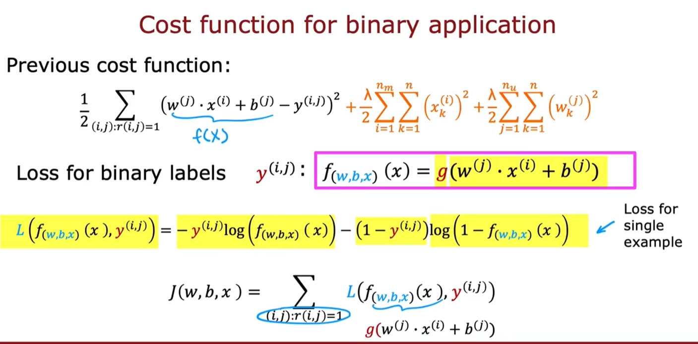

# 五、Recommender Systems implementation

## 5.1 Mean normalization

> 假设Eve是新用户，未对任何电影评分（即无训练数据）：
>
> - **代价函数分解**：
>   总损失 = **预测误差项**（如均方误差） + **正则化项**。
>   对Eve来说，预测误差项为零（无评分数据），损失函数仅由正则化项主导。
> - **参数更新逻辑**：
>   优化算法会最小化正则化项，迫使 $w^{(5)}$→0，$b^{(5)}$→0。
>   即使通常不正则化 b，若初始化b=0 且无数据更新，也会保留默认值。

在我们训练算法时，由于正则化的存在，我们试图使参数w变小，如果在这个数据集上运行算法，实际上会得到第5个用户 Eve的参数，$w^{(5)}=\begin{bmatrix} 0 \\ 0 \end{bmatrix}，b^{(5)}=0$，因为Eve还没有对任何电影评分，参数w、b不会影响代价函数中的第一项，因此最小化这个代价函数，意味着尽可能使参数w小，我们并没有真正正则化b，但如果将b=0作为默认值，你将得到$b^{(5)}=0$， 如果这是Eve的参数，那么算法会预测Eve的所有电影评分都是
$$
w^{(j)}·x^{(i)}+b^{(j)}=0·x^{(i)}+0=0
$$
因此这个算法会预测，如果有一个还没有评分的用户，他给所有的电影都是0分，这是不对的

- **均值归一化（mena normalization）**

取每部电影的平均分，记为$\mu$分， 然后每个电影的评分都减去$\mu$分

因为每部电影的都减了$\mu$分，

之前的评分预测公式：$w^{(j)}·x^{(i)}+b^{(j)}$  

变为了现在新的评分预测公式：$w^{(j)}·x^{(i)}+b^{(j)}+\mu$。

因此对于Eve，

由原来的评分预测公式：$w^{(j)}·x^{(i)}+b^{(j)}=0·x^{(i)}+0=0$ 

变成了新预测公式：$w^{(j)}·x^{(i)}+b^{(j)}+\mu=0·x^{(i)}+0+\mu=\mu$

这看起来更合理，取电影的平均评分，而不是猜测Eve的所有评分都是0，事实证明 将不同的电影mean normalization，算法的运行速度确实会快一些，对于没有评分的用户 预测也更合理。

在这个例子中，我们是将每一行mean normalization，这有助于处理新用户还没有评分过的情况，另一种方法是列mean normalization，这也是一个合理选择，为新电影预测评分。

## 5.2 TensorFlow implementation

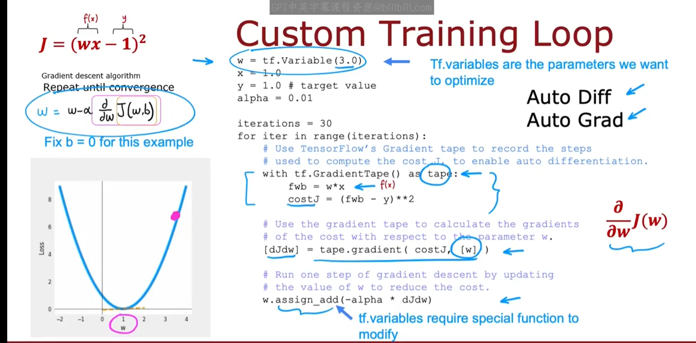

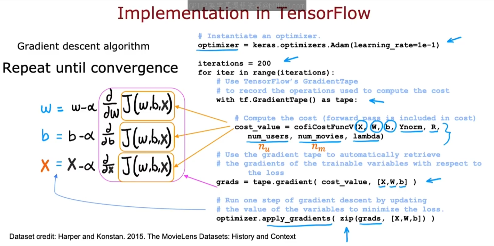

## 5.3 Finding related items

看电影时，那些相关电影推荐，是怎么得出的呢？

每个电影i的学习特征$x^{(i)}$ 很难解释，当你查看$x^{(1)}、x^{(2)}、x^{(3)}$时，很难看出他代表 浪漫电影、动作电影、外国电影 这些东西， 但尽管如此，这些学习到的特征共同传达了电影的一些信息。

想要查找相似电影k，给定一个特征向量$x^{(k)}$ 判断它是否与$x^{(i)}$相似

通过这种方法，找到$x^{(i)}$与$x^{(k)}$ 距离最小的那部电影， 比如说你找到5个$x^{(k)}$ 与$x^{(i)}$相似，那么就可以推荐5部电影 。特征$x^{(i)}$显示出了电影i的一些信息，而其他电影 $x^{(k)}$ 具有与$x^{(i)}$ 相似的特征  

- Limitations of collaborative filtering（协同过滤局限性）

**冷启动问题（Cold Start Problem）**

**新用户**： 
当用户刚注册且未对任何物品评分时，协同过滤无法通过历史行为找到相似用户，导致无法生成个性化推荐。 
**示例**：新用户Eve未评分任何电影，系统只能推荐热门电影或随机内容，可能不符合其偏好。

**解决方案**：  
利用**侧边信息（Side Information）**：  

- 用户侧：年龄、性别、地理位置等人口统计信息。  
- 物品侧：电影类型、导演、演员等元数据。  
- 例如：为新用户推荐与其年龄段和性别匹配的高分电影。

# 六、Content-based Filtering

## 6.1 Collaborative filtering vs Content-based filtering

- 协同过滤 vs 基于内容的过滤

Collborative filtering（协同过滤）：仅仅根据相似的用户评分来推荐物品。

Content-based filtering（基于内容的过滤）：根据 用户特征、物品特征 来推荐物品。

> 用户特征包括 用户评分

- Content-based filtering

查看电影i是否与用户j有较好的匹配。

**Leaning to match**

之前，用户对电影的评分预测公式：$w^{(j)}·x^{(i)}+b^{(j)}$

在Content-based filtering中：

1. b去掉，不影响结果。

2. 替换$w^{(j)}$  → $v_{u}^{(j)}$

   v代表向量，u代表用户，j代表用户j，它是从用户J的特征中 计算出的一组数字。

3. 替换$x^{(i)}$  → $v_{m}^{(i)}$

   v代表向量，m代表电影，i代表电影i，它是从电影i的特征中 计算出的一组数字。

用户对电影的评分预测公式：$_{u}^{(j)}·v_{m}^{(i)}$

通过选择合适的两个向量，将能对电影评分有个良好的预测

**例：**

用户 j 对动作电影评分4.9，爱情电影评分0.1，.....，悬疑电影评分0.3。$v_u^{(j)}=\begin{bmatrix} 4.9 \\ 0.1 \\...\\3.0 \end{bmatrix}$

电影 i 的动作电影程度4.6，爱情电影程度0.2，.....，对悬疑电影程度3.6。$v_m^{(i)}=\begin{bmatrix} 4.6 \\ 0.2 \\...\\3.6 \end{bmatrix}$

> 问题在于，两个向量维度不同，如何进行点积运算？

## 6.2 Deep learning for content-based filtering

开发content-based filtering的一个好方法是使用Deep learning

以用户特征列表$x_u$作为输入，通过几层，输出这个描述用户的向量$v_u$

> output layer具有32个单元，因此$v_u$包含32个数字

以电影特征列表$x_m$作为输入，通过几层，输出这个描述电影的向量$v_m$

> 都是32个数字，所以能点积。

评分预测公式：$v_u^{(j)}·v_m^{(j)}$

若想预测二分类问题，可修改公式为：$g(v_u^{(j)}·v_m^{(j)})$ 预测$y^{(i,j)}$为1的概率。

**将多个神经网络组合在一起，构建一个更大的神经网络**

将用户网络 和 电影网络 组合在一起，然后output 内积

**Cost function**

**利用特征 寻找相似电影**

**Tips**

设计这个系统，需要仔细研究输入特征有哪些。

# 七、Advanced implementation

## 7.1 Recommending from a large catalogue

今天的推荐系统需要从成千上万的项目中，挑选少数几个项目进行推荐，那如何高效计算呢?

- **Two steps：Retrieval（检索） & Ranking（排序）**

**第一步：Retrieval（检索）**

1. **在检索步骤中，生成一个包含大量合理候选项目的列表，其涵盖用户所有可能喜欢的东西。**

   这个候选列表 包含用户不喜欢的东西是可以的，因为在之后的排序步骤中，我们会微调并挑选出最佳项目推荐给用户

   > 例：
   >
   > 1. 根据用户最后观看的10部电影，再推荐10部相似的电影$|v_{m}^{(k)}-v_{m}^{(i)}|$
   > 2. 根据用户观看最多的3个流派的电影，再推荐10部评分最高的电影
   > 3. 推荐20部，在用户国家最流行的电影

   检索步骤可以非常快速的完成，你可能得到一个包含数百部合理电影的列表，推荐给用户，希望这个列表能推荐一些好的选项，但如果它包含一些用户不喜欢的选项 也是可以的，检索步骤的目标是确保广泛的覆盖，至少要有足够多的电影。

2. **将在检索步骤中检索到的所有项目合并到一个列表中，去除重复项，并去除用户已经观看或已经购买一些项目。**

在检索步骤中，输入的item越多，算法效果也就越好，但速度也就越慢。

为了权衡 item与性能，是检索100个？1000个？10000个？

推荐使用离线实验室，如果检索更多的项目 能带来多少更相关的推荐

**第二步：Ranking（排序）**

1. **在排序步骤中，使用在检索步骤检索到的列表，并使用学习模型对他们进行排序**。这意味着你把用户特征向量和电影特征向量输入到这个神经网络中，并计算每个用户电影的预测评分。
2. 你现在有了100多部电影，这些电影是用户最有可能给出高评分的，**然后你可以根据您认为用户会给出最高评分的顺序，向用户展示排序后的项目列表**

> 如果你已经提前计算了$v_m$，那么你只需要计算一次$v_u$就可以了，不用重复计算$v_m$。

- 总结

## 7.2 Ethical use of recommender systems

不道德的推荐，比如谷歌按广告商排序，百度的药家鑫事件。

# 八、Content-based Filtering

## 8.1 TensorFlow Implementation

# 九、Principal Component Analysis（Optional）

## 9.1 Reducing the number of features

Principal Components Analysis ：PCA（主成分分析）

这是一个常用于可视化的算法，如果你有一个包含许多特征的数据集，比如10个特征，50个特征，甚至成千上万个特征，那么你不能绘制出几千个维度的数据，因此PCA是一种算法，它允许你将具有大量的特征的数据减少到2个或3个特征，以便你可以绘制它并可视化它。

数据科学家通常使用它来可视化数据，以了解可能发生的情况，让我们看看PCA如何工作的.

假设你有一个car数据，cars有很多特征：长度、宽度、车轮直径、汽车高度。

如果你想减少特征数量 以便可视化 ，你该如何实现呢？

- **第一个例子**

假设你有一个包含两个特征的数据集，特征$x_1$是汽车长度，特征$x_2$是汽车的宽度， 而在大多数国家，车的宽度是恒定的 不会有太大变化，因此绘制出来，二维数据图是这样的

所以如果你想减少特征数量，可以只取$x_1$，因为$x_2$在不同汽车之间变化很小。

**PCA是一种算法，当应用于这个数据集的时，它会自动决定只取$x_1$**

- **第二个例子**

在这里例子中，特征$x_1$是汽车长度，特征$x_2$是汽车的高度

想要简化成1个特征的话，就需要建立一个新的坐标 z轴， z轴由 x轴和y轴结合，表示汽车的大小。这样你不再需要两个坐标 长度和宽度，才能表示这个数据， 你只需要一个新的数字 就可以捕捉汽车的大小。

**PCA：find new axis and coordinates（找到新的轴和坐标）**

在实际中，PCA会把数千个特征，减少到两三个特征，这样你就可以在二维、三维图中可视化数据

- 另一个例子：3D → 2D

- **另一个例子：国家GDP**

一个国家有50个特征，通过PCA算法，可以简化到2个特征，从而可视化数据

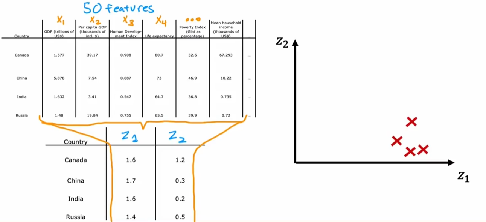

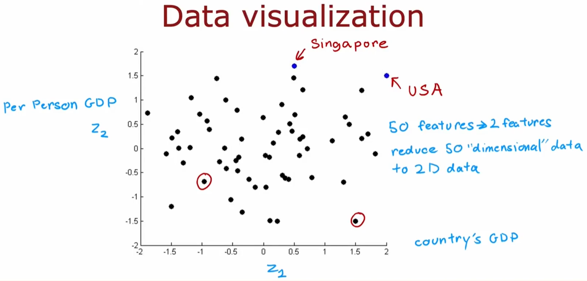

## 9.2 PCA Algorithm

# 十、PCA

## 10.1 PCA in Code

# 十一、Reinforcement Learning Introduction

## 11.1 What is Reinforcement Learning

用监督学习让直升机学会飞行是很难的，当直升机在空中的时候，很难确定什么是唯一正确的动作，左倾斜还是大幅左倾斜？稍微增加直升机动力还是大幅增加？ 获取一个包含状态x 动作y的数据集非常困难。这就是为什么对许多控制机器人的任务，比如直升机和机器人，都使用强化学习

- **强化学习** 

直升机状态s → 直升机操作a 

强化学习的关键输入是奖励函数：

​	飞的好 +1

​	飞的坏 -1000

- **强化学习应用**

控制机器人、工厂优化、股票交易、玩游戏

## 11.2 Mars rover example

有一个火星探测小车，到达左边的终点奖励100，到达右边的终点奖励40， 而中间的路途上没有奖励。

路径1: 4（0） → 3（0） → 2（0） → 1（100）

路径2: 4（0） → 5（0） → 6（40）

路径3: 4（0） → 5（0） → 4（0） → 3（0）→ 2（0） → 1（100）

表示方法：（状态，动作，奖励，下一步状态） = （s，a，R(s)，s'）=（4，←，0 ，3）

## 11.3 The Return in reinforcement learning

更快的获得奖励，比需要长时间才能获得奖励更具有吸引力。

假设每走一步，奖励都会衰减0.9，则最终奖励为72.9。

折扣因子（discount factor）通常为 0.9、0.99、0.999。

- **例子**

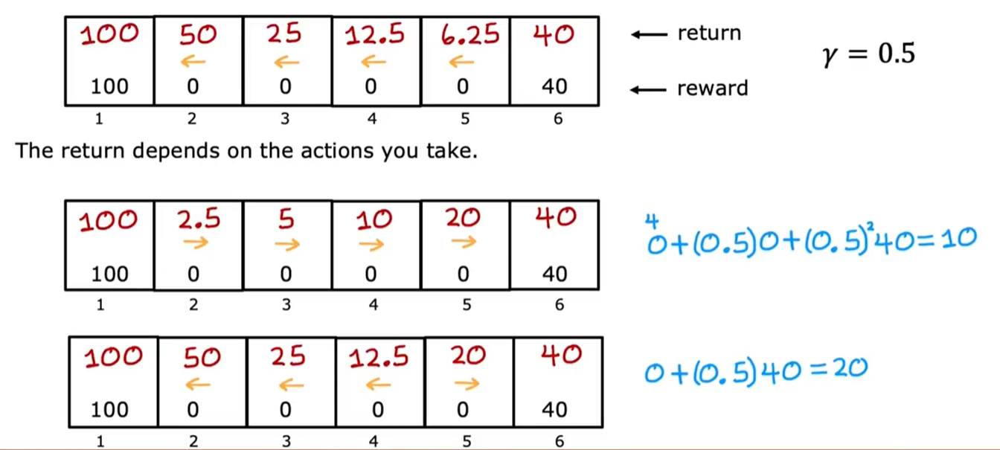

在本例中，假设折扣因子为0.5。

1. 一直向左走，最终奖励是100，那么倒数第二步是50，倒数第三步是25，倒数第四步是12.5，倒数第五步是6.25。
2. 一直向右走，最终奖励是40，那么倒数第二步是20，倒数第三步是10，倒数第四步是5，倒数第五步是2.5。

3. 如果在state 2 向左走，如果在state 3 向左走，如果在state 4 向左走，如果在state 5 向右走。

强化学习的return是系统获得的奖励总和，这些奖励因子是按折扣因子加权的，其中未来的奖励按折扣因子的更高次方加权。

如果获得的奖励为负，那么折扣因子实际上会激励系统 尽可能将负奖励推到未来。就像向某人借钱，尽可能在未来还。

## 11.4 Making decisions : Policies in reinforcement learning

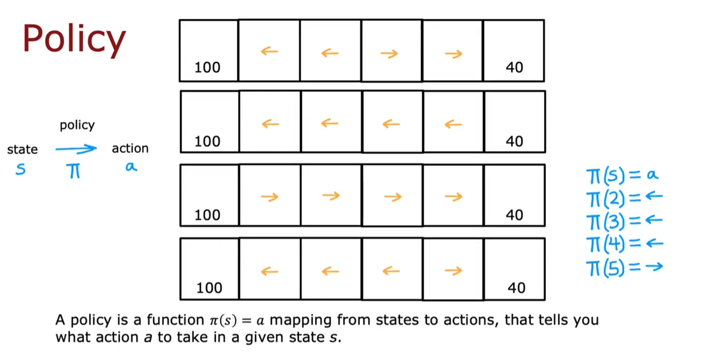

在强化学习中，可以采取的策略有很多种，

1. 选择更近的奖励，如果左边的奖励更近，就往左走，右边的奖励更近，就往右走。

2. 是选择更大的奖励

3. 选择更小的奖励

4. 总是向左走，除非向右走一步就能获得奖励。

   在这种方法中：

   π（2）= ←

   π（3）= ←

   π（4）= ←

   π（5）= →

在强化学习中，我们的目标是设计一个策略π，它接受任何状态s作为输入，映射到动作a上面：π（s）= a

强化学习的目标是找到一个策略π（s），告诉你  如何在每个状态下采取动作以获得最大回报

## 11.5 Review of key concepts

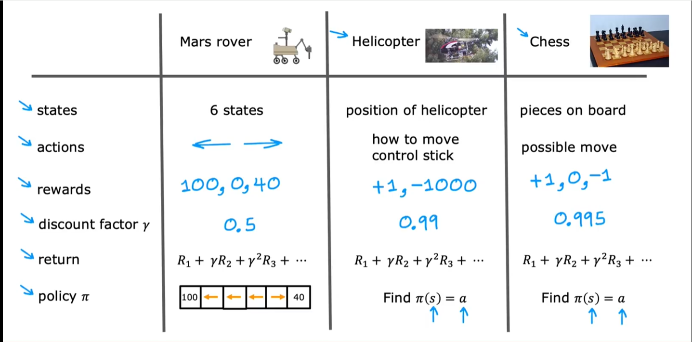

这种强化学习应用 也叫做**马尔科夫决策过程（Markov Decision Process，MDP）**

- **马尔科夫决策过程（Markov Decision Process，MDP）**

指的是未来只取决于当前状态，而不取决于你到达当前状态之前可能发生的任何事情，未来只取决于你现在在哪里，而不取决于你是如何到达这里的。

robot通过策略π 选择动作a， 然后 世界/环境 会发生改变，从而处于状态s 获得奖励R

# 十二、State-action value function

## 12.1 State-action value function definition

- **state action value function**

state action value function 通常用 Q(s,a)表示，该函数代表你当前的状态，以及在当前状态下采取的动作。

Q(s,a)会reutn一个数值，该数值等于 ①从状态s开始 ②采取1次动作a之后 ③采取最优行动所能得到的回报。

假设折扣因子是0.5.

Q（2，→）：如果在状态2 向→走 会到达状态3，在这之后的最优行为是 向←走 到达状态2，再向左走 到达状态1。
$$
Q(2,→)= 0 + (0.5)·0 + (0.5)^2·0 + (0.5)^3·100 = 12.5\\
$$
同理可得出
$$
Q(2,←) =0 + (0.5)·100 = 50
$$

$$
Q(4,←) =0 + (0.5)·0 + (0.5)^2·0 + (0.5)^3·100 = 12.5
$$

- **Picking actions**

**状态s中的最佳动作，是获得最佳回报$\underset{a}{\max}Q(s,a)$**

查看state 2：向←走 奖励是50，向→走 奖励是12.5，因此在state2时，最优路径是向←走，$\underset{a}{\max}Q(s,a)=50$

查看state 3：向←走 奖励是25，向→走 奖励是6.25，因此在state3时，最优路径是向←走，$\underset{a}{\max}Q(s,a)=25$

## 12.2 State-action value funciton example

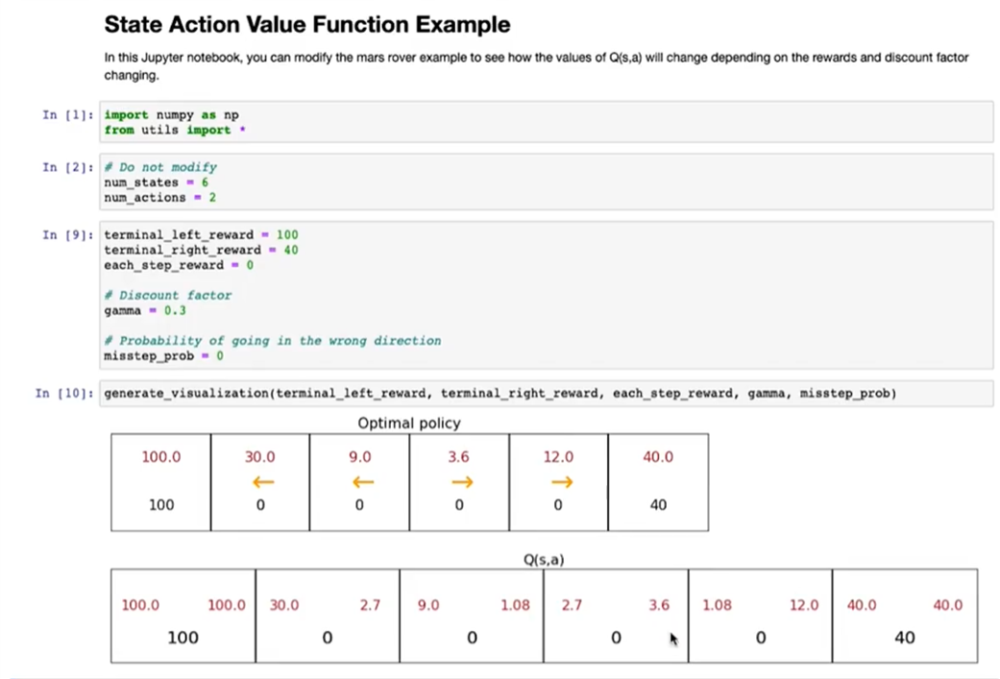

## 12.3 Bellman Equation

贝尔方程 Q(s,a) = 当前回报 + 下一个状态s'的回报

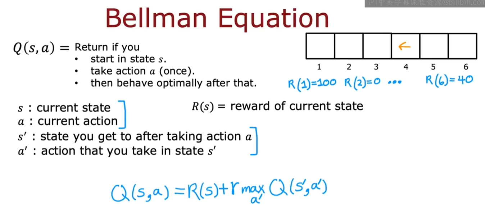

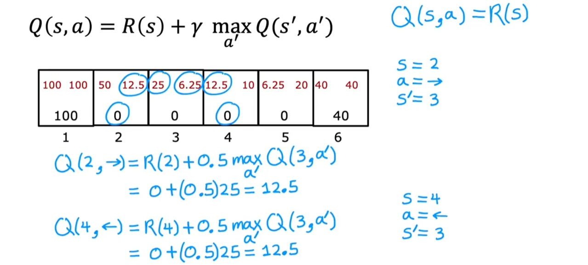

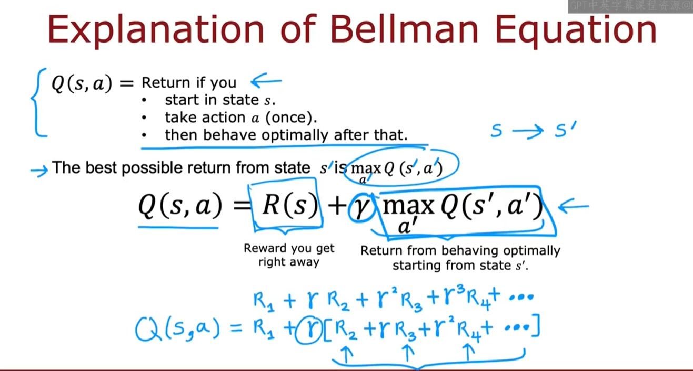

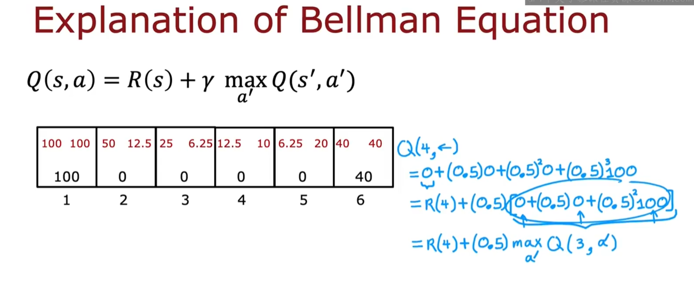

## 12.4 Random(stochastic) environment(Optional)

在火星探测器的例子中，让机器向左走，可能会有90%的情况遵循指令向左走，但同时也会有10%的情况出错 向右走。

在强化学习是随机的情况下，reward 可能会因为各种各样的情况出错，并没有一个固定的奖励序列。

因此在机器学习中 我们不关注max reward，这只是一个随机数。我们主要关注maxmizing the average value of the sum of discounted rewards（最大化折扣奖励总和的平均值）。通过统计1000次、10000次，会得到不同的奖励序列，通过对这些奖励序列进行平均，就会得到期望汇报（平均回报）。
$$
\begin{align}
\text{Expected Return} &= \text{Average} \left( R_1 + \gamma R_2 + \gamma^2 R_3 + \gamma^3 R_4 + \dots \right) \\
&= E\left( R_1 + \gamma R_2 + \gamma^2 R_3 + \gamma^3 R_4 + \dots \right)
\end{align}
$$

**Reinforcement Leanring目标：**

在状态 s中，使用策略π(s)，采取动作a， 来最大化 平均/期望折扣奖励回报（maximize the average or the expected sum of discounted rewards）

$$
\text{Bellman Equation}：Q(s,a)=R(s)+\gamma E[\underset{a'}{\max}Q(s',a')]
$$

# 十三、Continuous State Spaces

## 13.1 Example of continuous state applications

离散情况 → 连续情况

x：x位置

y：y位置

$\theta$：方向

$\dot{x}$：x方向速度

$\dot{y}$：y方向速度

$\dot{\theta}$：角速度

在连续状态强化学习问题中，数字向量的任何一个特征的数都是连续的，任何一个特征都可以在其有效范围内取任何值。

## 13.2 Lunar Lander

这是一个月球登录器的例子，总共有4个action，8个state

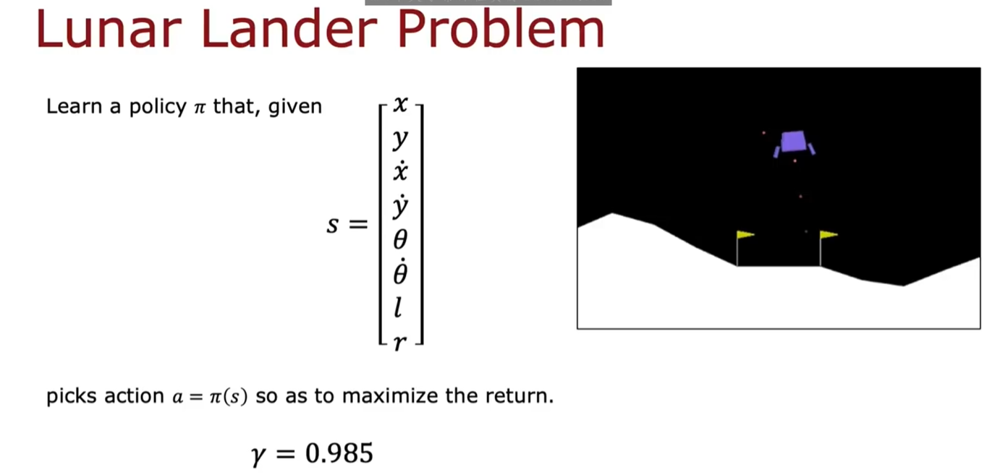

## 13.3 Learning the state-value function

## 13.4 Algorithm refinement: Improved neural network architecture

## 13.5 Algorithm refinement:ε